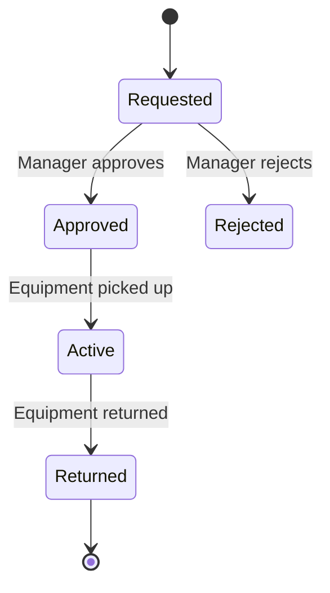

# Equipment Sharing & Policies

Track, manage, and share equipment across your organization.

## Overview

Equipment management allows organizations to:

- Track all equipment and assets
- Manage equipment assignments to employees
- Handle equipment sharing requests
- Set equipment sharing policies

## Managing Equipment

### Creating Equipment

1. Navigate to **Organization** → **Equipment**
2. Click **Add Equipment**
3. Fill in details:
   - Name
   - Type
   - Serial Number
   - Manufacturer
   - Purchase Date
   - Max Sharing Count

### Equipment Types

| Type      | Examples                      |
| --------- | ----------------------------- |
| Hardware  | Laptops, monitors, keyboards  |
| Furniture | Desks, chairs, standing desks |
| Software  | Software licenses             |
| Vehicles  | Company cars                  |
| Other     | Miscellaneous equipment       |

## Equipment Sharing

### Creating a Sharing Request

1. Go to **Equipment** → **Equipment Sharing**
2. Click **Request Equipment**
3. Select equipment, date range, and reason
4. Submit request

### Approval Workflow

### Sharing Policies

Configure auto-approval or manual approval via [Approval Policies](./approval-workflows).

## Related Pages

- [Equipment Endpoints](../api/equipment-endpoints) — equipment API
- [Equipment Sharing Endpoints](../api/equipment-sharing-endpoints) — sharing API
- [Approval Workflows](./approval-workflows) — approval policies
