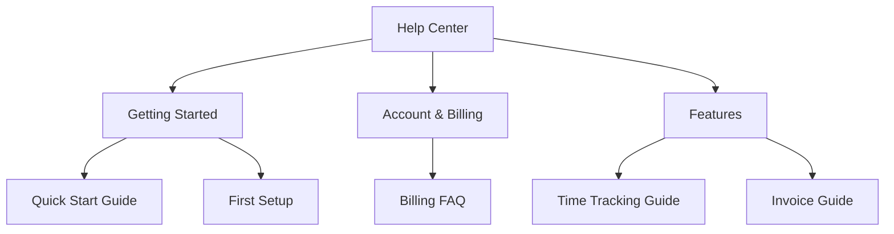

# Help Center

Build a customer-facing help center.

## Overview

The Help Center provides:

- Organized article categories
- Searchable content
- Public and private articles
- Multi-language support

## Setup

### Create Categories

1. Go to **Help Center** → **Categories**
2. Add categories:
   - Getting Started
   - Account & Billing
   - Time Tracking
   - Invoicing
   - Troubleshooting

### Write Articles

1. Go to **Help Center** → **Articles**
2. Click **New Article**
3. Write using the rich text editor
4. Set:
   - Category
   - Privacy (public/private)
   - Language
5. Publish

## Content Organization

## Multi-Language

Articles can be translated:

1. Open an article
2. Click **Translations**
3. Add translation for each language
4. Save

## API

Help center content is accessible via the Knowledge Base API.

## Related Pages

- [Knowledge Base](./knowledge-base) — internal knowledge
- [Comments & Mentions](./comments-and-mentions) — collaboration
