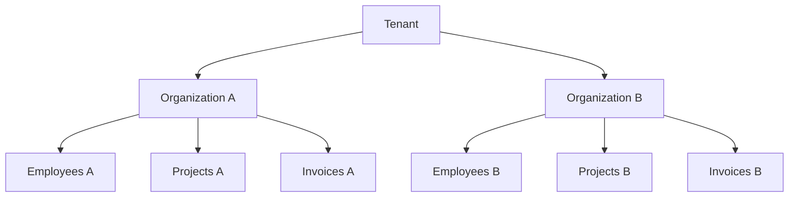

# Multi-Organization Management

Manage multiple organizations under a single tenant.

## Overview

A tenant can host multiple organizations, each with isolated:

- Employees
- Projects
- Invoices
- Settings
- Financial data

## Organization Switching

1. Click the **Organization Selector** in the header
2. Select the target organization
3. All views update to show org-specific data

## Creating Organizations

1. Go to **Settings** → **Organizations**
2. Click **Add Organization**
3. Configure:
   - Name and logo
   - Currency and timezone
   - Work hours per week
   - Start of week
   - Fiscal year start
4. Save

## Data Isolation

## Cross-Organization Features

| Feature          | Cross-Org Support     |
| ---------------- | --------------------- |
| User accounts    | ✅ Shared across orgs |
| Employee records | ❌ Per organization   |
| Projects         | ❌ Per organization   |
| Financial data   | ❌ Per organization   |
| Settings         | ❌ Per organization   |
| Tags             | ❌ Per organization   |

## Related Pages

- [Multi-Tenancy](../architecture/multi-tenancy) — tenant architecture
- [Organization Settings](./organization-settings) — org config
- [Tenant Isolation](../security/tenant-isolation) — security
