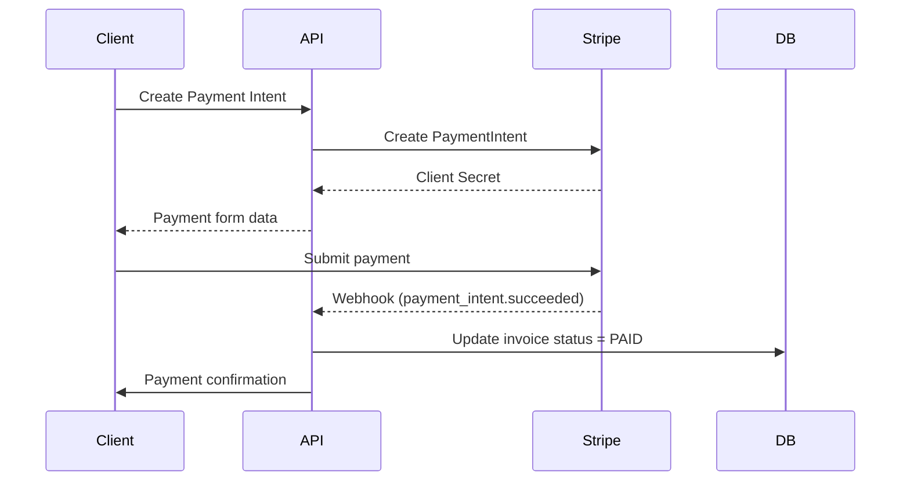

# Payment Gateway Configuration

Configure payment processing for invoices.

## Supported Gateways

| Gateway | Type          | Status   |
| ------- | ------------- | -------- |
| Stripe  | Credit Card   | Built-in |
| PayPal  | Online        | Built-in |
| Manual  | Bank Transfer | Built-in |

## Stripe Setup

1. Create a [Stripe account](https://stripe.com)
2. Get API keys from Stripe Dashboard
3. Configure in Gauzy:

```env
STRIPE_SECRET_KEY=sk_live_xxxxx
STRIPE_PUBLISHABLE_KEY=pk_live_xxxxx
STRIPE_WEBHOOK_SECRET=whsec_xxxxx
```

4. Go to **Settings** → **Payment** → **Stripe**
5. Enter API keys
6. Enable Stripe as payment method

## PayPal Setup

```env
PAYPAL_CLIENT_ID=your-client-id
PAYPAL_CLIENT_SECRET=your-client-secret
PAYPAL_MODE=live  # or sandbox
```

## Payment Flow



## Manual/Bank Transfer

1. Add bank details in **Settings** → **Payment**
2. Include bank info on invoices
3. Manually mark invoices as paid when transfer received

## Related Pages

- [Invoice Management](./invoice-management) — invoicing
- [Invoice Endpoints](../api/invoice-endpoints) — invoice API
- [Accounting Overview](./accounting-overview) — financial features
