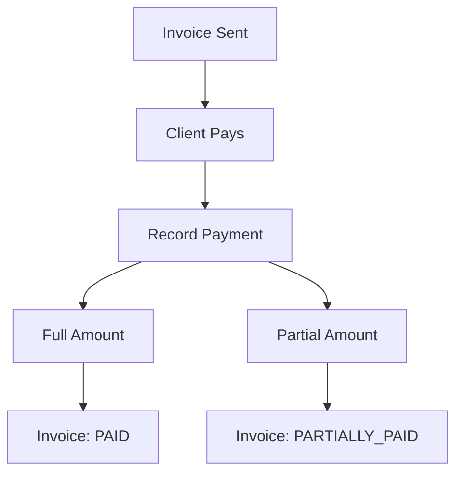

# Payments

Record and track payments received against invoices.

## Payment Methods

| Method          | Description                           |
| --------------- | ------------------------------------- |
| `BANK_TRANSFER` | Wire/bank transfer                    |
| `CASH`          | Cash payment                          |
| `CHEQUE`        | Check payment                         |
| `CREDIT_CARD`   | Credit card                           |
| `DEBIT`         | Debit card                            |
| `ONLINE`        | Online payment (PayPal, Stripe, etc.) |

## Payment Features

- **Invoice linking** — associate payments with specific invoices
- **Partial payments** — record multiple payments against one invoice
- **Payment notes** — add context to payments
- **Currency tracking** — payment currency may differ from invoice
- **Payment history** — complete audit trail of all payments

## Payment Flow

## Permissions

| Action               | Permission         |
| -------------------- | ------------------ |
| View payments        | `PAYMENT_VIEW`     |
| Create/edit payments | `PAYMENT_ADD_EDIT` |

## Related Pages

- [Invoicing](./invoicing) — invoice management
- [ERP Overview](./erp-overview) — ERP module overview
