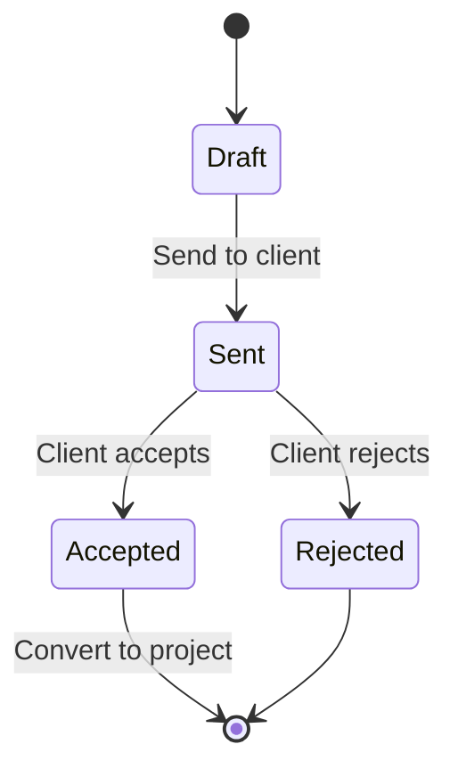

# Proposals Management

Create and track project proposals for clients.

## Overview

Proposals allow you to:

- Create professional project proposals
- Track proposal status (draft, sent, accepted, rejected)
- Link proposals to contacts and organizations
- Convert accepted proposals to projects

## Creating a Proposal

1. Navigate to **Sales** → **Proposals**
2. Click **Add Proposal**
3. Fill in:
   - **Title** and description
   - **Client** — select contact
   - **Value** — proposed budget
   - **Valid until** — expiry date
   - **Attached content** — rich text or PDF
4. Save as draft or send immediately

## Proposal Statuses

## Converting to Project

When a proposal is accepted:

1. Click **Convert to Project**
2. Project is created with proposal details
3. Team members are assigned
4. Tasks can be defined

## Proposal Templates

Save frequently used proposals as templates:

1. Create a proposal
2. Click **Save as Template**
3. Reuse for future proposals

## Related Pages

- [CRM Overview](./crm-overview) — CRM features
- [Contact Endpoints](../api/contact-endpoints) — contacts API
- [Project Management](./project-management) — project features
