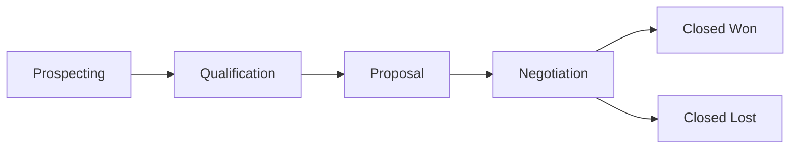

# Sales Pipelines

Manage multi-stage sales processes with visual pipeline boards and deal tracking.

## Overview

Gauzy provides a CRM pipeline feature that enables sales teams to:

- Define custom pipeline stages
- Track deals through the sales cycle
- Monitor win probability and deal value
- Generate sales forecasts

## Pipeline Management

### Creating a Pipeline

1. Navigate to **Contacts** → **Sales Pipelines**
2. Click **Add Pipeline**
3. Name the pipeline and add stages:

```
Prospecting → Qualification → Proposal → Negotiation → Closed
```

### Pipeline Stages

Each stage represents a step in the sales process:

| Property    | Description       |
| ----------- | ----------------- |
| Name        | Stage name        |
| Index       | Display order     |
| Description | Stage description |

## Deal Management

### Creating a Deal

| Field       | Description              |
| ----------- | ------------------------ |
| Title       | Deal name                |
| Stage       | Current pipeline stage   |
| Client      | Associated contact       |
| Probability | Win probability (0-100%) |

### Moving Deals

Drag deals between stages on the pipeline board, or update the stage via the deal edit form.

## Pipeline Flow



## Permissions

| Action | Required Permission    |
| ------ | ---------------------- |
| View   | `VIEW_SALES_PIPELINES` |
| Edit   | `EDIT_SALES_PIPELINES` |

## API Reference

See [Pipeline & Deal Endpoints](../api/pipeline-deal-endpoints) for the API documentation.

## Related Pages

- [Contacts Management](./contacts-management) — CRM contacts
- [Reports & Analytics](./reports-and-analytics) — sales reporting
