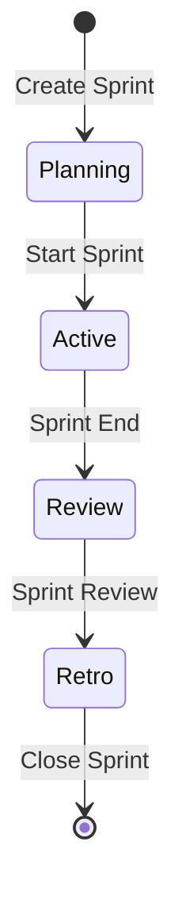

# Sprint Management Deep Dive

Agile sprint planning, execution, and reporting.

## Overview

Sprints provide time-boxed iterations for project work:

- 1-4 week durations
- Sprint backlog management
- Burndown tracking
- Sprint retrospectives

## Creating a Sprint

1. Go to **Projects** → select project → **Sprints**
2. Click **Create Sprint**
3. Configure:
   - Sprint name (e.g., "Sprint 14")
   - Start and end dates
   - Sprint goal
4. Save

## Sprint Workflow

## Managing Sprint Backlog

### Add Tasks to Sprint

1. Open the sprint board
2. Drag tasks from the backlog
3. Or click **Add to Sprint** on any task

### Sprint Board Columns

| Column      | Description     |
| ----------- | --------------- |
| TO DO       | Not started     |
| IN PROGRESS | Being worked on |
| IN REVIEW   | Code review/QA  |
| DONE        | Completed       |

## Burndown Chart

Track remaining work:

- **Ideal burndown** — linear from total to zero
- **Actual burndown** — based on completed tasks
- **Scope changes** — additions during sprint

## Sprint Metrics

| Metric          | Description                |
| --------------- | -------------------------- |
| Velocity        | Story points per sprint    |
| Completion Rate | % of tasks completed       |
| Burndown        | Work remaining over time   |
| Carry-over      | Tasks moved to next sprint |

## Related Pages

- [Task Management](./task-management) — task features
- [Project Management](./project-management) — project overview
- [Reports](./reports-and-analytics) — sprint reports
