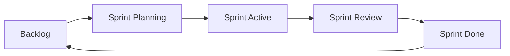

# Sprints & Agile Workflows

Manage agile sprints with task boards, sprint planning, and progress tracking.

## Overview

Gauzy provides full sprint management capabilities:

- Create and configure sprints per project
- Assign tasks and team members to sprints
- Track sprint progress with boards
- Manage sprint lifecycle (planning → active → review → done)

## Sprint Lifecycle

## Creating a Sprint

1. Navigate to **Projects** → select project → **Sprints**
2. Click **Create Sprint**
3. Configure sprint parameters:

| Field      | Description                    |
| ---------- | ------------------------------ |
| Name       | Sprint name (e.g., "Sprint 1") |
| Goal       | Sprint goal/objective          |
| Start Date | Sprint start                   |
| End Date   | Sprint end                     |
| Length     | Duration in days               |
| Day Start  | First working day of week      |

## Sprint Statuses

| Status          | Description                           |
| --------------- | ------------------------------------- |
| **TODO**        | Sprint is planned but not yet started |
| **IN_PROGRESS** | Sprint is currently active            |
| **DONE**        | Sprint is completed                   |

## Sprint Board

The sprint board displays tasks organized by status columns:

- **To Do** — tasks not yet started
- **In Progress** — tasks being worked on
- **In Review** — tasks awaiting review
- **Done** — completed tasks

## Sprint Members

Assign team members to sprints with specific roles:

- Track individual contribution during the sprint
- Calculate velocity per team member
- View sprint-level availability

## Sprint Tasks

Sprint tasks track additional metadata:

| Field              | Description                 |
| ------------------ | --------------------------- |
| Total Worked Hours | Actual hours logged on task |
| Story Points       | Estimated complexity        |
| Sprint Status      | Task-specific sprint status |

## Sprint Reporting

- **Velocity** — story points completed per sprint
- **Burndown** — remaining work over time
- **Sprint summary** — tasks completed vs planned

## Permissions

| Action         | Required Permission |
| -------------- | ------------------- |
| View sprints   | `ORG_SPRINT_VIEW`   |
| Create sprints | `ORG_SPRINT_ADD`    |
| Edit sprints   | `ORG_SPRINT_EDIT`   |
| Delete sprints | `ORG_SPRINT_DELETE` |

## API Reference

See [Sprint Endpoints](../api/sprint-endpoints) for the complete API documentation.

## Related Pages

- [Project Management](./project-management) — project features
- [Task Management](./task-management) — task management
- [Daily Plans](./daily-plans) — daily work planning
