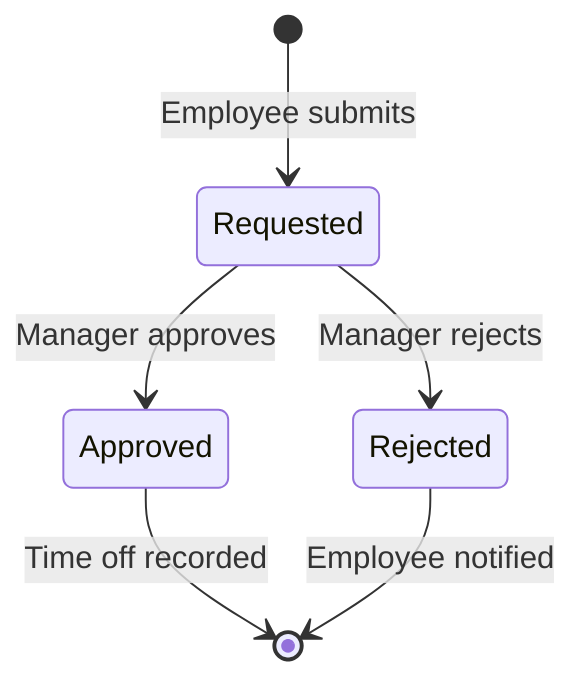

# Time Off Management Deep Dive

Configure and manage employee leave/vacation.

## Time Off Policies

### Creating a Policy

1. Go to **Settings** → **Time Off** → **Policies**
2. Click **Add Policy**
3. Configure:
   - Policy name (e.g., "Annual Leave")
   - Paid/Unpaid
   - Requires approval
   - Accrual rules (if applicable)
4. Save

### Default Policies

| Policy         | Days | Paid | Accrual |
| -------------- | ---- | ---- | ------- |
| Annual Leave   | 20   | ✅   | Monthly |
| Sick Leave     | 10   | ✅   | Yearly  |
| Personal Leave | 5    | ✅   | Yearly  |
| Unpaid Leave   | ∞    | ❌   | None    |
| Maternity      | 90   | ✅   | None    |
| Paternity      | 14   | ✅   | None    |

## Requesting Time Off

1. Go to **Time Off** → **Request**
2. Select policy
3. Choose dates (start/end)
4. Add description (optional)
5. Submit for approval

## Approval Process

## Calendar View

Time off is displayed:

- On the organization calendar
- In employee schedules
- On the team dashboard
- As blocked time slots

## Balance Tracking

| Feature         | Description              |
| --------------- | ------------------------ |
| Current Balance | Days remaining this year |
| Used            | Days taken               |
| Pending         | Awaiting approval        |
| Carry Over      | Days from previous year  |
| Accrual Rate    | Days earned per month    |

## Related Pages

- [Holiday Management](./holiday-management) — company holidays
- [Employee Availability](./employee-availability) — availability
- [Timesheet Approval](./timesheet-approval) — approvals
