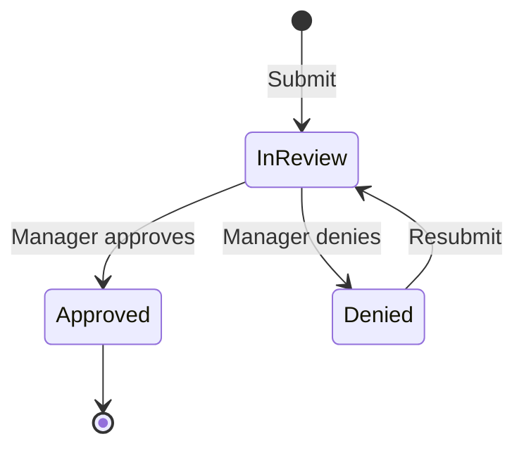

# Timesheet Management

Detailed guide to timesheet workflows, approvals, and configuration.

## Overview

Timesheets aggregate time logs into reviewable periods (weekly/bi-weekly/monthly) for manager approval.

## Timesheet Lifecycle

## Timesheet Periods

| Period    | Description         |
| --------- | ------------------- |
| Weekly    | Mon–Sun aggregation |
| Bi-weekly | Two-week periods    |
| Monthly   | Calendar month      |

Configured in **Settings** → **Time Tracking** → **Timesheet Period**.

## Submitting a Timesheet

1. Navigate to **Time Tracking** → **Timesheets**
2. Select the period
3. Review logged hours
4. Click **Submit for Approval**

## Approving Timesheets (Manager)

1. Navigate to **Time Tracking** → **Timesheet Approvals**
2. Review submitted timesheets
3. Check hours against projects and tasks
4. Click **Approve** or **Deny** with comments

## Configuration

| Setting         | Description               |
| --------------- | ------------------------- |
| Auto-submit     | Auto-submit at period end |
| Require project | Must link to project      |
| Require task    | Must link to task         |
| Min daily hours | Minimum hours per day     |
| Max daily hours | Maximum hours per day     |

## Related Pages

- [Time Tracking](./time-tracking) — time tracking feature
- [Time Tracking Endpoints](../api/time-tracking-endpoints) — API
- [Time Tracking Troubleshooting](../troubleshooting/time-tracking-issues) — issues
