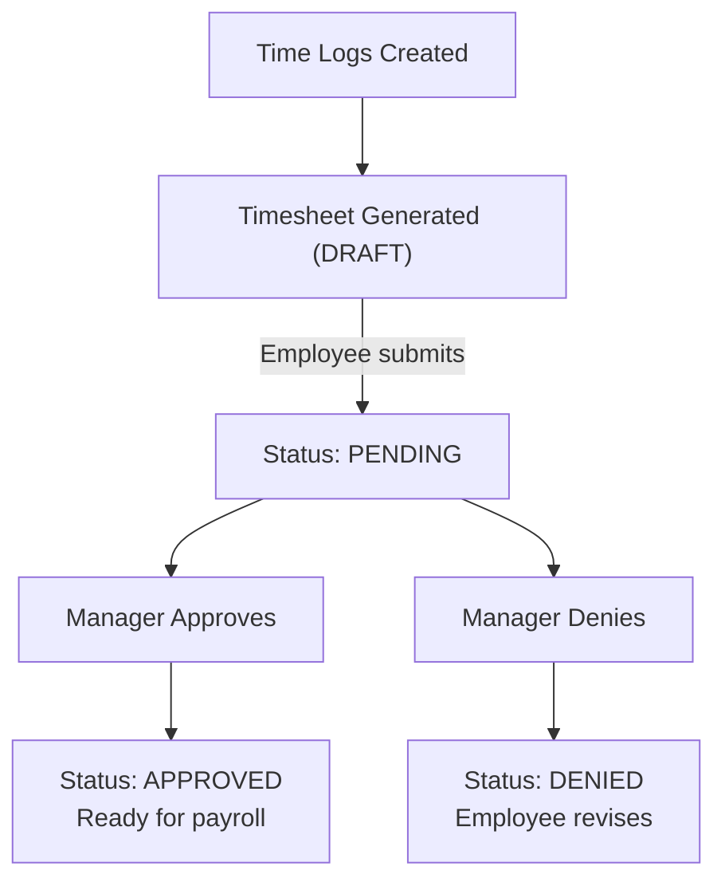

# Timesheets

Timesheets aggregate time logs into reviewable, approvable periods for payroll and billing.

## Timesheet Lifecycle



## Timesheet Statuses

| Status      | Description                 | Who Can Change    |
| ----------- | --------------------------- | ----------------- |
| `DRAFT`     | Auto-created, not submitted | Employee          |
| `PENDING`   | Submitted for review        | Employee (submit) |
| `IN_REVIEW` | Under manager review        | Manager           |
| `APPROVED`  | Approved for payroll        | Manager           |
| `DENIED`    | Rejected, needs revision    | Manager           |

## Timesheet Views

### Weekly View

Displays time logs grouped by day of the week:

| Day       | Project A | Project B |  Total  |
| --------- | :-------: | :-------: | :-----: |
| Mon       |    4h     |    3h     |   7h    |
| Tue       |    5h     |    2h     |   7h    |
| Wed       |    3h     |    4h     |   7h    |
| Thu       |    6h     |    2h     |   8h    |
| Fri       |    4h     |    3h     |   7h    |
| **Total** |  **22h**  |  **14h**  | **36h** |

### Calendar View

Monthly calendar showing daily totals with color-coded indicators.

### Report View

Aggregated data with filtering by employee, project, client, and date range.

## Approval Workflow

### For Employees

1. Track time throughout the week
2. Review daily logs for accuracy
3. Submit timesheet at end of period
4. Receive notification of approval/denial
5. If denied, revise and resubmit

### For Managers

1. Receive notification of pending timesheets
2. Review employee time logs
3. Check screenshots and activity levels
4. Approve or deny with comments
5. Bulk approve multiple timesheets

## Timesheet Data Model

```typescript
interface ITimesheet {
  id: string;
  startedAt: Date;
  stoppedAt: Date;
  duration: number; // Total seconds
  keyboard: number; // Total keyboard events
  mouse: number; // Total mouse events
  overall: number; // Overall activity percentage
  status: TimesheetStatus;
  approvedById?: string; // Manager who approved
  approvedAt?: Date;

  // Relations
  employeeId: string;
  organizationId: string;
  tenantId: string;
  timeLogs: ITimeLog[];
}
```

## Permissions

| Action              | Required Permission     |
| ------------------- | ----------------------- |
| View own timesheets | `TIME_TRACKER`          |
| Submit timesheets   | `TIME_TRACKER`          |
| Approve timesheets  | `CAN_APPROVE_TIMESHEET` |
| Edit time entries   | `TIMESHEET_EDIT`        |
| View all timesheets | Admin role              |

## Related Pages

- [Time Tracking](./time-tracking) — time logging methods
- [Activity Tracking](./activity-tracking) — screenshots and monitoring
- [Time Tracking Endpoints](../api/time-tracking-endpoints) — API reference
