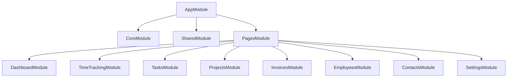

# Angular Module Architecture

Understanding the Angular frontend module organization.

## Overview

The Gauzy frontend is built with Angular, organized into lazy-loaded feature modules:



## Module Types

| Type    | Description                      | Example        |
| ------- | -------------------------------- | -------------- |
| Core    | Singleton services, guards       | `CoreModule`   |
| Shared  | Reusable components, pipes       | `SharedModule` |
| Feature | Lazy-loaded page modules         | `TasksModule`  |
| Layout  | Layout components (sidebar, nav) | `LayoutModule` |

## Core Module

Provides application-wide singletons:

- Authentication service
- HTTP interceptors
- Route guards
- Error handling service
- Store services

```typescript
@NgModule({
  providers: [AuthService, AuthGuard, ServerConnectionService, Store],
})
export class CoreModule {}
```

## Shared Module

Reusable components used across feature modules:

- Date pickers
- Data tables
- Form controls
- Modal dialogs
- Status badges
- User avatar components

## Feature Modules

Each feature is a lazy-loaded module:

```typescript
// app-routing.module.ts
const routes: Routes = [
  {
    path: "tasks",
    loadChildren: () =>
      import("./tasks/tasks.module").then((m) => m.TasksModule),
  },
  {
    path: "employees",
    loadChildren: () =>
      import("./employees/employees.module").then((m) => m.EmployeesModule),
  },
];
```

## Related Pages

- [Frontend Architecture](./frontend-architecture) — overview
- [UI Components](./ui-components) — component library
- [State Management](./state-management) — state patterns
