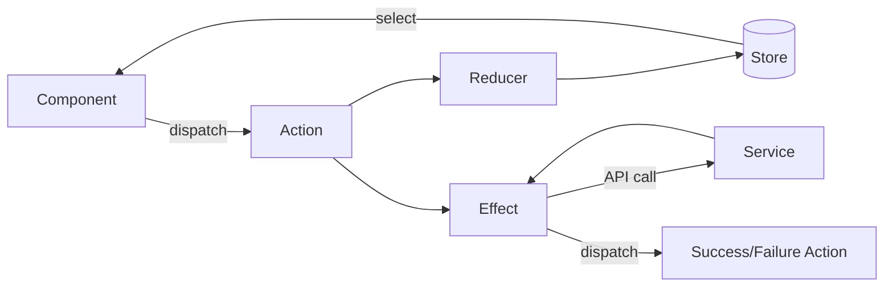

# NgRx State Management

Angular frontend state management with NgRx.

## Overview

The Gauzy Angular frontend uses NgRx for centralized state management:

- Predictable state container
- Unidirectional data flow
- Debugging with Redux DevTools
- Side effect management with Effects

## Architecture



## Example: Task State

### Actions

```typescript
// task.actions.ts
import { createAction, props } from "@ngrx/store";

export const loadTasks = createAction("[Task] Load Tasks");
export const loadTasksSuccess = createAction(
  "[Task] Load Tasks Success",
  props<{ tasks: ITask[]; total: number }>(),
);
export const loadTasksFailure = createAction(
  "[Task] Load Tasks Failure",
  props<{ error: string }>(),
);
export const createTask = createAction(
  "[Task] Create",
  props<{ task: ICreateTask }>(),
);
```

### Reducer

```typescript
// task.reducer.ts
export interface TaskState {
  tasks: ITask[];
  total: number;
  loading: boolean;
  error: string | null;
}

const initialState: TaskState = {
  tasks: [],
  total: 0,
  loading: false,
  error: null,
};

export const taskReducer = createReducer(
  initialState,
  on(loadTasks, (state) => ({ ...state, loading: true })),
  on(loadTasksSuccess, (state, { tasks, total }) => ({
    ...state,
    tasks,
    total,
    loading: false,
  })),
  on(loadTasksFailure, (state, { error }) => ({
    ...state,
    error,
    loading: false,
  })),
);
```

### Selectors

```typescript
// task.selectors.ts
export const selectTaskState = createFeatureSelector<TaskState>("task");
export const selectAllTasks = createSelector(selectTaskState, (s) => s.tasks);
export const selectTasksLoading = createSelector(
  selectTaskState,
  (s) => s.loading,
);
export const selectTaskCount = createSelector(selectTaskState, (s) => s.total);
```

### Effects

```typescript
// task.effects.ts
@Injectable()
export class TaskEffects {
  loadTasks$ = createEffect(() =>
    this.actions$.pipe(
      ofType(loadTasks),
      switchMap(() =>
        this.taskService.getAll().pipe(
          map((result) => loadTasksSuccess(result)),
          catchError((error) => of(loadTasksFailure({ error: error.message }))),
        ),
      ),
    ),
  );

  constructor(
    private actions$: Actions,
    private taskService: TaskService,
  ) {}
}
```

## Related Pages

- [Angular Module Architecture](./angular-module-architecture) — modules
- [Form Handling Patterns](./form-handling-patterns) — forms
