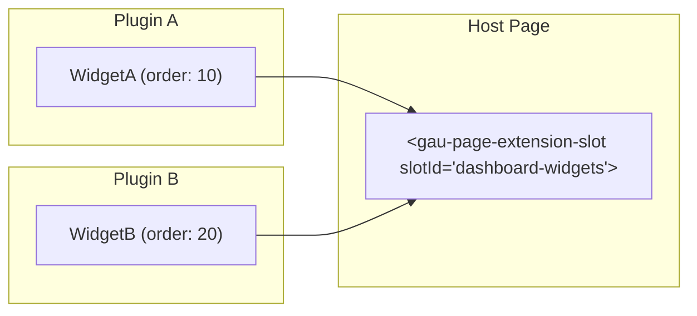

# Extension Slots

Extension slots are named insertion points in the UI where plugins can contribute components. They enable a loosely coupled architecture where the host application defines "where" and plugins define "what."

## How It Works



1. The host application places a `<gau-page-extension-slot>` component in its template
2. Plugins register extensions for that slot
3. The slot component renders all registered extensions in order

## Built-in Slots

### Dashboard Slots

| Slot ID (string value) | Constant | Description |
|------------------------|----------|-------------|
| `dashboard-widgets` | `PAGE_EXTENSION_SLOTS.DASHBOARD_WIDGETS` | Dashboard metric widgets |
| `dashboard-windows` | `PAGE_EXTENSION_SLOTS.DASHBOARD_WINDOWS` | Dashboard window panels |

### Tab Slots

Tab slot IDs correspond to `tabsetId` values used in `PageTabRegistryService`:

| Slot ID (string value) | Constant | Description |
|------------------------|----------|-------------|
| `dashboard-page` | `PAGE_EXTENSION_SLOTS.DASHBOARD_TABS` | Dashboard page tab bar |
| `timesheet-page` | `PAGE_EXTENSION_SLOTS.TIMESHEET_TABS` | Timesheet page tabs |
| `time-activity-page` | `PAGE_EXTENSION_SLOTS.TIME_ACTIVITY_TABS` | Time & activity tabs |
| `employee-edit-page` | `PAGE_EXTENSION_SLOTS.EMPLOYEE_EDIT_TABS` | Employee edit tabs |

:::caution
Note that tab slot IDs end with `-page`, not `-tabs`. For example, `DASHBOARD_TABS` maps to the string `'dashboard-page'`, not `'dashboard-tabs'`. Use the constants to avoid errors.
:::

### Layout Slots

| Slot ID (string value) | Constant | Description |
|------------------------|----------|-------------|
| `settings-tabs` | `PAGE_EXTENSION_SLOTS.SETTINGS_TABS` | Settings page tabs |
| `integrations-list` | `PAGE_EXTENSION_SLOTS.INTEGRATIONS_LIST` | Integrations listing |
| `page-sections` | `PAGE_EXTENSION_SLOTS.PAGE_SECTIONS` | Generic page sections |
| `header-toolbar` | `PAGE_EXTENSION_SLOTS.HEADER_TOOLBAR` | Header toolbar items |
| `sidebar-footer` | `PAGE_EXTENSION_SLOTS.SIDEBAR_FOOTER` | Sidebar footer area |
| `user-menu-items` | `PAGE_EXTENSION_SLOTS.USER_MENU_ITEMS` | User dropdown menu |

## Registering Extensions

### In a Plugin Definition (Declarative)

The simplest approach — declare extensions in your plugin definition:

```typescript
export const MyPlugin = defineDeclarativePlugin('my-plugin', {
  extensions: [
    {
      id: 'my-plugin:time-widget',
      slotId: PAGE_EXTENSION_SLOTS.DASHBOARD_WIDGETS,
      component: TimeWidgetComponent,
      order: 10,
      title: 'Time Tracking',
      description: 'Shows time tracked today'
    }
  ]
});
```

### Programmatic Registration

Register extensions at runtime via `PageExtensionRegistryService`:

```typescript
@Injectable()
export class MyPluginService {
  private readonly registry = inject(PageExtensionRegistryService);

  registerWidgets() {
    this.registry.register({
      id: 'my-plugin:dynamic-widget',
      slotId: 'dashboard-widgets',
      component: DynamicWidgetComponent,
      order: 30
    }, { pluginId: 'my-plugin' });
  }
}
```

### Batch Registration

```typescript
this.registry.registerAll([
  { id: 'widget-a', slotId: 'dashboard-widgets', component: WidgetA, order: 10 },
  { id: 'widget-b', slotId: 'dashboard-widgets', component: WidgetB, order: 20 }
], { pluginId: 'my-plugin' });
```

## Extension Definition Fields

| Field | Type | Description |
|-------|------|-------------|
| `id` | `string` | Unique extension identifier |
| `slotId` | `string` | Target slot ID |
| `component` | `Type<any>` | Angular component class |
| `loadComponent` | `() => Promise<Type<any>>` | Lazy-loaded component |
| `order` | `number` | Sort order (lower = first, default 999) |
| `title` | `string` | Display title |
| `description` | `string` | Description text |
| `pluginId` | `string` | Owning plugin ID |
| `hidden` | `boolean` | Hide the extension |
| `visible` | `(context) => boolean \| Promise<boolean>` | Custom visibility function |
| `permissions` | `string[]` | All required (AND logic) |
| `permissionsAny` | `string[]` | Any required (OR logic) |
| `featureKey` | `string` | Feature flag gate |
| `wrapper` | `ExtensionWrapperConfig` | Wrapping behavior (see below) |
| `lifecycle` | `ExtensionLifecycleHooks` | Mount/unmount hooks |
| `metadata` | `ExtensionMetadata` | Arbitrary metadata |

### Extension Wrapper Types

The `wrapper` field controls how the extension is visually wrapped when rendered in a slot:

| Type | Description |
|------|-------------|
| `'none'` | No wrapper — component renders as-is |
| `'card'` | Nebular card styling |
| `'widget'` | Widget card styling (compact) |
| `'window'` | Window panel styling |
| `'panel'` | Panel styling |
| `'custom'` | Custom wrapper component (provide via `ExtensionWrapperConfig.component`) |

```typescript
{
  id: 'my-widget',
  slotId: 'dashboard-widgets',
  component: MyWidgetComponent,
  wrapper: { type: 'card', title: 'My Widget' }
}
```

## Visibility Control

Extensions support fine-grained visibility rules.

### Permission-Based

```typescript
{
  id: 'admin-widget',
  slotId: 'dashboard-widgets',
  component: AdminWidgetComponent,
  // User must have ALL of these permissions
  permissions: ['ADMIN_DASHBOARD_VIEW', 'ORG_EXPENSES_VIEW'],
  // OR: User must have ANY of these permissions
  permissionsAny: ['SUPER_ADMIN', 'ORG_ADMIN']
}
```

### Feature Flag

```typescript
{
  id: 'beta-widget',
  slotId: 'dashboard-widgets',
  component: BetaWidgetComponent,
  featureKey: 'FEATURE_BETA_DASHBOARD'
}
```

### Custom Visibility Function

```typescript
{
  id: 'conditional-widget',
  slotId: 'dashboard-widgets',
  component: ConditionalWidgetComponent,
  visible: (context) => {
    // Sync or async check
    return context.organization?.name !== 'Demo';
  }
}
```

### Reactive Visibility

The slot component supports reactive visibility updates:

```html
<gau-page-extension-slot
  [slotId]="'dashboard-widgets'"
  [visibilityContext]="{ user: currentUser, organization: currentOrg }"
></gau-page-extension-slot>
```

## Using Extension Slots in Templates

### Basic Usage

```html
<gau-page-extension-slot [slotId]="'dashboard-widgets'"></gau-page-extension-slot>
```

### With Visibility Context

```html
<gau-page-extension-slot
  [slotId]="'dashboard-widgets'"
  [visibilityContext]="{ user: user, organization: org, data: { period: selectedPeriod } }"
></gau-page-extension-slot>
```

### Reactive Subscriptions

In your component code, subscribe to extension changes:

```typescript
// Non-reactive (snapshot)
const widgets = this.registry.getExtensions('dashboard-widgets');

// Reactive (auto-updates)
this.registry.getExtensions$('dashboard-widgets').subscribe(widgets => {
  console.log(`${widgets.length} widgets registered`);
});

// With visibility filtering
const visible = await this.registry.getVisibleExtensions('dashboard-widgets', {
  user: currentUser,
  organization: currentOrg
});
```

## Dynamic Slot Registration

Plugins can create their own extension points:

```typescript
// Register a custom slot
this.registry.registerSlot({
  id: 'my-plugin:custom-area',
  name: 'Custom Plugin Area',
  description: 'Extension point for my-plugin customization',
  multiple: true,
  maxExtensions: 5
}, { pluginId: 'my-plugin' });

// Other plugins can now contribute to 'my-plugin:custom-area'
```

## Cleanup

When a plugin is destroyed, all its extensions and slots are automatically removed:

```typescript
// Remove all extensions and slots registered by a plugin
this.registry.deregisterByPlugin('my-plugin');
```

This is called automatically during plugin teardown if extensions were registered with a `pluginId`.

## Related Pages

- [Plugin Definitions](./plugin-definitions) — declaring extensions in plugin config
- [React Bridge](./react-bridge) — React components in extension slots
- [Plugin Services](./plugin-services) — cross-plugin communication
