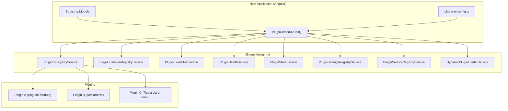
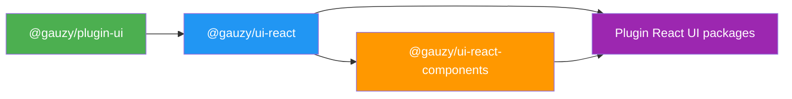

# Plugin UI System Overview

The **Plugin UI System** (`@gauzy/plugin-ui`) is a frontend plugin architecture that lets you extend the Ever Gauzy UI with new pages, navigation items, dashboard widgets, settings tabs, and more — without modifying the core application.

:::note
This is the **compile-time UI plugin system** for built-in frontend extensions. For the **runtime Marketplace Plugin System** (npm/CDN installation, lifecycle management), see the [Marketplace Plugin System](../../plugins-marketplace/overview) documentation.
:::

## Architecture



## Package Overview

The plugin UI system is split across four packages with clear responsibilities:

| Package | Purpose | Dependencies |
|---------|---------|-------------|
| **`@gauzy/plugin-ui`** | Core plugin infrastructure — registry, lifecycle, extensions, events, i18n | Angular only |
| **`@gauzy/ui-react`** | React-to-Angular bridge — directives, hooks, error boundary | Angular + React 19 |
| **`@gauzy/ui-react-components`** | Reusable React UI primitives (Card, Progress, etc.) | React only |
| **`@gauzy/plugin-*-react-ui`** | Individual React plugins (e.g., dashboard time tracking) | ui-react + ui-react-components |

### Dependency Graph



Key rule: `@gauzy/plugin-ui` has **no React dependency**. React lives only in `@gauzy/ui-react` and downstream.

## Core Concepts

### Plugin Definition

Every UI plugin is a `PluginUiDefinition` — a configuration object that declares what the plugin contributes:

```typescript
import { defineDeclarativePlugin } from '@gauzy/plugin-ui';

export const MyPlugin = defineDeclarativePlugin('my-plugin', {
  routes: [{ path: 'my-page', component: MyPageComponent }],
  navMenu: [{ title: 'My Page', icon: 'star-outline', link: '/pages/my-page' }],
  extensions: [{ id: 'my-widget', slotId: 'dashboard-widgets', component: MyWidgetComponent }]
});
```

### Plugin Types

| Type | Use Case | Function |
|------|----------|----------|
| **Declarative** | Simple plugins with routes/nav/tabs only | `defineDeclarativePlugin()` |
| **Module-based** | Plugins needing Angular DI, services, providers | `definePlugin()` |
| **Lazy module** | Large plugins loaded on demand | `definePlugin()` with `loadModule` |
| **Plugin group** | Parent plugin with child plugins | `definePluginGroup()` |

### Extension Slots

Extension slots are named insertion points in the UI where plugins can contribute components:

```typescript
// Plugin registers a widget into the dashboard
registry.register({
  id: 'time-tracking-widget',
  slotId: PAGE_EXTENSION_SLOTS.DASHBOARD_WIDGETS,
  component: TimeTrackingWidgetComponent,
  order: 10
});
```

Built-in slots include `DASHBOARD_WIDGETS`, `DASHBOARD_WINDOWS`, `SETTINGS_TABS`, `HEADER_TOOLBAR`, `SIDEBAR_FOOTER`, and more.

### Lifecycle Hooks

Plugins can implement lifecycle interfaces for initialization and cleanup:

```typescript
export class MyPluginModule implements IOnPluginUiBootstrap, IOnPluginUiDestroy {
  ngOnPluginBootstrap() {
    // Called after plugin instantiation
  }

  ngOnPluginDestroy() {
    // Called before plugin teardown
  }
}
```

### Cross-Plugin Communication

Plugins communicate via a type-safe event bus:

```typescript
// Define an event contract
export const DataRefreshed = definePluginEvent<{ timestamp: number }>('my-plugin', 'my-plugin:data-refreshed');

// Emit
const handle = bindEventToBus(DataRefreshed, eventBus);
handle.emit({ timestamp: Date.now() });

// Subscribe
handle.on().subscribe(event => console.log('Refreshed at', event.payload.timestamp));
```

## Configuration

Plugins are registered in the application's `plugin-ui.config.ts`:

```typescript
import { PluginUiConfig } from '@gauzy/plugin-ui';

export const uiPluginConfig: PluginUiConfig = {
  defaultLanguage: 'en',
  defaultLocale: 'en-US',
  availableLanguages: ['en', 'bg', 'he', 'ru'],
  availableLocales: ['en-US', 'bg-BG', 'he-IL', 'ru-RU'],
  startWeekOn: 1, // Monday
  plugins: [
    MyPlugin,
    AnotherPlugin.init({ plugins: [ChildPluginA, ChildPluginB] })
  ]
};
```

The host application initializes the system in its bootstrap module by passing **service types** (not instances) that bridge the plugin system to the host:

```typescript
@NgModule({
  imports: [
    PluginUiModule.init({
      navBuilder: NavMenuBuilderService,        // Implements IDeclarativeNavBuilder
      routeRegistry: PageRouteRegistryService,  // Implements IDeclarativePageRouteRegistry
      tabRegistry: PageTabRegistryService,      // Implements IDeclarativePageTabRegistry
      translateService: TranslateAdapterService,// Implements IPluginTranslateService
      permissionChecker: PermissionAdapterService, // Implements IPluginPermissionChecker
      featureChecker: FeatureAdapterService     // Implements IPluginFeatureChecker
    })
  ]
})
export class BootstrapModule {}
```

All six services are **optional** — the system works without them but specific features (navigation, routes, tabs, translations, permission gating, feature flags) require the corresponding service.

The `PluginUiServices` interface:

```typescript
interface PluginUiServices {
  navBuilder?: Type<IDeclarativeNavBuilder>;
  routeRegistry?: Type<IDeclarativePageRouteRegistry>;
  tabRegistry?: Type<IDeclarativePageTabRegistry>;
  translateService?: Type<IPluginTranslateService>;
  permissionChecker?: Type<IPluginPermissionChecker>;
  featureChecker?: Type<IPluginFeatureChecker>;
}
```

## Bootstrap Flow (Detailed)

When `PluginUiModule.bootstrapPlugins()` runs, it follows this exact sequence:

1. **Validate** — `validatePluginDependencies()` checks for missing deps and circular references
2. **Version check** — `checkVersionCompatibility()` verifies `peerPlugins` version ranges
3. **Order** — Topological sort by dependency graph
4. **Instantiate** — Create module instances (module-based) or call `bootstrap()` (declarative)
5. **Register** — Store instances in `PluginUiRegistryService`
6. **Record health** — `PluginHealthService` tracks boot time per plugin
7. **Bootstrap hooks** — Call `ngOnPluginBootstrap()` on all plugins in order
8. **After-bootstrap hooks** — Call `ngOnPluginAfterBootstrap()` on all plugins
9. **Preload** — Plugins with `loadStrategy: 'preload'` load in the background

If any plugin fails, the error is recorded in `PluginHealthService` and the remaining plugins continue to bootstrap.

## Related Pages

- [Getting Started](./getting-started) — create your first plugin
- [Plugin Definitions](./plugin-definitions) — declarative, module, and group plugins
- [Extension Slots](./extension-slots) — UI extension points
- [React Bridge](./react-bridge) — embedding React in Angular
- [Plugin Services](./plugin-services) — events, settings, state, cross-plugin services
- [Advanced Features](./advanced-features) — dynamic loading, health, devtools, i18n
- [API Reference](./api-reference) — complete types, tokens, and interfaces
