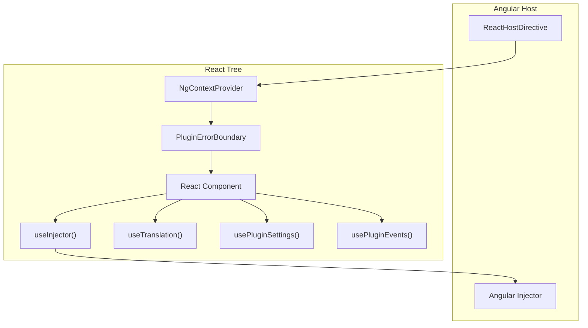

# React Bridge

The `@gauzy/ui-react` package enables embedding React components inside the Angular host application. It provides directives for mounting React trees and hooks for accessing Angular services from React code.

## Architecture



The `ReactHostDirective` creates a React root inside an Angular element, wraps the React tree with `NgContextProvider` (which exposes the Angular `Injector`) and `PluginErrorBoundary` (which isolates crashes), then hooks allow React components to consume Angular services.

## Mounting React Components

### ReactHostDirective

Renders a React component inside an Angular template.

```typescript
@Directive({ selector: '[gaReactHost]', standalone: true })
export class ReactHostDirective {
  @Input({ required: true }) gaReactHost!: React.ComponentType<unknown>;
  @Input() props: Record<string, unknown> = {};
  @Input() context: Record<string, unknown> = {};
}
```

**Usage:**

```typescript
import { Component } from '@angular/core';
import { ReactHostDirective } from '@gauzy/ui-react';
import { MyReactComponent } from './my-react-component';

@Component({
  selector: 'my-angular-wrapper',
  standalone: true,
  imports: [ReactHostDirective],
  template: `<div [gaReactHost]="component" [props]="props"></div>`
})
export class MyAngularWrapperComponent {
  component = MyReactComponent;
  props = { title: 'Hello from Angular' };
}
```

### LazyReactHostDirective

Lazy-loads a React component via dynamic import (code-splitting). Component is loaded only when the directive is rendered.

```typescript
@Directive({ selector: '[gaReactLazyHost]', standalone: true })
export class LazyReactHostDirective {
  @Input({ required: true })
  gaReactLazyHost!: () => Promise<{ default: React.ComponentType<unknown> }>;
  @Input() props: Record<string, unknown> = {};
  @Input() context: Record<string, unknown> = {};
}
```

**Usage:**

```html
<div [gaReactLazyHost]="loadComponent" [props]="props"></div>
```

```typescript
loadComponent = () => import('./heavy-component').then(m => m);
props = { columns: 3 };
```

### ReactBridge (Programmatic)

For full control, use the `ReactBridge` class directly:

```typescript
import { ReactBridge, provideReactBridge, REACT_BRIDGE } from '@gauzy/ui-react';

// Register provider
providers: [provideReactBridge()]

// In component
const bridge = inject(REACT_BRIDGE);
const result = bridge.mount({
  component: MyReactComponent,
  props: { title: 'Hello' },
  hostElement: this.elementRef.nativeElement,
  injector: this.injector
});

// Update props
result.updateProps({ title: 'Updated!' });

// Cleanup
result.unmount();
```

| Export | Description |
|--------|-------------|
| `ReactBridge` | Bridge class with `mount()`, `isCompatible()` |
| `createReactBridge()` | Factory function |
| `provideReactBridge()` | Angular provider helper (`EnvironmentProviders`) |
| `REACT_BRIDGE` | Injection token |

---

## Context & Providers

### NgContextProvider

React context provider that exposes Angular's `Injector` to child components. Automatically wraps children in `PluginErrorBoundary`.

```typescript
interface NgContextProviderProps {
  injector: Injector;
  context?: Record<string, unknown>;
  children?: React.ReactNode;
  pluginId?: string;
  errorFallback?: React.ReactNode | ((info: PluginErrorInfo, retry: () => void) => React.ReactNode);
  onError?: (info: PluginErrorInfo) => void;
}
```

### useBridgeContext

Access the full bridge context (injector + extra context values):

```typescript
function useBridgeContext(): NgReactBridgeContext
// { injector: Injector, [key: string]: unknown }
```

---

## Hooks Reference

All hooks must be called inside React components mounted via the bridge (within `NgContextProvider`).

### useInjector

Access the Angular `Injector` or retrieve a specific service directly.

```typescript
// Overload 1: Get the injector
function useInjector(): Injector;

// Overload 2: Get a specific service by token
function useInjector<T>(token: ProviderToken<T>): T;
```

**Examples:**

```tsx
// Get the injector for multiple lookups
const injector = useInjector();
const http = injector.get(HttpClient);
const router = injector.get(Router);

// Get a specific service directly
const myService = useInjector(MyAngularService);
```

**Throws:** Error if not used within `NgContextProvider`.

### useObservable

Subscribe to an RxJS Observable and get the latest value as React state. Handles `BehaviorSubject` synchronously (no flash of initial value).

```typescript
// With initial value — returns T
function useObservable<T>(observable$: Observable<T>, initialValue: T): T;

// Without initial value — returns T | undefined
function useObservable<T>(observable$: Observable<T>): T | undefined;
```

**Features:**
- Synchronous value reading from `BehaviorSubject`
- Auto-resubscription when observable reference changes
- Automatic cleanup on unmount

**Example:**

```tsx
const injector = useInjector();
const store = injector.get(Store);
const user = useObservable(store.user$, null);

return <div>Hello, {user?.name}</div>;
```

### useTranslation

Reactive translations via `PLUGIN_TRANSLATE_SERVICE`. Re-renders on language change.

```typescript
// Overload 1: Get translation function + language
function useTranslation(): { t: (key: string, params?: Record<string, unknown>) => string; lang: string };

// Overload 2: Translate a single key directly
function useTranslation(key: string, params?: Record<string, unknown>): string;
```

**Examples:**

```tsx
// Multi-key usage
const { t, lang } = useTranslation();
return (
  <div>
    <h1>{t('MY_PLUGIN.TITLE', { user: 'Alice' })}</h1>
    <p>Language: {lang}</p>
  </div>
);

// Single-key usage (convenience)
const title = useTranslation('MY_PLUGIN.TITLE');
const greeting = useTranslation('MY_PLUGIN.GREETING', { name: 'World' });
```

### usePluginSettings

Read all settings for a plugin reactively.

```typescript
function usePluginSettings(pluginId: string): Record<string, unknown>
```

**Example:**

```tsx
const settings = usePluginSettings('time-tracker');
const autoStart = settings['autoStart'] as boolean ?? false;
```

### usePluginSetting

Read a single setting value with optional default.

```typescript
// With default — returns T
function usePluginSetting<T>(pluginId: string, key: string, defaultValue: T): T;

// Without default — returns T | undefined
function usePluginSetting<T>(pluginId: string, key: string): T | undefined;
```

**Example:**

```tsx
const refreshInterval = usePluginSetting<number>('my-plugin', 'refreshInterval', 300);
const theme = usePluginSetting<string>('my-plugin', 'theme', 'light');
```

### usePluginState

Reactive access to the global plugin state store. Returns `[value, setValue]` tuple like React's `useState`, backed by `PluginStateService`.

```typescript
// With initial value — returns [T, setter]
function usePluginState<T>(key: string, initialValue: T): [T, (value: T | ((prev: T) => T)) => void];

// Without initial value — returns [T | undefined, setter]
function usePluginState<T>(key: string): [T | undefined, (value: T | ((prev: T | undefined) => T)) => void];
```

**Features:**
- Multi-source updates: changes from Angular, other React components, or other plugins trigger re-render
- Supports updater functions like React's `useState`
- Auto-initializes with `initialValue` if key doesn't exist

**Convention:** Prefix keys with your plugin ID to avoid collisions (e.g., `'my-plugin:counter'`).

**Example:**

```tsx
const [count, setCount] = usePluginState<number>('my-plugin:count', 0);
const [items, setItems] = usePluginState<string[]>('my-plugin:items', []);

// Direct value
setCount(42);

// Updater function
setItems(prev => [...prev, 'new item']);
```

### usePluginEvents

Raw access to the plugin event bus for inter-plugin communication.

```typescript
function usePluginEvents(pluginId?: string): {
  emit: <T>(type: string, payload: T, options?: EmitOptions) => void;
  on: <T>(type: string, options?: SubscribeOptions) => Observable<PluginEvent<T>>;
  onPattern: <T>(pattern: string, options?: SubscribeOptions) => Observable<PluginEvent<T>>;
  once: <T>(type: string, callback: (event: PluginEvent<T>) => void, options?: SubscribeOptions) => void;
}
```

**Example:**

```tsx
const events = usePluginEvents('my-plugin');

useEffect(() => {
  const sub = events.on<{ duration: number }>('time-tracked').subscribe(event => {
    console.log('Duration:', event.payload.duration);
  });
  return () => sub.unsubscribe();
}, [events]);

// Emit an event
events.emit('widget-clicked', { widgetId: 'stats' });
```

### usePluginEvent

Subscribe to a specific event type with automatic cleanup.

```typescript
function usePluginEvent<T>(
  type: string,
  callback: (event: PluginEvent<T>) => void,
  options?: SubscribeOptions,
  deps?: React.DependencyList
): void
```

**Example:**

```tsx
usePluginEvent('time-tracked', (event) => {
  console.log('Time tracked:', event.payload);
});
```

### useTypedEvent

Type-safe event handling using event contracts defined with `definePluginEvent()`.

```typescript
function useTypedEvent<T>(contract: PluginEventContract<T>): TypedEventHandle<T>
// TypedEventHandle<T> = { emit(payload: T): void; on(): Observable<PluginEvent<T>> }
```

**Example:**

```tsx
import { DashboardRefreshedEvent } from '@gauzy/plugin-dashboard-time-track-react-ui';

const handle = useTypedEvent(DashboardRefreshedEvent);

// Emit (fully typed — TypeScript checks the payload shape)
handle.emit({ timestamp: Date.now() });

// Subscribe (fully typed — event.payload is typed)
useEffect(() => {
  const sub = handle.on().subscribe(event => {
    console.log('Refreshed at', event.payload.timestamp);
  });
  return () => sub.unsubscribe();
}, [handle]);
```

### useTypedEventListener

Subscribe to a typed event with automatic cleanup (no manual unsubscribe needed).

```typescript
function useTypedEventListener<T>(
  contract: PluginEventContract<T>,
  callback: (event: PluginEvent<T>) => void,
  options?: SubscribeOptions,
  deps?: React.DependencyList
): void
```

**Example:**

```tsx
useTypedEventListener(DashboardRefreshedEvent, (event) => {
  console.log('Duration:', event.payload.timestamp);
});
```

### useDynamicPlugin

Dynamically load/unload plugins at runtime from React.

```typescript
function useDynamicPlugin(): {
  loadedIds: string[];
  load: (definition: PluginUiDefinition) => Promise<DynamicPluginLoadResult>;
  unload: (pluginId: string) => Promise<DynamicPluginLoadResult>;
  reload: (definition: PluginUiDefinition) => Promise<DynamicPluginLoadResult>;
  isLoaded: (pluginId: string) => boolean;
  loading: boolean;
  lastResult: DynamicPluginLoadResult | null;
}
```

**Example:**

```tsx
const { loadedIds, load, unload, isLoaded, loading } = useDynamicPlugin();

const handleInstall = async () => {
  const result = await load({
    id: 'analytics',
    bootstrap: (injector) => { /* ... */ }
  });
  if (!result.success) alert(result.error);
};

return (
  <div>
    <p>Active: {loadedIds.join(', ')}</p>
    <button onClick={handleInstall} disabled={loading}>Install</button>
    <button onClick={() => unload('analytics')}>Remove</button>
  </div>
);
```

---

## React Extensions in Slots

Register React components as extension slot contributions using helper functions.

### defineReactExtension (Eager)

```typescript
function defineReactExtension<TProps>(config: ReactExtensionConfig<TProps>): ReactExtensionDefinition<TProps>
```

```typescript
interface ReactExtensionConfig<TProps> {
  id: string;
  slotId: string;
  component: React.ComponentType<TProps>;
  props?: TProps | (() => TProps);
  context?: Record<string, unknown>;
  order?: number;

  // Visibility
  permissions?: string[];
  permissionsAny?: string[];
  featureKey?: string;
  visible?: (context: ReactExtensionVisibilityContext) => boolean | Promise<boolean>;
  hidden?: boolean;

  // Wrapper
  wrapper?: 'none' | 'card' | 'widget' | 'window' | 'panel'
    | { type: string; title?: string; cssClass?: string; showHeader?: boolean };

  // Lifecycle
  onMount?: (context: ReactExtensionLifecycleContext) => void | Promise<void>;
  onUnmount?: (context: ReactExtensionLifecycleContext) => void | Promise<void>;
  onActivate?: (context: ReactExtensionLifecycleContext) => void | Promise<void>;
  onDeactivate?: (context: ReactExtensionLifecycleContext) => void | Promise<void>;

  // Metadata
  metadata?: { title?: string; description?: string; icon?: string; category?: string; tags?: string[] };
}
```

**Example:**

```typescript
export const MyPlugin = defineDeclarativePlugin('my-plugin', {
  extensions: [
    defineReactExtension({
      id: 'my-plugin:react-widget',
      slotId: 'dashboard-page',
      component: MyWidget,
      order: 10,
      wrapper: 'card',
      permissions: ['ADMIN_DASHBOARD_VIEW'],
      onMount: (ctx) => console.log('Widget mounted in', ctx.slotId)
    })
  ]
});
```

### defineLazyReactExtension (Code-Splitting)

```typescript
function defineLazyReactExtension<TProps>(config: LazyReactExtensionConfig<TProps>): ReactExtensionDefinition<TProps>

// Same as ReactExtensionConfig but replaces `component` with:
interface LazyReactExtensionConfig<TProps> {
  loadComponent: () => Promise<React.ComponentType<TProps>>;
  // ... all other fields same as ReactExtensionConfig
}
```

**Example:**

```typescript
defineLazyReactExtension({
  id: 'my-plugin:heavy-widget',
  slotId: 'dashboard-page',
  loadComponent: () => import('./heavy-widget').then(m => m.HeavyWidget),
  order: 20
})
```

### isReactExtension (Type Guard)

```typescript
function isReactExtension(ext: unknown): ext is ReactExtensionDefinition
```

---

## Error Boundary

React components are automatically wrapped in `PluginErrorBoundary` by `NgContextProvider`. You can also use it manually for finer-grained isolation.

```typescript
interface PluginErrorInfo {
  error: Error;
  componentStack?: string;
  pluginId?: string;
}

interface PluginErrorBoundaryProps {
  children?: ReactNode;
  pluginId?: string;
  fallback?: ReactNode | ((info: PluginErrorInfo, retry: () => void) => ReactNode);
  onError?: (info: PluginErrorInfo) => void;
}
```

**Examples:**

```tsx
// Simple fallback
<PluginErrorBoundary pluginId="charts" fallback={<p>Chart failed to load</p>}>
  <ChartWidget />
</PluginErrorBoundary>

// Render function with retry
<PluginErrorBoundary
  pluginId="stats"
  fallback={(info, retry) => (
    <div>
      <p>Error: {info.error.message}</p>
      <button onClick={retry}>Retry</button>
    </div>
  )}
  onError={(info) => logToSentry(info)}
>
  <StatsWidget />
</PluginErrorBoundary>
```

Default fallback: styled error box with error message and "Retry" button.

---

## Webpack Configuration

To support JSX in the Angular build pipeline, a custom webpack rule is included in `apps/gauzy/config/custom-webpack.config.js`:

```javascript
{
  test: /\.jsx$/,
  exclude: /node_modules/,
  use: [{
    loader: 'ts-loader',
    options: {
      transpileOnly: true,
      compilerOptions: { jsx: 'react-jsx', allowJs: true }
    }
  }]
}
```

TSX files are handled by the existing TypeScript loader with `jsx: 'react-jsx'` in the relevant `tsconfig.json`.

## Related Pages

- [React Components Library](./react-components) — Card, Progress, ColorDots, theme tokens
- [Extension Slots](./extension-slots) — registering components in slots
- [Plugin Services](./plugin-services) — events and settings from React
- [Getting Started](./getting-started) — your first plugin
