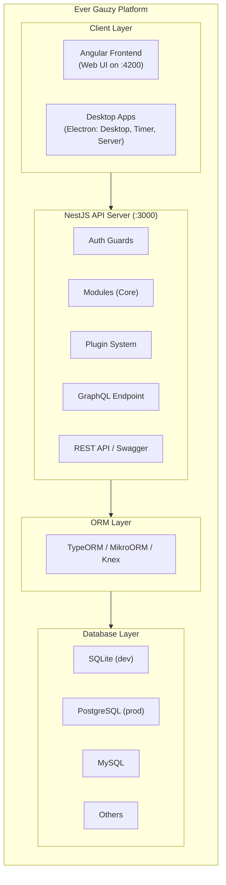

# Ever® Gauzy™ Platform

**Open-Source Business Management Platform (ERP/CRM/HRM)**

[Ever® Gauzy™](https://gauzy.co) is an **Open-Source Business Management Platform** designed for Collaborative, On-Demand, and Sharing Economies. It unifies multiple enterprise-grade modules into a single, cohesive platform:

- **Enterprise Resource Planning** (ERP) — invoicing, expenses, payments, inventory
- **Customer Relationship Management** (CRM) — contacts, leads, sales pipelines, deals
- **Human Resource Management** (HRM) — employee management, onboarding, awards
- **Applicant Tracking System** (ATS) — candidates, interviews, hiring workflows
- **Work & Project Management** (PM) — projects, tasks, sprints, goals, KPIs
- **Time Tracking & Productivity** — time logs, timesheets, activity monitoring, screenshots

## Why "Gauzy"?

The name "Gauzy" comes from the concept of **transparency**. The platform was originally created to enable fair and transparent profit sharing between an IT agency and its employees. Over time, it evolved into a comprehensive business management solution.

**Core values:**

- **Transparency** — share business metrics, compensation, and time tracking with stakeholders
- **Fairness** — fair employee compensation through profit-based and revenue-based bonus calculations
- **Open Source** — fully open-source with community and enterprise editions

## Key Highlights

| Feature                   | Description                                                               |
| ------------------------- | ------------------------------------------------------------------------- |
| **Full-Stack TypeScript** | Node.js/NestJS backend, Angular frontend                                  |
| **Multi-ORM Support**     | TypeORM, MikroORM, and Knex for maximum database flexibility              |
| **Multi-Database**        | SQLite (dev/demo), PostgreSQL, MySQL, MariaDB, and more                   |
| **Multi-Tenant**          | Built-in tenant isolation with automatic scoping                          |
| **Desktop Apps**          | Electron-based Desktop App, Timer, and Server for Windows/macOS/Linux     |
| **Cloud Native**          | Docker, Kubernetes, Terraform, and Pulumi support                         |
| **Plugin Architecture**   | Extensible with modular plugins for integrations and custom functionality |
| **MCP Server**            | AI-powered interactions via Model Context Protocol with 323+ tools        |
| **Headless APIs**         | REST (OpenAPI/Swagger) and GraphQL APIs for headless operation            |
| **Multi-Language**        | i18n support with Crowdin integration for 10+ languages                   |
| **Theming**               | Dark, Light, Corporate, Material, and custom themes                       |

## Platform Architecture

## Use Cases

### Who Should Use Gauzy?

- **IT Service Companies / Agencies** — track employee time, calculate profit-based bonuses, manage client billing
- **Small to Medium Businesses** — all-in-one ERP/CRM/HRM for daily operations
- **Freelancers & Contractors** — time tracking, invoicing, and client management
- **Remote Teams** — activity monitoring, desktop timer, and team collaboration
- **Startups** — project management, recruitment (ATS), and goal tracking
- **Open Source Projects** — free hosting and licensing for qualifying non-profit/open-source projects

### Industries

- Software Development & IT Services
- Consulting & Professional Services
- Marketing & Creative Agencies
- Education & Non-Profits
- Any business requiring time tracking, HR, and financial management

## Platform Components

- **Web Application** — Angular-based admin dashboard
- **REST & GraphQL API** — NestJS backend with multi-ORM support
- **Desktop Timer** — Electron app for time tracking with screenshots
- **Desktop Server** — Local API server for offline use
- **MCP Server** — AI assistant integration (323+ tools)
- **Browser Extension** — Quick time tracking from the browser

## Ecosystem

Ever® Gauzy™ is part of the larger [Ever® Platform](https://ever.co) ecosystem:

| Product                                                     | Description                                                                                |
| ----------------------------------------------------------- | ------------------------------------------------------------------------------------------ |
| **[Ever® Gauzy™](https://gauzy.co)**                        | Business Management Platform (this project)                                                |
| **[Ever® Teams™](https://github.com/ever-co/ever-teams)**   | Work & Project Management — React/Next.js + React Native frontend connecting to Gauzy APIs |
| **[Ever® Demand™](https://github.com/ever-co/ever-demand)** | On-Demand & Delivery Platform                                                              |

## Quick Links

- **[Quick Start](./quick-start)** — get running in minutes
- **[Installation](./installation)** — detailed setup guide
- **[Configuration](./configuration)** — configure environment variables, database, and services
- **[Architecture](../architecture/overview)** — understand the platform design
- **[API Reference](../api/overview)** — REST & GraphQL documentation
- **[Desktop Apps](../desktop/desktop-overview)** — timer and server apps
- **[Deployment](../deployment/deployment-overview)** — production deployment guides

## Links

- **Website**: [gauzy.co](https://gauzy.co)
- **SaaS**: [app.gauzy.co](https://app.gauzy.co) (Alpha)
- **Demo**: [demo.gauzy.co](https://demo.gauzy.co)
- **Downloads**: [gauzy.co/downloads](https://gauzy.co/downloads)
- **API Docs**: [api.gauzy.co/docs](https://api.gauzy.co/docs)
- **GitHub**: [ever-co/ever-gauzy](https://github.com/ever-co/ever-gauzy)
- **Discord**: [discord.gg/hKQfn4j](https://discord.gg/hKQfn4j)

## License

Ever Gauzy is available under the [AGPL-3.0 license](../licensing/licensing) for open-source use, with commercial licenses available for proprietary deployments.
