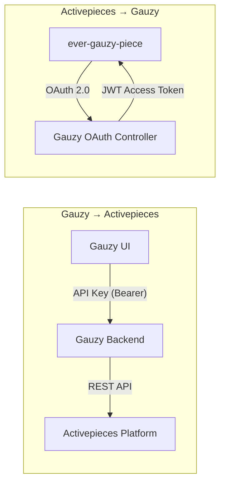
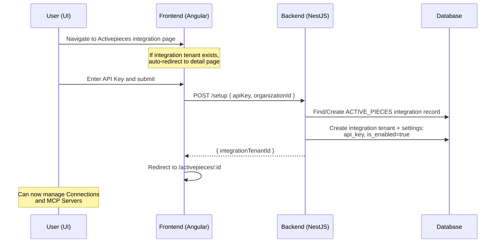
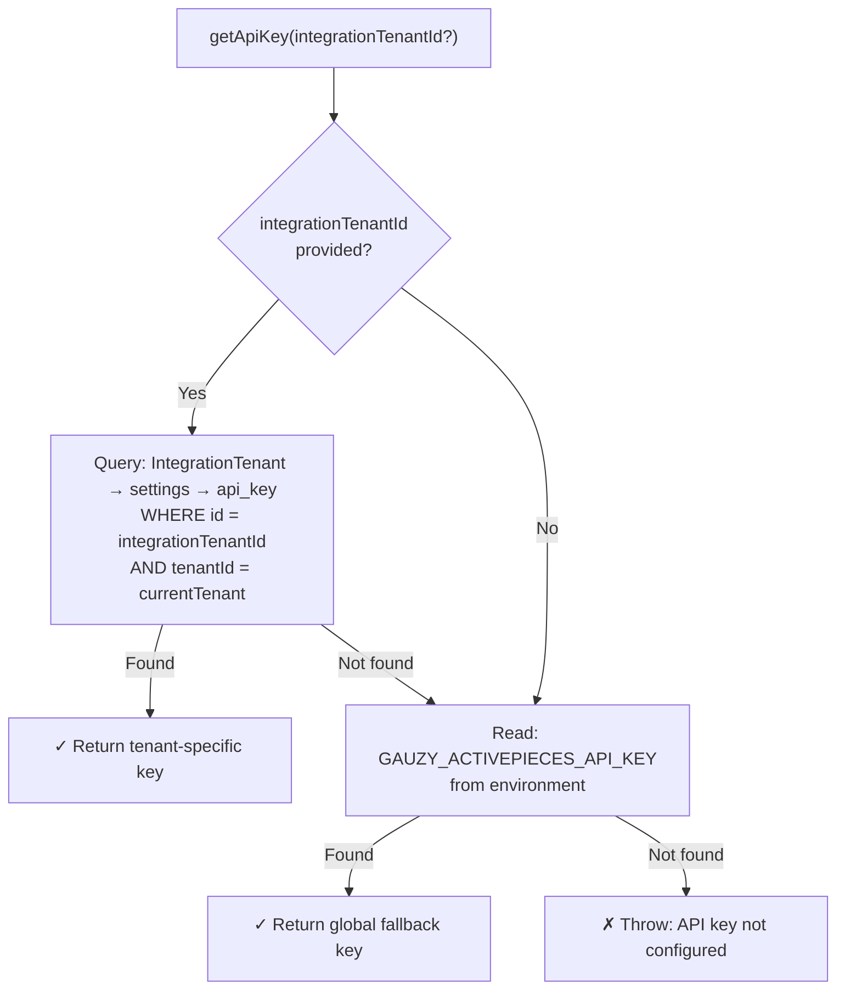
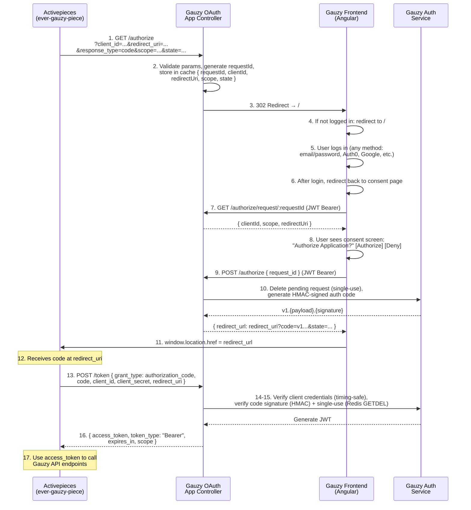

# Activepieces Integration

Bidirectional integration between Ever Gauzy and [Activepieces](https://www.activepieces.com/) — the open-source business automation tool.

:::info
This integration works in two directions:

- **Gauzy → Activepieces** (Plugin Integration): Gauzy manages Activepieces connections and MCP servers via the Activepieces API, authenticated with an API Key.
- **Activepieces → Gauzy** (OAuth App): The `ever-gauzy-piece` on Activepieces authenticates into Gauzy via an OAuth 2.0 Authorization Code flow.
  :::

## Architecture Overview



---

## Part 1: Gauzy → Activepieces (Plugin Integration)

This direction allows Gauzy users to manage their Activepieces connections and MCP servers from within the Gauzy UI. All API calls to the Activepieces platform are authenticated using an API Key sent as a Bearer token.

### Setup Flow



**Step-by-step:**

1. User navigates to the Activepieces integration page in Gauzy.
2. If an integration tenant already exists for the current organization, the UI auto-redirects to the integration detail page (remember state).
3. If not, the UI shows a form with a single API Key input field (password type).
4. User enters their Activepieces API key and submits. To get the API Key, users need to contact the sales team of Activepieces at `sales@activepieces.com`. Check the [Activepieces docs](https://www.activepieces.com/docs) for more information.
5. Frontend calls `POST /api/integration/activepieces/setup` with `{ apiKey, organizationId }`.
6. Backend creates/finds the base `ACTIVE_PIECES` integration record, then creates an integration tenant with the API key stored as a setting.
7. Backend returns `{ integrationTenantId }`.
8. Frontend navigates to `/pages/integrations/activepieces/:integrationTenantId`.
9. User can now manage Connections and MCP Servers from the tabbed interface.

### API Key Management and Tenant Isolation

The system supports multi-tenant API key isolation with a global fallback. Each tenant (organization) can have its own Activepieces API key, or the system can fall back to a shared global key.

#### Two-Tier API Key Resolution



#### How Each Method Resolves the API Key

| Method                    | How It Finds the Integration Tenant                 | Notes                                   |
| ------------------------- | --------------------------------------------------- | --------------------------------------- |
| `setupIntegration()`      | N/A (creates the tenant)                            | Stores the key                          |
| `upsertConnection()`      | Queries by `tenantId` + provider: `ACTIVE_PIECES`   | Resolved before API call                |
| `listConnections()`       | Receives `integrationId` from route parameter       | Passed by controller                    |
| `getConnection()`         | Receives `integrationTenantId` from route parameter | Direct lookup                           |
| `deleteConnection()`      | Receives `integrationTenantId` from route parameter | Direct lookup                           |
| MCP service (all methods) | Queries by `tenantId` + provider: `ACTIVE_PIECES`   | Direct lookup via private `getApiKey()` |

#### Tenant Isolation Guarantees

- Every database query includes a `tenantId` filter from `RequestContext.currentTenantId()`, which is derived from the authenticated user's JWT token.
- A tenant can only access their own integration tenant, settings, and connections.
- The `TenantPermissionGuard` on every controller endpoint enforces that the requesting user belongs to the tenant.
- Connection metadata includes `tenantId` and `organizationId` for filtering when listing connections from Activepieces.

#### Per-Tenant vs. Global API Key

| Scenario                                                              | Behavior                                                                    |
| --------------------------------------------------------------------- | --------------------------------------------------------------------------- |
| Tenant sets up via UI (enters API key)                                | Key is stored in DB per-tenant. All API calls for this tenant use this key. |
| Tenant has not set up, but `GAUZY_ACTIVEPIECES_API_KEY` is configured | Falls back to the global key. Useful for shared/demo deployments.           |
| Neither configured                                                    | API calls fail with `"Activepieces API key not configured"`.                |

### Connection Management

Once setup is complete, tenants can create connections between Gauzy and Activepieces projects.

**Creating a Connection** (`POST /api/integration/activepieces/connection`):

- Requires: `accessToken` (Gauzy access token for the piece), `projectId` (Activepieces project ID)
- Creates a `SECRET_TEXT` type connection on Activepieces with:
  - `externalId`: `gauzy-tenant-{tenantId}-org-{organizationId}`
  - `pieceName`: `Ever-gauzy`
  - `metadata`: `{ tenantId, organizationId, createdAt, gauzyVersion }`
- Stores connection details (connection ID, project IDs, access token) in integration tenant settings

**Listing Connections** (`GET /api/integration/activepieces/connections/:integrationId`):

- Supports pagination (`cursor`, `limit`) and filtering (`pieceName`, `displayName`, `status`, `scope`)
- Tenant connections filtered by `metadata.tenantId`

**Deleting a Connection** (`DELETE /api/integration/activepieces/connection/:integrationId`):

- Removes the connection from Activepieces via their API

### MCP Server Management

Tenants can view and manage MCP (Model Context Protocol) servers on Activepieces.

- **List servers**: filtered by project ID
- **Update server**: modify name and tool configurations
- **Rotate token**: generate a new authentication token for the MCP server
- **Security**: The controller sanitizes responses by removing the `token` field before returning to the frontend

### Backend API Endpoints

All endpoints are prefixed with `/api/integration/activepieces` and guarded by `TenantPermissionGuard`.

:::tip
While these endpoints cover connections and MCP servers, refer to the [Activepieces Piece Schema](https://www.activepieces.com/docs/developers/piece-reference/piece-schema) for the full Activepieces API surface.
:::

#### Plugin Endpoints

| Method   | Path                                            | Permission           | Description                           |
| -------- | ----------------------------------------------- | -------------------- | ------------------------------------- |
| `POST`   | `/setup`                                        | `INTEGRATION_ADD`    | Set up integration with API key       |
| `POST`   | `/connection`                                   | `INTEGRATION_ADD`    | Create/update Activepieces connection |
| `GET`    | `/connections/:integrationId`                   | `INTEGRATION_VIEW`   | List connections for a project        |
| `GET`    | `/connections/tenant/:integrationId/:projectId` | `INTEGRATION_VIEW`   | Get tenant-specific connections       |
| `GET`    | `/connection/:integrationId`                    | `INTEGRATION_VIEW`   | Get connection details                |
| `DELETE` | `/connection/:integrationId`                    | `INTEGRATION_DELETE` | Delete a connection                   |
| `GET`    | `/status/:integrationId`                        | `INTEGRATION_VIEW`   | Check if integration is enabled       |
| `GET`    | `/integration-tenant/:integrationId`            | `INTEGRATION_VIEW`   | Get integration tenant info           |

#### MCP Endpoints

| Method  | Path                    | Permission         | Description             |
| ------- | ----------------------- | ------------------ | ----------------------- |
| `GET`   | `/mcp`                  | `INTEGRATION_VIEW` | List MCP servers        |
| `GET`   | `/mcp/tenant`           | `INTEGRATION_VIEW` | Get tenant MCP servers  |
| `GET`   | `/mcp/:serverId`        | `INTEGRATION_VIEW` | Get MCP server details  |
| `PATCH` | `/mcp/:serverId`        | `INTEGRATION_EDIT` | Update MCP server       |
| `POST`  | `/mcp/:serverId/rotate` | `INTEGRATION_EDIT` | Rotate MCP server token |

### UI Routes

```
/pages/integrations/activepieces
├── /                    → Authorize page (auto-redirects if already set up)
├── /regenerate          → Authorize page (no auto-redirect, for re-setup)
└── /:id                 → Integration detail page
    ├── /connections     → Manage Activepieces connections
    └── /mcp-servers     → Manage MCP servers
```

### Configuration

| Variable                     | Description                                                                     | Default                          |
| ---------------------------- | ------------------------------------------------------------------------------- | -------------------------------- |
| `ACTIVEPIECES_BASE_URL`      | Activepieces platform API base URL                                              | `https://cloud.activepieces.com` |
| `GAUZY_ACTIVEPIECES_API_KEY` | Global fallback API key (we will need to set our own API Key as the global one) | —                                |

---

## Part 2: Activepieces → Gauzy (OAuth App)

This direction allows the `ever-gauzy-piece` on Activepieces to authenticate users into Gauzy. It implements a standard OAuth 2.0 Authorization Code Grant ([RFC 6749](https://datatracker.ietf.org/doc/html/rfc6749)) with HMAC-signed codes, single-use enforcement, and JWT access tokens.

:::important
The OAuth App flow is completely independent of Auth0 or any other social login provider. Auth0 is a third-party identity provider used for Gauzy's own user login — it is a separate concern and is not involved in the OAuth App flow. Users authenticate via Gauzy's standard login (email/password, social login, or any other method) before approving the OAuth authorization request.
:::

### Design Principles

- **Separation of concerns**: The OAuth App has its own dedicated controller (`OAuthAppController`) and endpoints. It does not reuse or depend on any social auth callback (Auth0, Google, GitHub, etc.).
- **Provider-agnostic authentication**: The user can log in via any method supported by Gauzy. The OAuth App flow only requires a valid JWT token — it does not care how the user obtained it.
- **Cache-based state**: Pending authorization requests are stored in Redis/cache (not Express sessions), making the flow stateless and safe for multi-instance deployments.
- **Frontend consent page**: A dedicated Angular component (`OAuthAuthorizeComponent`) presents the consent screen, giving the user visibility into what they are approving.

### OAuth Authorization Code Flow



**Step-by-step:**

1. The `ever-gauzy-piece` on Activepieces redirects the user's browser to `GET /api/integration/ever-gauzy/oauth/authorize` with `client_id`, `redirect_uri`, `response_type=code`, optional `scope` and `state`.
2. The `OAuthAppController` validates all parameters: `client_id` matches config, `redirect_uri` is in the allowlist, `response_type` is `"code"`. A unique `requestId` is generated (32 random bytes, base64url-encoded) and the pending request is stored in Redis/cache with a 10-minute TTL.
3. The backend redirects the browser to the Gauzy frontend consent page: `/#/auth/oauth-authorize?request_id=<requestId>`.
4. The `OAuthAuthorizeComponent` loads and calls `GET /api/integration/ever-gauzy/oauth/authorize/request/:requestId` (with JWT Bearer token) to fetch the pending request details. If the user is not logged in (401 response), the component stores the `request_id` in sessionStorage and redirects to `/#/auth/login`.
5. The user logs in via any supported method (email/password, Auth0, Google, GitHub, etc.). The OAuth App flow does not prescribe or depend on any specific login method.
6. After successful login, the sign-in-success component checks sessionStorage for a pending OAuth request. If found, it redirects the user back to `/#/auth/oauth-authorize?request_id=<requestId>` instead of the dashboard.
7. The consent page now successfully loads the pending request details (`clientId`, `scope`, `redirectUri`) and displays the consent screen.
8. The user sees what the third-party application is requesting and can choose to **Authorize** or **Deny**.
9. If the user clicks **Authorize**, the frontend calls `POST /api/integration/ever-gauzy/oauth/authorize` with `{ request_id }` (JWT automatically attached by the `TokenInterceptor`). If the user clicks **Deny**, the frontend redirects to the `redirect_uri` with `?error=access_denied`.
10. The backend deletes the pending request from cache (single-use enforcement), extracts the user's identity from the JWT token (`userId`, `tenantId`), and generates an HMAC-signed authorization code with a 10-minute TTL stored in Redis/cache.
11. The backend returns `{ redirect_url }` containing the `redirect_uri` with `?code=...&state=...` parameters.
12. The frontend redirects the browser to the `redirect_url`, sending the user back to Activepieces with the authorization code.
13. Activepieces exchanges the code by calling `POST /api/integration/ever-gauzy/oauth/token` with the `code`, `client_id`, `client_secret`, and `redirect_uri`.
14. The backend validates client credentials using timing-safe comparison.
15. The authorization code is verified: HMAC signature check (timing-safe), expiration check, context match (`client_id`, `redirect_uri`), and single-use enforcement via Redis `GETDEL` (atomic).
16. A JWT access token is generated and returned to Activepieces.
17. The `ever-gauzy-piece` uses this token as Bearer auth to call Gauzy API endpoints on behalf of the authenticated user.

### OAuth App Backend API Endpoints

All endpoints are prefixed with `/api/integration/ever-gauzy/oauth`.

| Method | Path                            | Auth         | Description                                                                                 |
| ------ | ------------------------------- | ------------ | ------------------------------------------------------------------------------------------- |
| `GET`  | `/authorize`                    | Public       | Validates OAuth params, stores pending request in cache, redirects to frontend consent page |
| `GET`  | `/authorize/request/:requestId` | JWT (Bearer) | Returns pending request details (`clientId`, `scope`, `redirectUri`) for the consent page   |
| `POST` | `/authorize`                    | JWT (Bearer) | User approves the request; generates authorization code and returns redirect URL            |
| `POST` | `/token`                        | Public       | Exchanges authorization code for JWT access token (RFC 6749 compliant)                      |

### OAuth App Frontend Routes

| Route                                     | Description                                           |
| ----------------------------------------- | ----------------------------------------------------- |
| `/#/auth/oauth-authorize?request_id=<id>` | Consent page (shows app info, Authorize/Deny buttons) |
| `/#/auth/login`                           | Standard login page (any auth method)                 |

### Authorization Code Security

The authorization code format is `v1.{base64url_payload}.{base64url_signature}`.

**Payload structure:**

```json
{
  "jti": "<random 32-byte base64url>",
  "userId": "<user ID>",
  "tenantId": "<tenant ID>",
  "clientId": "<OAuth client ID>",
  "redirectUri": "<redirect URI>",
  "scope": "<requested scope>",
  "exp": "<unix timestamp, now + 600s>"
}
```

**Security mechanisms:**

| Mechanism                                    | Purpose                                                                                                                               |
| -------------------------------------------- | ------------------------------------------------------------------------------------------------------------------------------------- |
| HMAC-SHA256 signing                          | Prevents code tampering; `codeSecret` is server-side only                                                                             |
| Timing-safe comparison                       | Prevents timing side-channel attacks on signature and client secret verification                                                      |
| Single-use enforcement (authorization codes) | Redis `GETDEL` atomically retrieves and deletes the code marker, preventing replay attacks                                            |
| Single-use enforcement (pending requests)    | Pending request is deleted from cache when the user approves, preventing replay of the `request_id`                                   |
| 10-minute TTL (codes and pending requests)   | Both codes and pending requests expire quickly, reducing the window for interception                                                  |
| JWT-protected approve endpoint               | Only authenticated users can approve an authorization request; user identity is derived from the JWT, not from a session              |
| Redirect URI allowlist                       | Validated at `GET /authorize` (initial request) and again at `POST /token` (code exchange)                                            |
| Cache-based state (no sessions)              | Pending requests stored in Redis/cache instead of Express sessions, making the flow stateless and safe for multi-instance deployments |

### Redis and Cache

Authorization codes are stored for single-use enforcement:

- **Redis (preferred)**: Uses `SET key "valid" PX 600000` to store, `GETDEL key` to atomically retrieve and delete during exchange.
- **Cache-manager (fallback)**: Uses `set(key, "valid", ttl)` then `get(key)` + `del(key)` (non-atomic but functional for single-instance deployments).

The `RedisModule` is a global NestJS module that:

- Reads `REDIS_ENABLED`, `REDIS_URL`, `REDIS_HOST`, `REDIS_PORT`, `REDIS_TLS`, `REDIS_USER`, `REDIS_PASSWORD` from environment
- If `REDIS_ENABLED !== "true"` or connection details are missing, the Redis client is `null` (disabled)
- If connection fails at runtime, falls back to cache-manager with a warning log

### OAuth App Configuration

The OAuth App requires four configuration values:

| Config Key     | Environment Variable            | Description                                                         |
| -------------- | ------------------------------- | ------------------------------------------------------------------- |
| `clientId`     | `GAUZY_OAUTH_APP_CLIENT_ID`     | Identifies the OAuth client (shared with Activepieces piece config) |
| `clientSecret` | `GAUZY_OAUTH_APP_CLIENT_SECRET` | Authenticates the client during token exchange                      |
| `codeSecret`   | `GAUZY_OAUTH_APP_CODE_SECRET`   | HMAC secret for signing authorization codes                         |
| `redirectUris` | `GAUZY_OAUTH_APP_REDIRECT_URIS` | Comma-separated allowlist of valid redirect URIs                    |

---

## Environment Variables Reference

### Activepieces Plugin (Gauzy → Activepieces)

| Variable                     | Required | Description                                                                     | Default                          |
| ---------------------------- | :------: | ------------------------------------------------------------------------------- | -------------------------------- |
| `ACTIVEPIECES_BASE_URL`      |    No    | Activepieces platform URL                                                       | `https://cloud.activepieces.com` |
| `GAUZY_ACTIVEPIECES_API_KEY` |   No\*   | Global API key for Activepieces API calls (provided by Activepieces sales team) | —                                |

\*Required if no tenant-specific API key is set up via the UI.

### OAuth App (Activepieces → Gauzy)

| Variable                        | Required | Description                            | Example                                   |
| ------------------------------- | :------: | -------------------------------------- | ----------------------------------------- |
| `GAUZY_OAUTH_APP_CLIENT_ID`     |   Yes    | OAuth client identifier                | `8012eaea-b166-...`                       |
| `GAUZY_OAUTH_APP_CLIENT_SECRET` |   Yes    | OAuth client secret                    | `5b9d261d96b5...`                         |
| `GAUZY_OAUTH_APP_CODE_SECRET`   |   Yes    | HMAC secret for code signing           | `TECP7Ooa2WN7tN5Z...`                     |
| `GAUZY_OAUTH_APP_REDIRECT_URIS` |   Yes    | Comma-separated redirect URI allowlist | `https://cloud.activepieces.com/redirect` |

### Redis (Optional, for Multi-Instance Deployments)

| Variable         | Required | Description                                     | Default     |
| ---------------- | :------: | ----------------------------------------------- | ----------- |
| `REDIS_ENABLED`  |    No    | Enable Redis client                             | `false`     |
| `REDIS_URL`      |    No    | Full Redis connection URL (overrides host/port) | —           |
| `REDIS_HOST`     |    No    | Redis host                                      | `localhost` |
| `REDIS_PORT`     |    No    | Redis port                                      | `6379`      |
| `REDIS_TLS`      |    No    | Use TLS (`"true"` for `rediss://`)              | `false`     |
| `REDIS_USER`     |    No    | Redis username                                  | —           |
| `REDIS_PASSWORD` |    No    | Redis password                                  | —           |

---

## Summary

Ever Gauzy integrates with Activepieces in two directions:

- **Gauzy → Activepieces (Plugin Integration)**: Gauzy users manage their Activepieces connections and MCP servers directly from the Gauzy UI. Authentication uses an API Key sent as a Bearer token to the Activepieces API. Each tenant can provide their own API key through the setup form — if none is provided, the system falls back to a global key (`GAUZY_ACTIVEPIECES_API_KEY`). This ensures tenant isolation: every tenant's data, connections, and API keys are scoped to their own organization, enforced by the `TenantPermissionGuard` and `RequestContext` on every request.

- **Activepieces → Gauzy (OAuth App)**: The `ever-gauzy-piece` on Activepieces authenticates users into Gauzy using a standard OAuth 2.0 Authorization Code flow ([RFC 6749](https://datatracker.ietf.org/doc/html/rfc6749)). When a user connects the piece, they are redirected to Gauzy's dedicated consent page, log in via any supported method (email/password, Auth0, Google, etc.), approve the authorization request, and are sent back to Activepieces with an authorization code. Activepieces exchanges that code for a JWT access token, which it then uses to call Gauzy API endpoints on behalf of the user. The OAuth App flow is completely independent of any specific identity provider — it has its own controller, endpoints, and frontend consent page. The flow is secured with HMAC-signed codes, timing-safe verification, single-use enforcement (via Redis), JWT-protected approve endpoint, cache-based state management, and redirect URI allowlisting.

## Related Pages

- [Integrations Overview](./integrations-overview)
- [Custom Integrations](./custom-integrations)
- [Integration Endpoints](../api/integration-endpoints)
- [Authentication Flows](../security/authentication-flows)
- [Token Lifecycle](../security/token-lifecycle)
