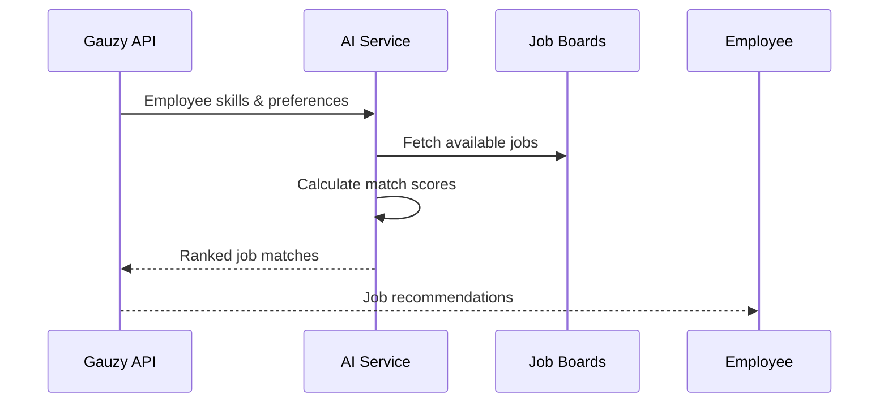

# Gauzy AI Integration

Integrate the Gauzy AI service for intelligent matching, analytics, and automation.

## Overview

Gauzy AI provides:

- **Job Matching** — AI-powered job-to-employee matching
- **Skill Analysis** — automated skill gap detection
- **Smart Suggestions** — task assignment recommendations
- **Employee Analytics** — productivity insights

## Configuration

```
GAUZY_AI_GRAPHQL_ENDPOINT=https://ai.gauzy.co/graphql
GAUZY_AI_API_KEY=your-api-key
GAUZY_AI_API_SECRET=your-api-secret
```

## GraphQL API

The AI service exposes a GraphQL endpoint:

```graphql
query {
  employeeJobPosts(filter: { employeeId: "employee-uuid", isActive: true }) {
    items {
      title
      matchScore
      skills
    }
  }
}
```

## Job Matching Flow



## Features

| Feature          | Description                  |
| ---------------- | ---------------------------- |
| Job matching     | Score employees against jobs |
| Skill extraction | Extract skills from profiles |
| Auto-apply       | Automated job applications   |
| Analytics        | Work pattern insights        |

## Related Pages

- [Job Board Plugins](../plugins/plugins-built-in/job-board-plugins) — job plugins
- [Employee Statistics](../api/employee-sub-resource-endpoints) — employee stats
