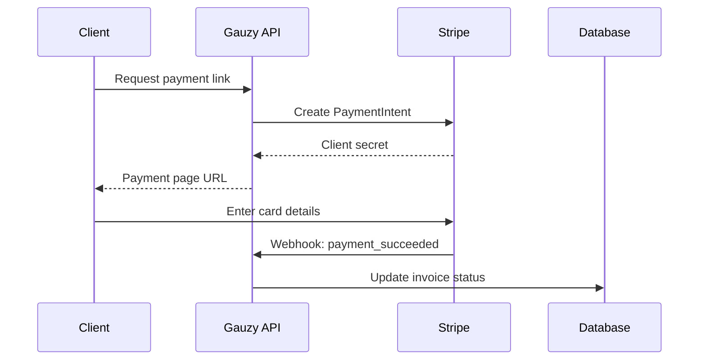

# Payment Gateway Integration

Connect payment processors for online invoice payments.

## Overview

Gauzy supports integrating payment gateways for:

- Online invoice payments
- Subscription billing
- Payment link generation

## Supported Gateways

| Gateway  | Status    | Features                |
| -------- | --------- | ----------------------- |
| Stripe   | Available | Cards, ACH, invoices    |
| PayPal   | Available | PayPal balance, cards   |
| RazorPay | Available | UPI, cards, net banking |

## Stripe Setup

### 1. Create Stripe Account

1. Go to [stripe.com](https://stripe.com)
2. Get your API keys from Dashboard → Developers

### 2. Configure

```
STRIPE_API_KEY=sk_live_...
STRIPE_SECRET_KEY=sk_live_...
STRIPE_WEBHOOK_SECRET=whsec_...
```

### 3. Webhook Events

Configure Stripe webhooks to receive payment notifications:

```
https://api.example.com/api/payment/webhook/stripe
```

Events to subscribe:

- `payment_intent.succeeded`
- `payment_intent.payment_failed`
- `invoice.paid`

## PayPal Setup

```
PAYPAL_CLIENT_ID=your-client-id
PAYPAL_CLIENT_SECRET=your-secret
PAYPAL_MODE=sandbox  # or 'live'
```

## Payment Flow



## Related Pages

- [Invoice Endpoints](../api/invoice-endpoints) — invoice API
- [Payment Endpoints](../api/payment-endpoints) — payment API
- [Invoicing Feature](../features/invoicing) — invoicing
