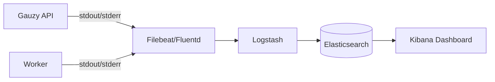

# Log Aggregation with ELK Stack

Centralize logs using Elasticsearch, Logstash, and Kibana.

## Architecture



## Docker Compose Setup

```yaml
elasticsearch:
  image: docker.elastic.co/elasticsearch/elasticsearch:8.11.0
  environment:
    - discovery.type=single-node
    - xpack.security.enabled=false
  ports:
    - "9200:9200"
  volumes:
    - esdata:/usr/share/elasticsearch/data

kibana:
  image: docker.elastic.co/kibana/kibana:8.11.0
  ports:
    - "5601:5601"
  depends_on:
    - elasticsearch

filebeat:
  image: docker.elastic.co/beats/filebeat:8.11.0
  volumes:
    - /var/lib/docker/containers:/var/lib/docker/containers:ro
    - ./filebeat.yml:/usr/share/filebeat/filebeat.yml
  depends_on:
    - elasticsearch

volumes:
  esdata:
```

## Filebeat Configuration

```yaml
# filebeat.yml
filebeat.inputs:
  - type: container
    paths:
      - /var/lib/docker/containers/*/*.log
    processors:
      - add_docker_metadata: ~

output.elasticsearch:
  hosts: ["elasticsearch:9200"]
  index: "gauzy-logs-%{+yyyy.MM.dd}"
```

## Structured Logging

Gauzy outputs JSON logs when `LOG_FORMAT=json`:

```json
{
  "level": "info",
  "message": "Request processed",
  "method": "GET",
  "url": "/api/employee",
  "statusCode": 200,
  "duration": 45,
  "tenantId": "uuid",
  "timestamp": "2025-01-15T10:30:00Z"
}
```

## Kibana Queries

| Query               | Finds                |
| ------------------- | -------------------- |
| `level: "error"`    | All errors           |
| `statusCode >= 500` | Server errors        |
| `duration > 1000`   | Slow requests (>1s)  |
| `tenantId: "uuid"`  | Tenant-specific logs |

## Related Pages

- [Prometheus Metrics](./prometheus-metrics) — metrics
- [Sentry Error Tracking](./sentry-error-tracking) — error monitoring
- [Performance Troubleshooting](../troubleshooting/performance-issues) — performance
