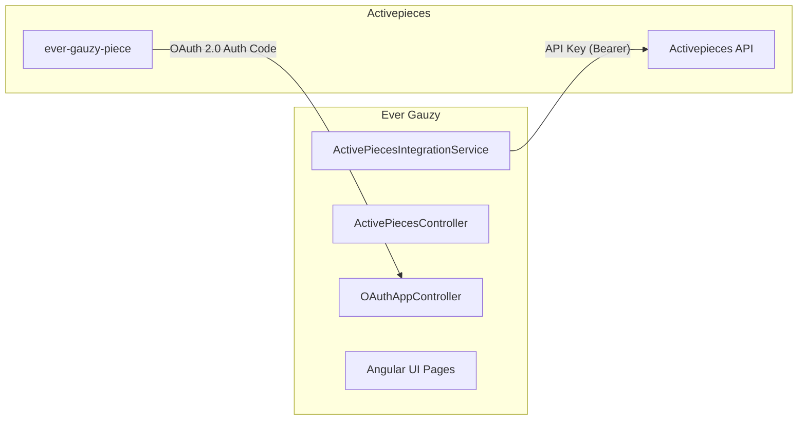
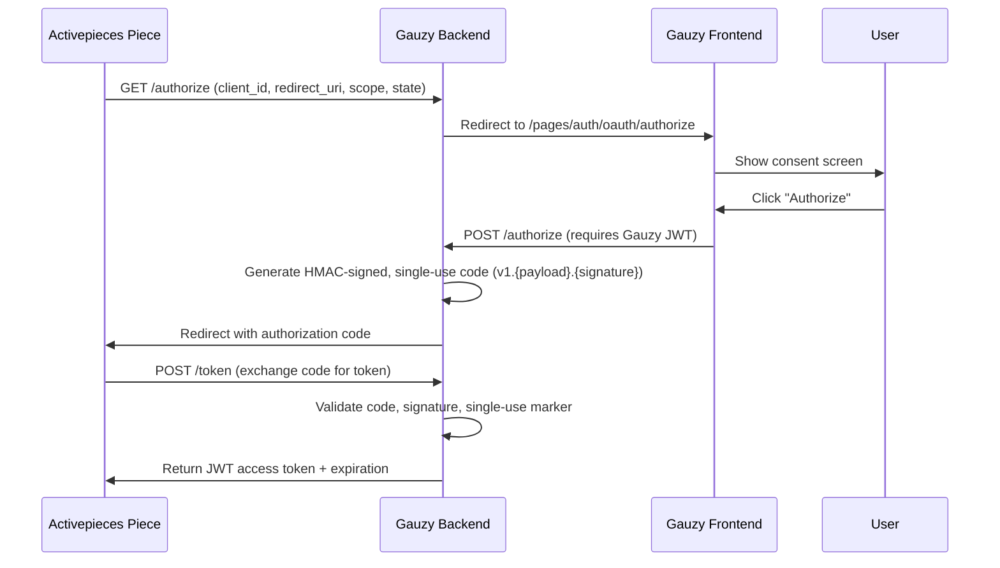

# Activepieces Plugin

Open-source automation alternative to Zapier and Make with **bidirectional** integration — Gauzy manages Activepieces resources, and the `ever-gauzy-piece` on Activepieces authenticates back into Gauzy via OAuth 2.0.

## Overview

| Property       | Value                                            |
| -------------- | ------------------------------------------------ |
| **Package**    | `@ever-co/gauzy-plugin-integration-activepieces` |
| **Source**     | `packages/plugins/integration-activepieces`      |
| **UI Package** | `packages/plugins/integration-activepieces-ui`   |

## Why Activepieces?

| Feature        | Activepieces | Zapier  |  Make   |
| -------------- | :----------: | :-----: | :-----: |
| Open Source    |      ✅      |   ❌    |   ❌    |
| Self-Hosted    |      ✅      |   ❌    |   ❌    |
| Free Tier      |  Unlimited   | Limited | Limited |
| Visual Builder |      ✅      |   ✅    |   ✅    |
| Custom Pieces  |      ✅      |   ✅    |   ✅    |

## Architecture

The integration is **bidirectional**:



| Direction                | Purpose                                           | Authentication                                | Isolation                                                    |
| ------------------------ | ------------------------------------------------- | --------------------------------------------- | ------------------------------------------------------------ |
| **Gauzy → Activepieces** | Manage AP connections & MCP servers from Gauzy UI | API Key (Bearer token)                        | Multi-tenant; per-tenant keys or global fallback             |
| **Activepieces → Gauzy** | `ever-gauzy-piece` calls Gauzy APIs securely      | OAuth 2.0 Authorization Code Grant (RFC 6749) | HMAC-signed codes, single-use enforcement, JWT access tokens |

---

## Part 1: Gauzy → Activepieces (Plugin Integration)

### Setup Flow

1. **Obtain API Key** — get a key from Activepieces (via `sales@activepieces.com` or the platform dashboard).
2. **Plugin Setup** — navigate to `/pages/integrations/activepieces` and submit the API key via `POST /api/integration/activepieces/setup`. The backend creates/updates an `IntegrationTenant` record for the current Gauzy tenant, storing the API key in the settings.
3. **Tenant Isolation** — all queries include `tenantId` filtering derived from the authenticated user's JWT. `TenantPermissionGuard` ensures only authorized users can modify settings.

### Connection Management

| Operation         | Endpoint                                                 | Notes                                                                         |
| ----------------- | -------------------------------------------------------- | ----------------------------------------------------------------------------- |
| **Create/Upsert** | `POST /api/v1/app-connections` (on AP via Gauzy backend) | Auto-adds `tenantId`, `organizationId`, `gauzyVersion`; type is `SECRET_TEXT` |
| **List**          | `GET /api/v1/app-connections`                            | Filter by `pieceName`, `displayName`, and Gauzy `tenantId`                    |
| **Delete**        | `DELETE /api/v1/app-connections/:id`                     | —                                                                             |

### MCP Server Management

Gauzy manages Model Context Protocol (MCP) servers on the Activepieces platform:

- **List** servers by project
- **Rotate** authentication tokens
- **Update** server tool configurations

:::tip
Response tokens are sanitized before being sent to the frontend for security.
:::

### Backend API Endpoints

All endpoints are prefixed with `/api/integration/activepieces`.

| Method   | Path                          | Description                                       |
| -------- | ----------------------------- | ------------------------------------------------- |
| `POST`   | `/setup`                      | Set up Activepieces integration with API key      |
| `POST`   | `/connection`                 | Create or update an Activepieces connection       |
| `GET`    | `/connections/:integrationId` | List available connections for a specific project |
| `GET`    | `/connection/:integrationId`  | Get specific connection details                   |
| `DELETE` | `/connection/:integrationId`  | Remove a connection                               |

---

## Part 2: Activepieces → Gauzy (OAuth App)

### OAuth 2.0 Authorization Code Flow



**Step-by-step:**

1. **Authorize Request** — `GET /authorize` with `client_id`, `redirect_uri`, `scope`, `state`.
2. **User Consent** — backend validates the request and redirects to `/pages/auth/oauth/authorize`.
3. **Approval** — user clicks "Authorize"; frontend calls `POST /authorize` (requires a Gauzy JWT).
4. **Code Generation** — backend generates an HMAC-signed, single-use authorization code: `v1.{payload}.{signature}`.
5. **Redirect** — user is redirected back to Activepieces with the code.
6. **Token Exchange** — Activepieces calls `POST /token`; backend validates code, signature, and single-use marker in cache.
7. **Response** — returns a Gauzy Access Token (JWT) and expiration.

### Security Details

| Mechanism                   | Description                                                                                      |
| --------------------------- | ------------------------------------------------------------------------------------------------ |
| **Single-Use Codes**        | Authorization codes are stored in cache (Redis) and deleted atomically via `GETDEL` on first use |
| **HMAC Signature**          | Codes are signed with `GAUZY_OAUTH_APP_CODE_SECRET` to prevent tampering                         |
| **Authorization TTL**       | Pending authorization requests expire after **10 minutes**                                       |
| **Code TTL**                | Authorization codes expire after **1 minute**                                                    |
| **Redirect URI Validation** | Enforced at both authorize and token exchange phases against an allowlist                        |

---

## Configuration

### Activepieces Plugin (Gauzy → Activepieces)

```bash
# Activepieces platform base URL (default: https://cloud.activepieces.com)
ACTIVEPIECES_BASE_URL=https://cloud.activepieces.com

# Activepieces API endpoint (default: https://api.activepieces.com/v1)
GAUZY_ACTIVEPIECES_API_URL=https://api.activepieces.com/v1

# Global API key — fallback if no per-tenant key is configured
GAUZY_ACTIVEPIECES_API_KEY=
```

### OAuth App (Activepieces → Gauzy)

```bash
# OAuth client identifier
GAUZY_OAUTH_APP_CLIENT_ID=8012eaea-b166-...

# Client authentication secret
GAUZY_OAUTH_APP_CLIENT_SECRET=5b9d261d96b5...

# HMAC secret for signing authorization codes
GAUZY_OAUTH_APP_CODE_SECRET=TECP70oa2WN...

# Comma-separated redirect URI allowlist
GAUZY_OAUTH_APP_REDIRECT_URIS=https://cloud.activepieces.com/redirect
```

:::tip
For multi-instance deployments, enable Redis for cache-based state management:

```bash
REDIS_ENABLED=true
REDIS_URL=redis://localhost:6379  # or REDIS_HOST / REDIS_PORT
REDIS_TLS=true                    # for TLS connections (rediss://)
```

:::

## Features

- **Self-Hosted Automation** — run workflows on your own infrastructure
- **Data Privacy** — no data leaves your servers
- **Unlimited Flows** — no per-flow pricing
- **Custom Pieces** — build Gauzy-specific automation blocks
- **Webhooks** — trigger flows from Gauzy events

## Supported Pieces

### Triggers

- Employee created/updated
- Time log recorded
- Task status changed
- Invoice generated

### Actions

- Create/update employee
- Log time entry
- Create/update task
- Generate invoice
- Send notification

## Related Pages

- [Plugins Overview](./plugins-overview)
- [Zapier Plugin](./zapier-plugin)
- [Make Plugin](./make-plugin)
- [Integrations Overview](../integrations/integrations-overview)
- [Configuration Reference](../getting-started/configuration#activepieces)
