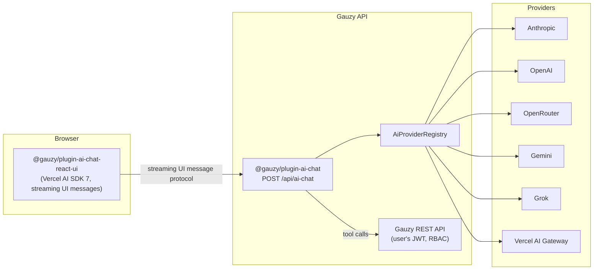

# AI Chat Plugin

Backend and frontend plugins powering the embedded [AI Agent Chat](../features/ai-agent-chat) — a provider-pluggable AI assistant that answers questions about tenant data and operates the platform UI with user approval.

## Overview

| Property             | Value                                     |
| -------------------- | ----------------------------------------- |
| **Package**          | `@gauzy/plugin-ai-chat`                   |
| **Source**           | `packages/plugins/ai-chat`                |
| **UI Package**       | `@gauzy/plugin-ai-chat-react-ui`          |
| **UI Source**        | `packages/plugins/ai-chat-react-ui`       |
| **API Endpoints**    | See [API Endpoints](#api-endpoints) below |

## API Endpoints

| Endpoint                                   | Purpose                                                      |
| ------------------------------------------ | ------------------------------------------------------------ |
| `POST /api/ai-chat`                        | One chat turn as a streaming UI message response             |
| `GET /api/ai-chat/config`                  | Feature/provider availability for the current tenant (no secrets) |
| `POST /api/ai-chat/transcribe`             | Speech-to-text for the chat's voice dictation (25 MB limit)  |
| `POST /api/ai-chat/attachments`            | Fallback chat-local file storage when the Documents feature is unavailable (uploads normally go straight to the Documents upload endpoint with source `CHAT`) |
| `GET /api/ai-chat/providers/:id/models`    | A provider's model catalogue, for the settings model picker  |
| `GET`/`POST`/`PUT`/`DELETE` `/api/ai-chat/credentials` | Per-tenant BYOK credential management (keys masked on read) |
| `POST /api/ai-chat/credentials/connect`    | Completes a provider "Connect" flow (OpenRouter PKCE) server-side |
| `GET`/`DELETE` `/api/ai-chat/conversations` | Per-user chat history                                        |

## Providers

Each AI provider is its own plugin implementing `IAiChatProviderDefinition`, registered in the `AiProviderRegistry`:

| Provider              | Status                | Default Model               |
| --------------------- | --------------------- | --------------------------- |
| **Anthropic**         | Default               | `claude-sonnet-5`           |
| **OpenAI**            | Supported (also powers voice dictation) | `gpt-5.5` |
| **OpenRouter**        | Supported (Connect flow + optional shared free tier) | `anthropic/claude-sonnet-5` |
| **Google Gemini**     | Supported             | `gemini-3.5-flash`          |
| **xAI Grok**          | Supported             | `grok-4.3`                  |
| **Vercel AI Gateway** | Supported             | `anthropic/claude-sonnet-5` |
| **Gauzy AI**          | Placeholder           | —                           |

:::note
The Gauzy AI provider is currently a placeholder — chat traffic is not yet routed through the [Gauzy AI server](./ai-plugin). Use one of the other providers.
:::

## Configuration

There are two ways to configure provider credentials. **Per-tenant keys take precedence** over server environment variables.

### Option 1: Per-tenant BYOK (recommended for multi-tenant)

Users with the `AI_CHAT_SETTINGS` permission can add provider API keys under **Settings → AI Providers**. Keys are stored encrypted at rest using the server's `ENCRYPTION_KEY`.

### Option 2: Server environment variables

```bash
# Enable the AI chat feature
GAUZY_AI_CHAT_ENABLED=true

# Default provider and model
GAUZY_AI_CHAT_DEFAULT_PROVIDER=anthropic
GAUZY_AI_CHAT_DEFAULT_MODEL=claude-sonnet-5

# Provider API keys (set the ones you use)
ANTHROPIC_API_KEY=sk-ant-...
OPENAI_API_KEY=sk-...
OPENROUTER_API_KEY=sk-or-...
GEMINI_API_KEY=...            # or GOOGLE_GENERATIVE_AI_API_KEY
XAI_API_KEY=...               # or GROK_API_KEY
AI_GATEWAY_API_KEY=...

# Optional: custom base URLs per provider
# ANTHROPIC_BASE_URL=...
# OPENAI_BASE_URL=...
# OPENROUTER_BASE_URL=...
```

### Option 3: Shared free tier (operator-provided)

```bash
# A platform-supplied OpenRouter key shared by all tenants that have no key of
# their own. Restricted to the provider's FREE models — enforced server-side.
OPENROUTER_PLATFORM_API_KEY=sk-or-...
```

The platform key is resolved **last** — after the tenant's own key and after the operator's `OPENROUTER_API_KEY` — so it never downgrades anyone who brought a paid key. When a shared free-tier request is rate-limited, the chat tells the user and suggests adding their own key.

### Advanced options

| Variable                     | Description                                                                 |
| ---------------------------- | --------------------------------------------------------------------------- |
| `GAUZY_AI_CHAT_MCP_URL`      | Connect the agent to an external MCP server for extra tools. **Off by default.** |
| `GAUZY_AI_CHAT_SELF_API_URL` | Override the base URL the agent uses to call the Gauzy API itself           |

:::caution
`GAUZY_AI_CHAT_MCP_URL` is an advanced option. Any MCP server you connect gains tool-level access within the agent loop — only point it at servers you control and trust.
:::

## Security Model

- **User-scoped API access** — the agent calls the Gauzy REST API with the requesting user's own JWT. Role-based access control and tenant isolation always apply; the agent can never read or write more than the user could via the UI.
- **Human-in-the-loop mutations** — tools that modify data (form submission, create/update/delete) require explicit user approval in the chat before executing.
- **Encrypted credentials** — per-tenant BYOK keys are encrypted with `ENCRYPTION_KEY` and never sent to the browser.

## Architecture


```mermaid
graph LR
    subgraph Browser
        UI["@gauzy/plugin-ai-chat-react-ui<br/>(Vercel AI SDK 7, streaming UI messages)"]
    end
    subgraph API["Gauzy API"]
        CHAT["@gauzy/plugin-ai-chat<br/>POST /api/ai-chat"]
        REG["AiProviderRegistry"]
        REST["Gauzy REST API<br/>(user's JWT, RBAC)"]
    end
    subgraph Providers
        ANT["Anthropic"]
        OAI["OpenAI"]
        ORT["OpenRouter"]
        GEM["Gemini"]
        GRK["Grok"]
        VAG["Vercel AI Gateway"]
    end

    UI -- "streaming UI message protocol" --> CHAT
    CHAT --> REG
    REG --> ANT & OAI & ORT & GEM & GRK & VAG
    CHAT -- "tool calls" --> REST
```

- **Frontend** — `@gauzy/plugin-ai-chat-react-ui` renders the chat sidebar using the Vercel AI SDK 7 and its streaming UI message protocol.
- **Backend** — `@gauzy/plugin-ai-chat` exposes the routes listed under [API Endpoints](#api-endpoints): the chat stream, runtime config, voice transcription, per-provider model catalogues, BYOK credential management (including the Connect exchange), and per-user conversation history.
- **Providers** — one plugin per provider, each implementing `IAiChatProviderDefinition` and registering itself in the `AiProviderRegistry`.

For implementation details, see the package READMEs on GitHub:

- [`packages/plugins/ai-chat`](https://github.com/ever-co/ever-gauzy/tree/develop/packages/plugins/ai-chat)
- [`packages/plugins/ai-chat-react-ui`](https://github.com/ever-co/ever-gauzy/tree/develop/packages/plugins/ai-chat-react-ui)

## Related Pages

- [AI Agent Chat (user guide)](../features/ai-agent-chat)
- [AI Plugin (Gauzy AI server)](./ai-plugin)
- [Environment Variables](../reference/environment-variables)
- [Permissions Reference](../reference/permissions-reference)
