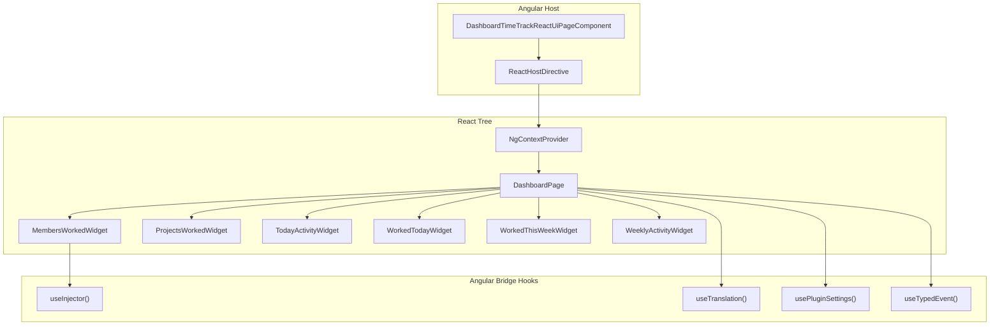

# Dashboard Time Track React UI Plugin

A React-based dashboard plugin that provides time tracking widgets within the Angular host application. This plugin demonstrates the full capabilities of the Plugin UI system: declarative definitions, React bridge integration, type-safe events, auto-generated settings, and i18n namespace isolation.

:::note
This plugin is currently loaded **only in demo environments** (`environment.DEMO === true`).
:::

## Plugin Details

| Property | Value |
|----------|-------|
| **Plugin ID** | `dashboard-time-track-react-ui` |
| **Package** | `@gauzy/plugin-dashboard-time-track-react-ui` |
| **Version** | `1.0.0` |
| **Location** | `page-sections` |
| **Type** | Declarative (no Angular module) |
| **Framework** | React via `@gauzy/ui-react` bridge |
| **Permissions** | `ADMIN_DASHBOARD_VIEW`, `TIME_TRACKING_DASHBOARD` |

## Plugin Definition

```typescript
import { defineDeclarativePlugin } from '@gauzy/plugin-ui';
import { PermissionsEnum } from '@gauzy/contracts';
import { DASHBOARD_TIME_TRACK_ROUTE } from './dashboard-time-track-react-ui.routes';
import en from '../i18n/en.json';

export const DashboardTimeTrackReactUiPlugin = defineDeclarativePlugin(
  'dashboard-time-track-react-ui', {
    version: '1.0.0',
    location: 'page-sections',
    routes: [DASHBOARD_TIME_TRACK_ROUTE as PluginRouteInput],

    // i18n namespace isolation
    translationNamespace: 'REACT_UI',
    translations: { en },

    // Auto-generated settings UI
    settings: {
      title: 'React Dashboard Widgets',
      description: 'Configure which widgets are visible on the React Time Tracking dashboard.',
      category: 'dashboard',
      fields: [
        { key: 'showMembersWorked', type: 'boolean', label: 'Show Members Worked', defaultValue: true, order: 1 },
        { key: 'showProjectsWorked', type: 'boolean', label: 'Show Projects Worked', defaultValue: true, order: 2 },
        { key: 'showTodayActivity', type: 'boolean', label: 'Show Today Activity', defaultValue: true, order: 3 },
        { key: 'showWorkedToday', type: 'boolean', label: 'Show Worked Today', defaultValue: true, order: 4 },
        { key: 'showWorkedThisWeek', type: 'boolean', label: 'Show Worked This Week', defaultValue: true, order: 5 },
        { key: 'showWeeklyActivity', type: 'boolean', label: 'Show Weekly Activity', defaultValue: true, order: 6 },
        { key: 'refreshInterval', type: 'number', label: 'Auto-refresh interval (seconds)',
          description: 'Set to 0 to disable auto-refresh.',
          defaultValue: 300, validation: { min: 0, max: 3600 }, order: 7 }
      ]
    },

    // Dashboard tab
    tabs: [{
      tabsetId: 'dashboard-page',
      tabId: 'react-time-tracking',
      tabsetType: 'route',
      path: '/pages/dashboard/dashboard-time-track',
      tabTitle: (_i18n) => _i18n.getTranslation('REACT_UI.DASHBOARD_PAGE.TABS.REACT_TIME_TRACKING'),
      tabIcon: 'code-outline',
      responsive: true,
      activeLinkOptions: { exact: false },
      order: 4,
      permissions: [PermissionsEnum.ADMIN_DASHBOARD_VIEW, PermissionsEnum.TIME_TRACKING_DASHBOARD]
    }]
  }
);
```

## Registration

Conditionally registered in `apps/gauzy/src/plugin-ui.config.ts`:

```typescript
import { DashboardTimeTrackReactUiPlugin } from '@gauzy/plugin-dashboard-time-track-react-ui';

export const uiPluginConfig: PluginUiConfig = {
  plugins: [
    // ... other plugins

    // React UI Plugin (demo only)
    ...(environment.DEMO ? [DashboardTimeTrackReactUiPlugin] : [])
  ]
};
```

## Route

- **Path:** `/pages/dashboard/dashboard-time-track`
- **Component:** `DashboardTimeTrackReactUiPageComponent` (direct, not lazy-loaded)
- **Location:** `dashboard-sections`

The route renders an Angular host component that uses the React bridge to mount React widgets.

## Dashboard Tab

Adds a **React Time Tracking** tab to the dashboard page:

- **Position:** Order 4 (after the default dashboard tabs)
- **Icon:** `code-outline`
- **Permissions:** Requires both `ADMIN_DASHBOARD_VIEW` and `TIME_TRACKING_DASHBOARD`
- **Tab title:** Translated via `REACT_UI.DASHBOARD_PAGE.TABS.REACT_TIME_TRACKING`

## Widgets

The plugin provides six React-based dashboard widgets:

| Widget | Setting Key | Description |
|--------|-------------|-------------|
| **Members Worked** | `showMembersWorked` | Team members who tracked time |
| **Projects Worked** | `showProjectsWorked` | Projects with tracked time |
| **Today Activity** | `showTodayActivity` | Activity percentage for today |
| **Worked Today** | `showWorkedToday` | Total hours tracked today |
| **Worked This Week** | `showWorkedThisWeek` | Total hours tracked this week |
| **Weekly Activity** | `showWeeklyActivity` | Activity percentage this week |

Each widget's visibility is controlled via the plugin settings. The `refreshInterval` setting controls auto-refresh (default: 5 minutes, 0 to disable).

## Type-Safe Events

The plugin exports typed event contracts for cross-plugin communication:

```typescript
import { definePluginEvent } from '@gauzy/plugin-ui';

// Emitted when dashboard data is refreshed
export const DashboardRefreshedEvent = definePluginEvent<DashboardRefreshedPayload>(
  'dashboard-time-track-react-ui',
  'dashboard-time-track-react-ui:dashboard-refreshed'
);

// Emitted when a widget's visibility changes
export const WidgetVisibilityChangedEvent = definePluginEvent<WidgetVisibilityPayload>(
  'dashboard-time-track-react-ui',
  'dashboard-time-track-react-ui:widget-visibility-changed'
);
```

### Subscribing from Another Plugin

```typescript
import { DashboardRefreshedEvent } from '@gauzy/plugin-dashboard-time-track-react-ui';
import { bindEventToBus } from '@gauzy/plugin-ui';

const handle = bindEventToBus(DashboardRefreshedEvent, eventBus);
handle.on().subscribe(event => {
  console.log('Dashboard refreshed at', event.payload.timestamp);
});
```

## Exported API

```typescript
// Plugin definition
export { DashboardTimeTrackReactUiPlugin } from './lib/dashboard-time-track-react-ui.plugin';

// Type-safe events
export { DashboardRefreshedEvent } from './lib/events';
export { WidgetVisibilityChangedEvent } from './lib/events';

// Event payload types
export type { DashboardRefreshedPayload } from './lib/events';
export type { WidgetVisibilityPayload } from './lib/events';
```

## Technology Stack

| Layer | Technology |
|-------|-----------|
| Plugin definition | `@gauzy/plugin-ui` (`defineDeclarativePlugin`) |
| React bridge | `@gauzy/ui-react` (hooks, directives, error boundary) |
| UI components | `@gauzy/ui-react-components` (Card, Progress, ColorDots) |
| Data fetching | `TimesheetStatisticsService` via Angular injector bridge |
| State | Plugin settings + local React state |
| i18n | Namespaced translations (`REACT_UI.*`) |

## Architecture



## Related

- [Plugin UI System](../frontend/plugin-ui/overview) — plugin architecture overview
- [React Bridge](../frontend/plugin-ui/react-bridge) — how React components integrate with Angular
- [Plugin Services](../frontend/plugin-ui/plugin-services) — type-safe events and settings
- [Plugin Definitions](../frontend/plugin-ui/plugin-definitions) — declarative plugin pattern
