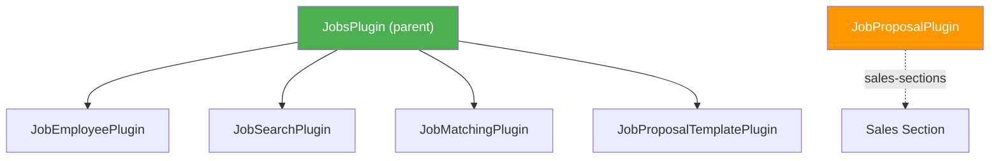

# Jobs UI Plugins

The Jobs plugin system provides the frontend for job management in Ever Gauzy. It uses a **parent-child plugin group** architecture where `JobsPlugin` is the parent and child plugins contribute individual tabs and pages.

## Architecture



## Plugin Group Overview

| Plugin | Tab / Page | URL | Permission |
|--------|-----------|-----|------------|
| [**JobsPlugin**](#jobsplugin-parent) | Jobs (parent layout) | `/pages/jobs` | `FEATURE_JOB` |
| [**JobEmployeePlugin**](./job-employee-plugin) | Employee tab | `/pages/jobs/employee` | `ORG_JOB_EMPLOYEE_VIEW` |
| [**JobSearchPlugin**](./job-search-plugin) | Browse tab | `/pages/jobs/search` | `ORG_JOB_SEARCH` |
| [**JobMatchingPlugin**](./job-matching-plugin) | Matching tab | `/pages/jobs/matching` | `ORG_JOB_MATCHING_VIEW` |
| [**JobProposalTemplatePlugin**](./job-proposal-template-plugin) | Proposal Template tab | `/pages/jobs/proposal-template` | `ORG_PROPOSAL_TEMPLATES_VIEW` |
| [**JobProposalPlugin**](./job-proposal-plugin) | Proposals page (Sales) | `/pages/sales/proposals` | `ORG_PROPOSALS_VIEW` |

:::note
`JobProposalPlugin` registers under `sales-sections` (not `jobs-sections`), so it appears in the Sales menu rather than the Jobs menu. It is still passed as a child in `plugin-ui.config.ts` for organizational purposes.
:::

## Registration

All Jobs plugins are registered together via the `.init()` pattern in `plugin-ui.config.ts`:

```typescript
// apps/gauzy/src/plugin-ui.config.ts
import { JobsPlugin } from '@gauzy/plugin-jobs-ui';
import { JobProposalPlugin, JobProposalTemplatePlugin } from '@gauzy/plugin-job-proposal-ui';
import { JobEmployeePlugin } from '@gauzy/plugin-job-employee-ui';
import { JobSearchPlugin } from '@gauzy/plugin-job-search-ui';
import { JobMatchingPlugin } from '@gauzy/plugin-job-matching-ui';

export const uiPluginConfig: PluginUiConfig = {
  plugins: [
    JobsPlugin.init({
      plugins: [
        JobProposalPlugin,
        JobEmployeePlugin,
        JobSearchPlugin,
        JobMatchingPlugin,
        JobProposalTemplatePlugin
      ]
    }),
    // ...
  ]
};
```

The `.init()` method lets each deployment choose which child plugins to include. Omit a child to disable that tab.

---

## JobsPlugin (Parent)

| Property | Value |
|----------|-------|
| **Plugin ID** | `jobs` |
| **Package** | `@gauzy/plugin-jobs-ui` |
| **Version** | `1.0.0` |
| **Location** | `page-sections` |
| **Feature Key** | `FEATURE_JOB` |
| **Type** | Module-based plugin group |

### Plugin Definition

```typescript
export interface JobsPluginDefinition extends PluginUiDefinition {
  init(opts: { plugins: PluginUiDefinition[] }): PluginUiDefinition;
}

export const JobsPlugin: JobsPluginDefinition = {
  id: 'jobs',
  version: '1.0.0',
  location: 'page-sections',
  module: JobsModule,
  routes: [JOBS_PAGE_ROUTE as PluginRouteInput],
  navMenu: [{
    type: 'config',
    config: {
      id: 'jobs',
      title: 'Jobs',
      icon: 'fas fa-briefcase',
      link: '/pages/jobs',
      data: {
        translationKey: 'MENU.JOBS',
        featureKey: FeatureEnum.FEATURE_JOB
      },
      items: []
    },
    before: 'employees'
  }],
  featureKey: FeatureEnum.FEATURE_JOB,
  plugins: [],

  init(opts: { plugins: PluginUiDefinition[] }): PluginUiDefinition {
    return { ...JobsPlugin, plugins: opts.plugins };
  }
};
```

### Navigation

Adds a **Jobs** menu item to the sidebar, positioned before "Employees", with the briefcase icon. Only visible when the `FEATURE_JOB` feature flag is enabled.

### Route Structure

```text
/pages/jobs
  └── JobLayoutComponent (tabset wrapper)
      ├── /employee       → JobEmployeePlugin
      ├── /search         → JobSearchPlugin
      ├── /matching       → JobMatchingPlugin
      └── /proposal-template → JobProposalTemplatePlugin
```

Default redirect: `/pages/jobs` → `/pages/jobs/employee`

## Child Plugins

Each child plugin is documented on its own page:

- [JobEmployeePlugin](./job-employee-plugin) — Employee job listings and assignments
- [JobSearchPlugin](./job-search-plugin) — Browse and search job listings
- [JobMatchingPlugin](./job-matching-plugin) — AI-powered job-candidate matching
- [JobProposalPlugin](./job-proposal-plugin) — Job proposal management (Sales section)
- [JobProposalTemplatePlugin](./job-proposal-template-plugin) — Reusable proposal templates

## Related

- [Plugin UI System](../frontend/plugin-ui/overview) — how UI plugins work
- [Plugin Definitions](../frontend/plugin-ui/plugin-definitions) — plugin group pattern
- [Getting Started](../frontend/plugin-ui/getting-started) — create your own plugin
