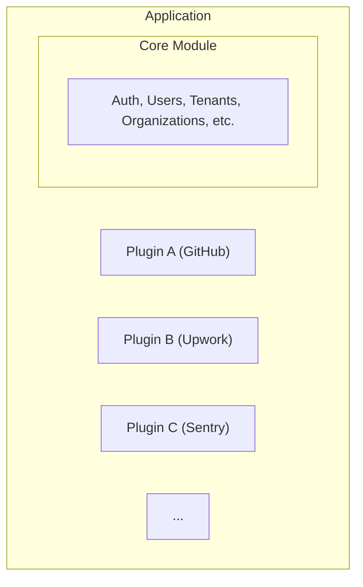

# Built-in Plugins Overview

Ever Gauzy uses a plugin-based architecture to extend the platform with optional features, integrations, analytics, and media capture capabilities. Built-in plugins are NestJS dynamic modules that ship with the monorepo and are registered through the `PluginModule` system at bootstrap time.

## Architecture



Each plugin:

- Registers its own entities, services, and controllers
- Can extend existing entities with custom fields
- Runs migrations independently
- Has its own configuration via environment variables

## Plugin Types

### Backend Plugins

Backend plugins can add:

| Capability           | Description                 |
| -------------------- | --------------------------- |
| **Entities**         | New database tables/columns |
| **Controllers**      | New API endpoints           |
| **Services**         | Business logic              |
| **Commands/Queries** | CQRS handlers               |
| **Event Handlers**   | React to platform events    |
| **Middleware**       | Request processing          |
| **Guards**           | Authorization rules         |

### UI Plugins

UI plugins provide:

| Capability     | Description             |
| -------------- | ----------------------- |
| **Pages**      | New routes and views    |
| **Components** | Reusable UI components  |
| **Modules**    | Angular feature modules |
| **Services**   | Frontend business logic |

## Available Built-in Plugins

### Integration Plugins

| Plugin                                           | Package                              | Description                             |
| ------------------------------------------------ | ------------------------------------ | --------------------------------------- |
| [AI](./ai-plugin)                                | `@gauzy/plugin-integration-ai`       | Gauzy AI assistant, NLP, smart matching |
| [GitHub](../integrations/github-integration)     | `@gauzy/plugin-integration-github`   | Issue sync, PRs, repos, webhooks        |
| [Upwork](../integrations/upwork-integration)     | `@gauzy/plugin-integration-upwork`   | Time tracking and contract sync         |
| [HubStaff](../integrations/hubstaff-integration) | `@gauzy/plugin-integration-hubstaff` | Time tracking sync                      |
| [Jira](../integrations/jira-integration)         | `@gauzy/plugin-integration-jira`     | Issue tracking sync                     |
| [WakaTime](./wakatime-plugin)                    | `@gauzy/plugin-integration-wakatime` | Developer metrics                       |
| [SIM](./sim-plugin)                              | `@gauzy/plugin-integration-sim`      | AI workflow orchestration               |

### Automation Plugins

| Plugin                                | Package                                  | Description             |
| ------------------------------------- | ---------------------------------------- | ----------------------- |
| [Zapier](./zapier-plugin)             | `@gauzy/plugin-integration-zapier`       | 5,000+ app automations  |
| [Make](./make-plugin)                 | `@gauzy/plugin-integration-make`         | Visual workflow builder |
| [Activepieces](./activepieces-plugin) | `@gauzy/plugin-integration-activepieces` | Open-source automation  |

### Feature Plugins

| Plugin              | Package                         | Description                  |
| ------------------- | ------------------------------- | ---------------------------- |
| **Knowledge Base**  | `@gauzy/plugin-knowledge-base`  | Help center / knowledge base |
| **Product Reviews** | `@gauzy/plugin-product-reviews` | Product review system        |
| **Job Search**      | `@gauzy/plugin-job-search`      | Job board search integration |
| **Job Proposal**    | `@gauzy/plugin-job-proposal`    | Job proposal management      |
| **Changelog**       | `@gauzy/plugin-changelog`       | Release changelog management |

### Analytics & Monitoring Plugins

| Plugin                           | Package                         | Description                       |
| -------------------------------- | ------------------------------- | --------------------------------- |
| **Sentry**                       | `@gauzy/plugin-sentry`          | Error tracking & performance      |
| [Analytics](./analytics-plugins) | `@gauzy/plugin-jitsu-analytics` | Product analytics, event tracking |

### Media & Capture Plugins

| Plugin                           | Package                          | Description                      |
| -------------------------------- | -------------------------------- | -------------------------------- |
| [Media Capture](./media-plugins) | `camshot`, `soundshot`, `videos` | Screenshot, audio, video capture |

### UI Plugins

| Plugin                | Package                               | Description                |
| --------------------- | ------------------------------------- | -------------------------- |
| **GitHub UI**         | `@gauzy/plugin-integration-github-ui` | GitHub settings UI         |
| **Job Search UI**     | `@gauzy/plugin-job-search-ui`         | Job board search UI        |
| **Job Matching UI**   | `@gauzy/plugin-job-matching-ui`       | Job matching interface     |
| **Knowledge Base UI** | `@gauzy/plugin-knowledge-base-ui`     | Knowledge base frontend    |
| **Onboarding UI**     | `@gauzy/plugin-onboarding-ui`         | Setup/onboarding wizard UI |
| **Legal UI**          | `@gauzy/plugin-legal-ui`              | Privacy/Terms pages        |

## Plugin Loading & Registration

Plugins are loaded through the `PluginModule` in the API bootstrap:

```typescript
// apps/api/src/plugin-config.ts
@Module({
  imports: [
    PluginModule.init({
      plugins: [
        IntegrationAIModule,
        IntegrationGitHubModule,
        SentryTracingModule,
        // ... more plugins
      ],
    }),
  ],
})
export class AppModule {}
```

The platform discovers and dynamically imports each plugin into the NestJS dependency injection container.

## Plugin Configuration

### Integration Plugin Pattern

Integration plugins follow a common pattern:

```typescript
@Module({
  imports: [
    TypeOrmModule.forFeature([IntegrationEntity, IntegrationSetting]),
    HttpModule,
  ],
  controllers: [IntegrationController],
  providers: [
    IntegrationService,
    IntegrationCommandHandler,
    IntegrationEventHandler,
  ],
})
export class IntegrationPluginModule {
  // Register OAuth callbacks, webhook endpoints, and settings
}
```

### Environment-Based Activation

Most plugins are controlled by environment variables:

```bash
# Feature flags
FEATURE_APP_INTEGRATION=true
FEATURE_JOB=true
FEATURE_ORGANIZATION_HELP_CENTER=true

# Integration-specific credentials
GAUZY_AI_GRAPHQL_ENDPOINT=http://localhost:3005/graphql
GITHUB_CLIENT_ID=your-github-id
HUBSTAFF_CLIENT_ID=your-hubstaff-id
JIRA_CLIENT_ID=your-jira-id
```

## Creating a Custom Plugin

### Step 1: Create Plugin Module

```typescript
// packages/plugins/my-plugin/src/lib/my-plugin.module.ts
import { Module } from "@nestjs/common";
import { TypeOrmModule } from "@nestjs/typeorm";
import { MikroOrmModule } from "@mikro-orm/nestjs";
import { MyPluginEntity } from "./my-plugin.entity";
import { MyPluginService } from "./my-plugin.service";
import { MyPluginController } from "./my-plugin.controller";

@Module({
  imports: [
    TypeOrmModule.forFeature([MyPluginEntity]),
    MikroOrmModule.forFeature([MyPluginEntity]),
  ],
  controllers: [MyPluginController],
  providers: [MyPluginService],
  exports: [MyPluginService],
})
export class MyPluginModule {}
```

### Step 2: Define Entity

```typescript
import { MultiORMEntity, MultiORMColumn } from "@gauzy/core";
import { TenantOrganizationBaseEntity } from "@gauzy/core";

@MultiORMEntity("my_plugin_data")
export class MyPluginEntity extends TenantOrganizationBaseEntity {
  @MultiORMColumn()
  name: string;

  @MultiORMColumn({ type: "jsonb", nullable: true })
  config?: Record<string, any>;
}
```

### Step 3: Create Service

```typescript
import { Injectable } from "@nestjs/common";
import { InjectRepository } from "@nestjs/typeorm";
import { TenantAwareCrudService } from "@gauzy/core";
import { MyPluginEntity } from "./my-plugin.entity";

@Injectable()
export class MyPluginService extends TenantAwareCrudService<MyPluginEntity> {
  constructor(
    @InjectRepository(MyPluginEntity)
    private readonly myPluginRepository,
  ) {
    super(myPluginRepository);
  }
}
```

### Step 4: Register the Plugin

Add the plugin module to your API configuration:

```typescript
// apps/api/src/plugin-config.ts
import { MyPluginModule } from "@gauzy/plugin-my-plugin";

export const pluginConfig = {
  plugins: [
    MyPluginModule,
    // ... other plugins
  ],
};
```

For a deeper dive into plugin development, see the [Plugin System](../development/plugin-system) guide.

## Related Pages

- [Plugin System](../development/plugin-system) — how to build plugins
- [Architecture: Plugin System](../architecture/plugin-system) — plugin architecture
- [Custom Integrations](../integrations/custom-integrations) — API-based integrations
