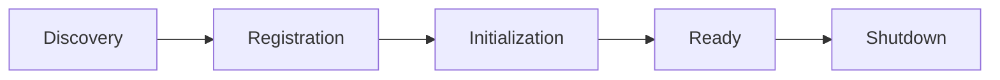

# Plugin Development Guide

Create custom plugins to extend Ever Gauzy functionality.

## Overview

Gauzy's plugin architecture allows developers to add new features, integrations, and modules without modifying the core codebase.

## Plugin Structure

A typical plugin follows this directory structure:

```
packages/plugins/my-plugin/
├── src/
│   ├── lib/
│   │   ├── my-plugin.module.ts    # Main module
│   │   ├── my-plugin.service.ts   # Business logic
│   │   ├── my-plugin.controller.ts # REST endpoints
│   │   └── my-plugin.entity.ts    # Database entities
│   └── index.ts                    # Public API exports
├── package.json
├── tsconfig.json
└── README.md
```

## Creating a Plugin

### 1. Scaffold the Plugin

```bash
# Create the plugin directory
mkdir -p packages/plugins/my-plugin/src/lib
```

### 2. Define the Module

```typescript
// my-plugin.module.ts
import { Module } from "@nestjs/common";
import { TypeOrmModule } from "@nestjs/typeorm";
import { MikroOrmModule } from "@mikro-orm/nestjs";
import { MyPluginService } from "./my-plugin.service";
import { MyPluginController } from "./my-plugin.controller";
import { MyEntity } from "./my-plugin.entity";

@Module({
  imports: [
    TypeOrmModule.forFeature([MyEntity]),
    MikroOrmModule.forFeature([MyEntity]),
  ],
  controllers: [MyPluginController],
  providers: [MyPluginService],
  exports: [MyPluginService],
})
export class MyPluginModule {}
```

### 3. Create an Entity

```typescript
// my-plugin.entity.ts
import { MultiORMEntity, MultiORMColumn } from "@gauzy/core";
import { TenantOrganizationBaseEntity } from "@gauzy/core";

@MultiORMEntity("my_entity")
export class MyEntity extends TenantOrganizationBaseEntity {
  @MultiORMColumn()
  name: string;

  @MultiORMColumn({ nullable: true })
  description?: string;
}
```

### 4. Create a Service

```typescript
// my-plugin.service.ts
import { Injectable } from "@nestjs/common";
import { InjectRepository } from "@nestjs/typeorm";
import { Repository } from "typeorm";
import { TenantAwareCrudService } from "@gauzy/core";
import { MyEntity } from "./my-plugin.entity";

@Injectable()
export class MyPluginService extends TenantAwareCrudService<MyEntity> {
  constructor(
    @InjectRepository(MyEntity)
    private readonly myRepository: Repository<MyEntity>,
  ) {
    super(myRepository);
  }
}
```

### 5. Create a Controller

```typescript
// my-plugin.controller.ts
import { Controller, UseGuards } from "@nestjs/common";
import { ApiTags } from "@nestjs/swagger";
import { CrudController } from "@gauzy/core";
import { TenantPermissionGuard, PermissionGuard } from "@gauzy/core";
import { MyEntity } from "./my-plugin.entity";
import { MyPluginService } from "./my-plugin.service";

@ApiTags("MyPlugin")
@UseGuards(TenantPermissionGuard, PermissionGuard)
@Controller("/my-plugin")
export class MyPluginController extends CrudController<MyEntity> {
  constructor(private readonly service: MyPluginService) {
    super(service);
  }
}
```

### 6. Register the Plugin

Add the plugin module to the application's main module:

```typescript
// In app.module.ts or plugin registration
import { MyPluginModule } from "@gauzy/plugin-my-plugin";

@Module({
  imports: [
    // ... other modules
    MyPluginModule,
  ],
})
export class AppModule {}
```

## Plugin Lifecycle



| Phase          | Description                                        |
| -------------- | -------------------------------------------------- |
| Discovery      | Plugin package is found in node_modules            |
| Registration   | Module is imported and providers registered        |
| Initialization | Database entities are synced, services initialized |
| Ready          | Plugin is fully operational                        |
| Shutdown       | Cleanup on application shutdown                    |

## Best Practices

1. **Extend base classes** — use `TenantOrganizationBaseEntity` and `TenantAwareCrudService`
2. **Multi-ORM support** — use `MultiORMEntity` and `MultiORMColumn` decorators
3. **Guard all endpoints** — apply `TenantPermissionGuard` and `PermissionGuard`
4. **Use DTOs** — create validation DTOs for all inputs
5. **Document API** — apply `@ApiTags` and `@ApiOperation` decorators

## Related Pages

- [Plugin Architecture](../../architecture/plugin-architecture) — architecture overview
- [Plugin API Reference](../plugin-api-reference) — shared plugin APIs
- [Built-in Plugins](../plugins-built-in/overview) — reference implementations
