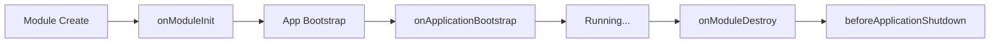

# Plugin Lifecycle Hooks

Understand the plugin initialization and teardown lifecycle.

## Lifecycle Phases



## NestJS Lifecycle Hooks

| Hook                          | When Called                   |
| ----------------------------- | ----------------------------- |
| `onModuleInit()`              | After module instantiation    |
| `onApplicationBootstrap()`    | After all modules initialized |
| `onModuleDestroy()`           | Before module teardown        |
| `beforeApplicationShutdown()` | Before app stops              |

## Implementation

```typescript
import {
  Module,
  OnModuleInit,
  OnApplicationBootstrap,
  OnModuleDestroy,
} from "@nestjs/common";

@Module({
  /* ... */
})
export class MyPluginModule
  implements OnModuleInit, OnApplicationBootstrap, OnModuleDestroy
{
  async onModuleInit() {
    console.log("Plugin module initialized");
    // Register entities, set up connections
  }

  async onApplicationBootstrap() {
    console.log("Application fully started");
    // Start background tasks, subscribe to events
  }

  async onModuleDestroy() {
    console.log("Plugin shutting down");
    // Cleanup connections, stop timers
  }
}
```

## Common Init Tasks

| Phase                    | Tasks                                          |
| ------------------------ | ---------------------------------------------- |
| `onModuleInit`           | Register entities, validate config             |
| `onApplicationBootstrap` | Start schedulers, connect to external services |
| `onModuleDestroy`        | Close connections, flush queues                |

## Related Pages

- [Plugin Dev Quickstart](./plugin-dev-quickstart) — getting started
- [Plugin Entity Registration](./plugin-entity-registration) — entities
- [Plugin Configuration](./plugin-configuration) — config
