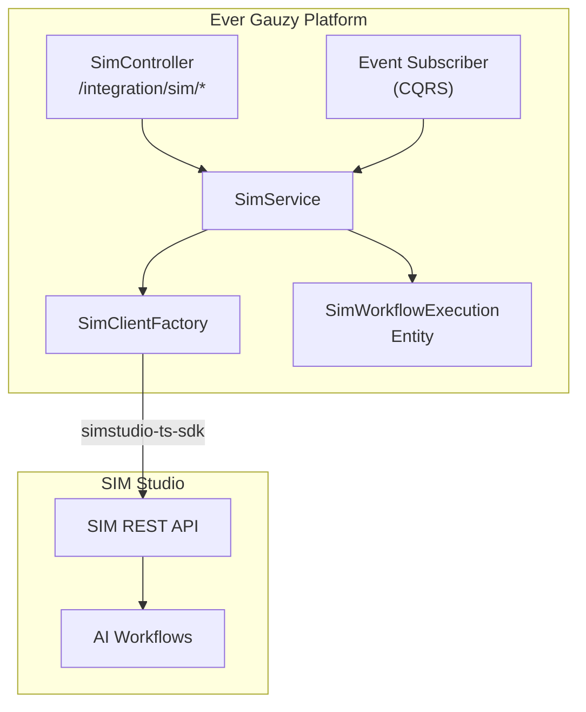
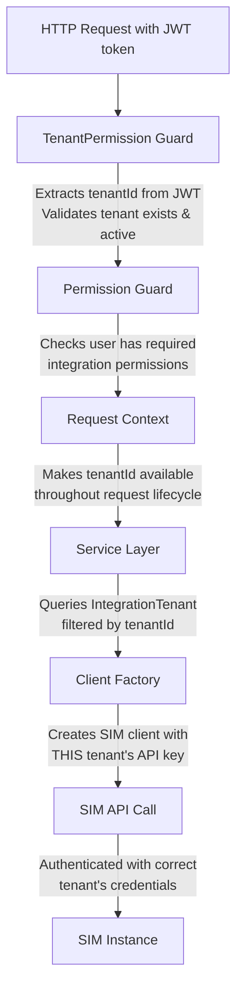
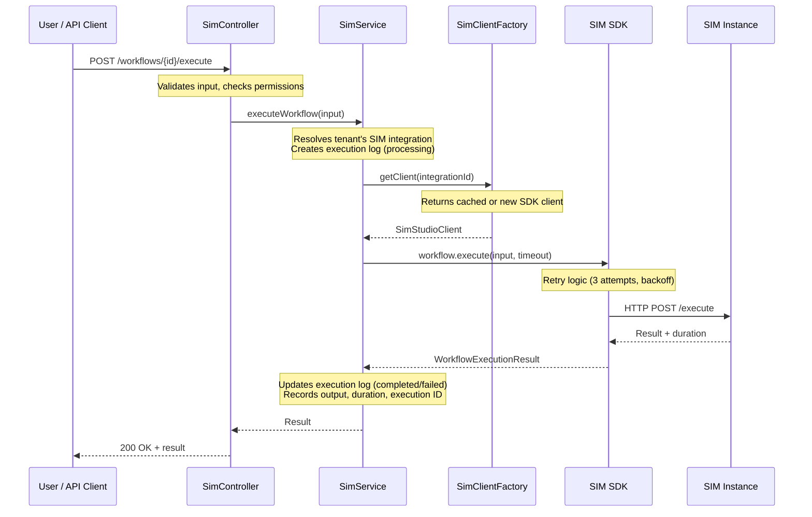
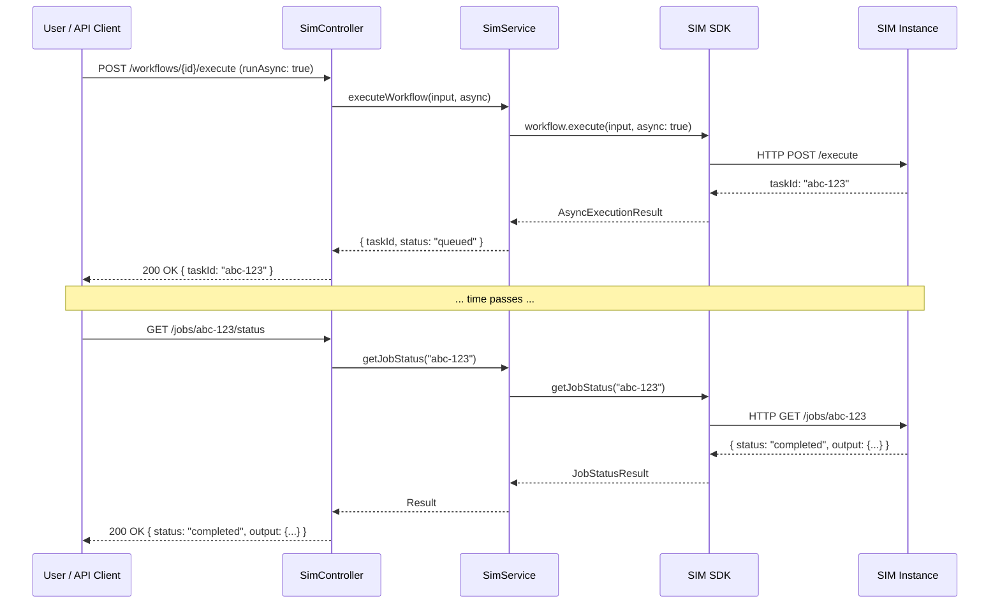
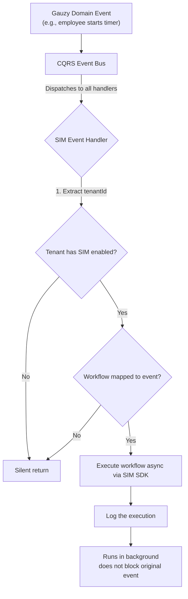
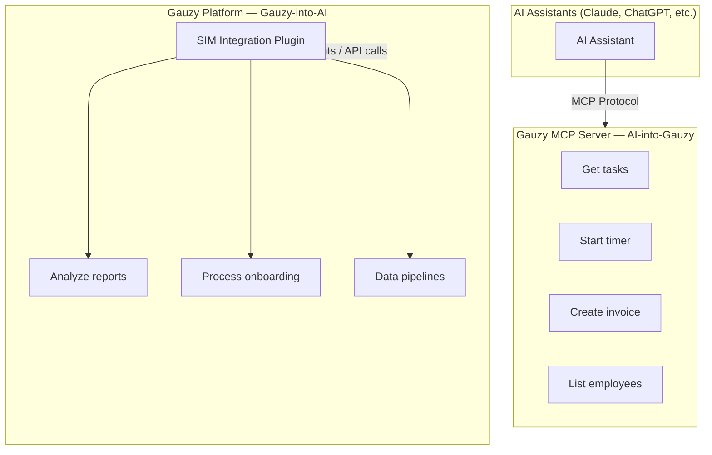
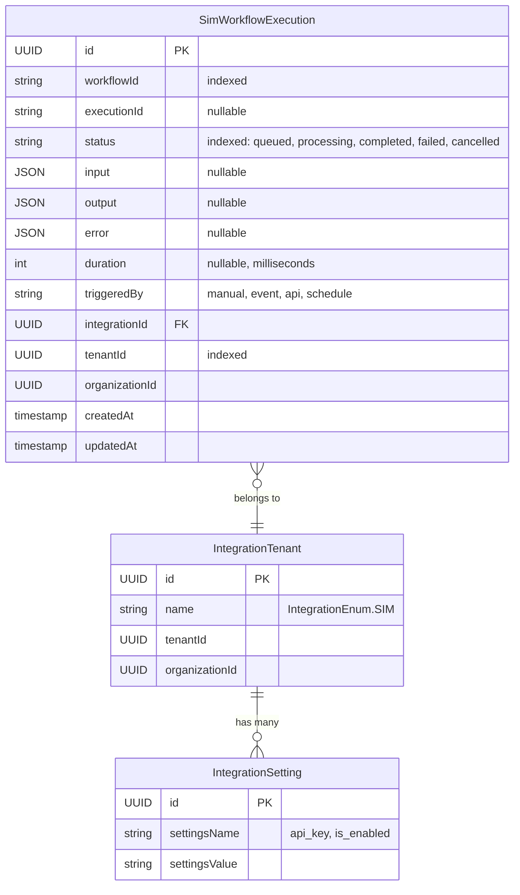
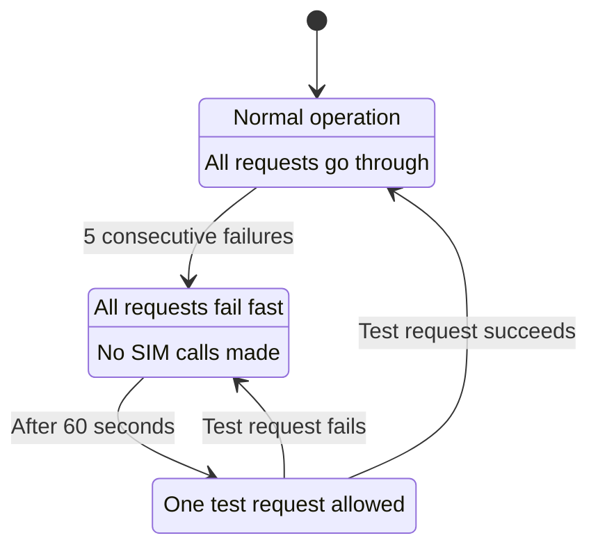
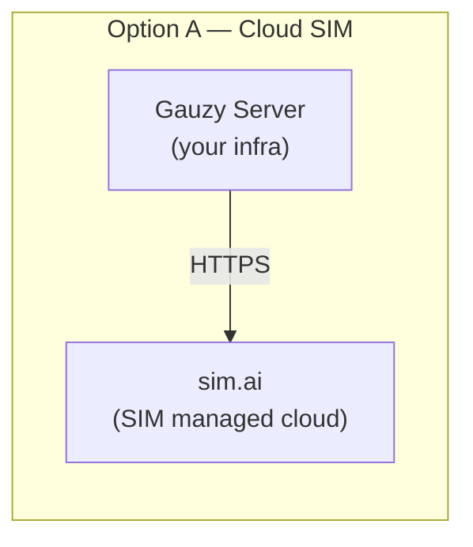
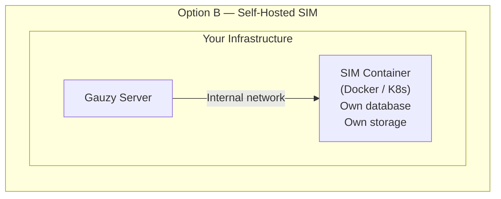

# SIM Integration Plugin

The SIM (Sim Studio) integration plugin brings AI-native workflow orchestration to Ever Gauzy, enabling tenants to design, trigger, and monitor AI agent workflows directly from the platform.

## Overview

| Property    | Value                                                                |
| ----------- | -------------------------------------------------------------------- |
| **Package** | `@gauzy/plugin-integration-sim`                                      |
| **Source**  | `packages/plugins/integration-sim`                                   |
| **SDK**     | [`simstudio-ts-sdk`](https://www.npmjs.com/package/simstudio-ts-sdk) |
| **License** | AGPL-3.0                                                             |
| **Version** | 0.1.0                                                                |

---

## 1. Introduction

This document describes the architecture and workflow design for integrating **SIM (Sim Studio)** — an open-source visual workflow builder for AI agent workflows — into the **Ever Gauzy** multi-tenant SaaS platform. It covers concepts, design decisions, data flows, and schema diagrams to provide a clear mental model of how the integration works.

---

## 2. What Is SIM and Why Integrate It?

### 2.1 What SIM Provides

[SIM (Sim Studio)](https://sim.ai) is an open-source platform that allows users to design, build, and deploy AI agent workflows through a visual drag-and-drop canvas. It connects AI models (OpenAI, Anthropic, Google Gemini, and others), databases, APIs, and business tools into orchestrated pipelines. Workflows can be triggered through chat interfaces, REST APIs, webhooks, scheduled cron jobs, or external events.

SIM offers over 80 native integrations, real-time collaboration, and can be deployed either as a managed cloud service or self-hosted via Docker and Kubernetes.

### 2.2 Why Gauzy Needs SIM

Gauzy already integrates with automation platforms — Zapier, Make, and Activepieces — which are designed for general-purpose workflow automation. SIM fills a different niche: **AI-native orchestration**. Where Zapier connects apps through triggers and actions, SIM connects AI agents through intelligent pipelines that can reason, branch, loop, and process unstructured data.

By integrating SIM, Gauzy tenants gain the ability to:

- Build AI-powered automation workflows that interact with their Gauzy data
- Execute complex multi-step AI pipelines programmatically from within Gauzy
- Trigger AI workflows from internal Gauzy events such as timer starts, task completions, or employee onboarding
- Monitor workflow execution history and results directly from the Gauzy dashboard

### 2.3 How SIM Differs from Existing Integrations

| Aspect            | Zapier / Make / Activepieces | SIM                                                  |
| ----------------- | ---------------------------- | ---------------------------------------------------- |
| Primary purpose   | App-to-app automation        | AI agent orchestration                               |
| Workflow building | Trigger-action chains        | Visual block canvas with AI agents, logic, and tools |
| AI capabilities   | Limited (single AI step)     | Native (multi-agent, reasoning, branching)           |
| Authentication    | OAuth2 flow                  | API key                                              |
| Execution model   | Event-driven webhooks        | SDK-driven programmatic execution                    |
| Self-hosting      | Varies                       | Fully supported (Docker / Kubernetes)                |

---

## 3. Integration Approach

### 3.1 Plugin-Based Architecture

The SIM integration is implemented as a Gauzy plugin, following the same architectural pattern used by the Zapier, Make, and Activepieces integrations. This means it lives as a self-contained package within the `plugins` directory and registers itself with the Gauzy core through the standard plugin lifecycle.

This approach was chosen for the following reasons:

- **Consistency**: Every automation integration in Gauzy is a plugin. SIM is no exception.
- **Modularity**: The plugin can be enabled or disabled per deployment without affecting the core platform.
- **Reuse**: The plugin leverages all existing core integration infrastructure — tenant management, settings storage, permission guards, event buses — rather than reinventing them.
- **Isolation**: Plugin code is decoupled from Gauzy core, making it independently testable and maintainable.

### 3.2 Why Not a Microservice or MCP Extension?

A **microservice approach** was considered but rejected because SIM integration is fundamentally a client-side operation — Gauzy calls SIM's API. There is no need for a separate runtime process. The SDK handles all communication.

An **MCP-only extension** was also considered. While SIM workflows will be selectively exposed via MCP (see Section 9), the MCP server is designed for AI assistants to call Gauzy tools, not for Gauzy to orchestrate external platforms. The plugin approach is the correct layer for this integration.

### 3.3 Architecture Diagram



---

## 4. How the Plugin Fits into Gauzy

### 4.1 Plugin Lifecycle

When Gauzy starts, the SIM plugin goes through the standard plugin lifecycle:

1. **Registration**: The plugin declares its module, entities, and configuration callback
2. **Bootstrap**: The plugin validates that essential configuration is present (environment variables for default SIM URL) and logs its readiness
3. **Runtime**: The module's controllers, services, and event handlers become active and respond to requests
4. **Destroy**: On shutdown, the plugin cleans up any resources (cached clients, etc.)

```typescript
@Plugin({
  imports: [SimModule],
  entities: [SimWorkflowExecution],
  configuration: (config: ApplicationPluginConfig) => {
    return config;
  },
})
export class IntegrationSimPlugin
  implements IOnPluginBootstrap, IOnPluginDestroy
{
  onPluginBootstrap(): void {
    console.log("IntegrationSimPlugin is being bootstrapped...");
  }

  onPluginDestroy(): void {
    console.log("IntegrationSimPlugin is being destroyed...");
  }
}
```

### 4.2 Core Module Dependencies

The SIM plugin does not operate in isolation. It imports and depends on several core Gauzy modules:

- **Integration Tenant Module**: Manages the per-tenant integration record that links a tenant to their SIM configuration
- **Integration Setting Module**: Stores and retrieves per-tenant settings like API keys, base URLs, and event-to-workflow mappings
- **Integration Module**: Manages the base "SIM" integration entry in the integration catalog
- **Role Permission Module**: Provides guards for permission-based access control
- **CQRS Module**: Enables the command bus (for creating/updating integration records) and event bus (for listening to internal Gauzy events)
- **HTTP Module**: Provides HTTP client capabilities (used internally by the SIM SDK)
- **Config Module**: Access to environment-level configuration

### 4.3 Contracts Extension

The shared contracts package includes an entry in the integration enumeration to identify SIM as a recognized integration provider. This is a single-line addition to the existing enum that already contains entries for Zapier, Make, Activepieces, GitHub, Jira, and others.

### 4.4 Component Responsibility Map

| Component              | Responsibility                                                                                    |
| ---------------------- | ------------------------------------------------------------------------------------------------- |
| `IntegrationSimPlugin` | Entry point; registers the module and entity with the Gauzy plugin system                         |
| `SimModule`            | NestJS module wiring controllers, services, and repositories                                      |
| `SimController`        | Handles incoming REST requests (setup, execution, history, status)                                |
| `SimService`           | Core business logic: credential management, workflow execution, event triggers, execution history |
| `SimClientFactory`     | Per-tenant SDK client instantiation with caching and concurrency control                          |
| `SimRepositoryService` | Data access layer for the `SimWorkflowExecution` entity                                           |
| `SimWorkflowExecution` | Database entity storing execution logs per tenant                                                 |

---

## 5. Authentication and Credential Management

### 5.1 How SIM Authentication Works

Unlike Zapier and Make which use OAuth2 with authorization codes, redirect URIs, and token refresh cycles, SIM uses a straightforward **API key authentication model**. Each SIM user or organization generates an API key from their SIM dashboard, and this key is included with every API request.

This simplifies the integration significantly — there is no OAuth flow to implement, no authorization controller needed, no token refresh logic, and no state parameter management. The tenant simply provides their API key, and the plugin stores it.

### 5.2 Credential Storage

Credentials are stored using Gauzy's existing `IntegrationSetting` mechanism, which is a key-value store scoped by tenant and organization. Each tenant's SIM configuration consists of three settings:

| Setting          | Purpose                                                                                   |
| ---------------- | ----------------------------------------------------------------------------------------- |
| **API Key**      | The SIM API key used to authenticate SDK calls                                            |
| **Base URL**     | The SIM instance URL (defaults to the cloud service, can point to a self-hosted instance) |
| **Enabled Flag** | Whether the integration is active for this tenant                                         |

These settings are stored in the same way Zapier stores its client ID, client secret, and access tokens — as named entries in the integration settings table, linked to the tenant's integration record.

---

## 6. Multi-Tenant Isolation

### 6.1 How Tenant Isolation Is Achieved

Multi-tenancy is a first-class concern in this integration. The isolation model works at four levels:

**Level 1 — Request Authentication**: Every API request to Gauzy includes a JWT token that identifies the tenant. The `TenantPermissionGuard` extracts and validates this before any controller logic executes.

**Level 2 — Data Scoping**: All database queries for integration records, settings, and execution logs include the tenant ID as a filter. A tenant can never read or write another tenant's SIM configuration or execution history.

**Level 3 — Client Isolation**: The `SimClientFactory` creates a separate SIM SDK client instance for each tenant, initialized with that tenant's unique API key and base URL. Clients are cached by integration ID, so two tenants with different API keys will always have different client instances.

**Level 4 — Execution Isolation**: Each workflow execution is logged with the tenant ID and organization ID. Execution results, inputs, and outputs are stored per-tenant and only accessible by that tenant.

### 6.2 Tenant Isolation Flow



---

## 7. How Workflow Execution Works

### 7.1 Execution Modes

The SIM SDK supports two execution modes, both of which the plugin exposes:

- **Synchronous Execution**: The caller sends a request and waits for the workflow to complete. The response includes the full output, duration, and execution metadata. Best for short-running workflows (under 30 seconds).
- **Asynchronous Execution**: The caller sends a request and immediately receives a task ID. The workflow runs in the background on the SIM side. The caller can poll for status using the task ID. Best for long-running workflows or when the caller does not need to wait.

### 7.2 Synchronous Execution Flow



### 7.3 Asynchronous Execution Flow



### 7.4 What Happens Inside SIM

When the SIM SDK sends an execution request, SIM processes it through its internal engine:

1. The workflow definition is loaded (blocks, connections, configuration)
2. The input data is injected into the entry block
3. Each block executes in sequence or parallel depending on the graph structure
4. AI agent blocks call their configured AI models (OpenAI, Anthropic, etc.)
5. Logic blocks evaluate conditions and route data accordingly
6. Output blocks collect the final results
7. The result is returned to the caller (or stored for async polling)

Gauzy does not need to know the internal details of SIM's execution engine. The plugin treats SIM as a black box: send input, receive output.

---

## 8. Event-Driven Workflow Triggers

### 8.1 Concept

Beyond manual and API-driven execution, the SIM plugin can automatically trigger workflows in response to internal Gauzy events. This is the same pattern used by the Zapier integration, where Zapier webhooks are notified when a timer starts or stops.

The difference is that instead of posting to a webhook URL, the SIM plugin directly executes a SIM workflow using the SDK.

### 8.2 Event-to-Workflow Mapping

Tenants can configure mappings between Gauzy events and SIM workflow IDs. These mappings are stored as integration settings:

| Event Name       | Mapped Workflow ID | Description                                   |
| ---------------- | ------------------ | --------------------------------------------- |
| `timer.started`  | `wf-abc-123`       | Triggered when an employee starts their timer |
| `timer.stopped`  | `wf-def-456`       | Triggered when an employee stops their timer  |
| `task.completed` | `wf-ghi-789`       | Triggered when a task is marked complete      |

When a Gauzy domain event fires, the plugin's event handler checks if the tenant has SIM enabled and if there is a workflow mapped to that event. If so, it executes the workflow asynchronously with the event data as input.

### 8.3 Event-Driven Flow



### 8.4 Important Design Decisions

- Event-driven execution is **always asynchronous** — it must not block the original Gauzy event processing
- If the SIM integration is not configured for a tenant, the event handler silently returns without error
- If no workflow is mapped to the event, the handler silently returns
- Errors in SIM execution are logged but do not propagate back to the event source
- This is an **opt-in feature** — tenants must explicitly configure event-to-workflow mappings

---

## 9. How SIM and the MCP Server Coexist

### 9.1 Different Purposes, Complementary Roles

Gauzy already has an MCP (Model Context Protocol) server that exposes Gauzy's data and actions as tools for AI assistants. The MCP server and SIM integration serve fundamentally different purposes:

- **MCP Server**: Enables "AI-into-Gauzy" — AI assistants use Gauzy tools
- **SIM Integration**: Enables "Gauzy-into-AI" — Gauzy triggers complex AI pipelines
- **Integration Point**: Selected SIM workflows can be exposed as MCP tools, allowing an AI assistant to trigger a complex SIM pipeline during a chat



### 9.2 The Decision Matrix

**Use MCP when**: A single, discrete action is needed. "Get my tasks." "Start a timer." "Create an invoice." These are direct data operations that the MCP server handles efficiently.

**Use SIM when**: A complex, multi-step pipeline is needed. "Analyze all employee timesheets for the quarter, generate a summary report, identify anomalies, and email the results to the HR manager." This requires chaining multiple AI agents with business logic — exactly what SIM excels at.

### 9.3 Optional MCP Bridge

As an advanced feature, selected SIM workflows can be exposed as MCP tools. This allows AI assistants to trigger complex SIM workflows through the MCP protocol. The MCP server would include a tool that calls the SIM plugin's execution endpoint, bridging the two systems.

This is optional and should be implemented only after the core plugin is stable.

---

## 10. Execution Logging and Audit Trail

### 10.1 What Gets Logged

Every workflow execution — whether manual, API-driven, or event-triggered — is recorded in a dedicated execution log. Each log entry captures:

- **Workflow ID**: Which SIM workflow was executed
- **Execution ID**: SIM's internal execution identifier (for cross-referencing with SIM's own logs)
- **Status**: The execution outcome — `queued`, `processing`, `completed`, `failed`, or `cancelled`
- **Input**: The data sent to the workflow (sanitized to remove any sensitive information)
- **Output**: The result returned by the workflow
- **Error**: If the execution failed, the error details
- **Duration**: How long the execution took in milliseconds
- **Triggered By**: What initiated the execution — `manual` (user action), `event` (Gauzy domain event), `api` (programmatic call), or `schedule` (cron-based)
- **Tenant and Organization**: Standard multi-tenancy scoping

### 10.2 Execution Log Data Model



### 10.3 Retention and Querying

Execution logs are indexed by tenant, workflow ID, and status for efficient querying. The API exposes paginated access to execution history with optional filters. For long-running deployments, a retention policy should be implemented to archive or delete logs older than a configurable period (e.g., 90 days).

---

## 11. Security Considerations

### 11.1 API Key Protection

SIM API keys are the most sensitive piece of data in this integration. They must be:

- **Encrypted at rest** in the database using Gauzy's existing encryption mechanism for integration settings
- **Never returned in any API response** — the settings endpoint returns a boolean indicating whether an API key exists, not the key itself
- **Accessible only server-side** — the key is loaded by the client factory when creating SDK instances, and never sent to the browser

### 11.2 Permission Model

Access to the SIM integration is controlled through Gauzy's existing role-based permission system:

| Action                              | Permission Required  |
| ----------------------------------- | -------------------- |
| Set up or modify SIM integration    | `INTEGRATION_ADD`    |
| Execute workflows                   | `INTEGRATION_EDIT`   |
| View settings and execution history | `INTEGRATION_VIEW`   |
| Remove integration                  | `INTEGRATION_DELETE` |

These permissions are checked at the controller level using Gauzy's standard guard chain: first the `TenantPermissionGuard` validates tenant access, then the `PermissionGuard` validates the user has the required permission.

### 11.3 Input Sanitization

Workflow input data passes through validation DTOs before being sent to SIM. This prevents injection of malformed payloads. Timeout values are bounded (minimum 1 second, maximum 5 minutes) to prevent resource exhaustion.

### 11.4 Tenant Data Boundaries

The complete isolation described in Section 6 ensures that one tenant cannot:

- Read another tenant's API key
- Execute workflows using another tenant's SIM credentials
- View another tenant's execution history
- Modify another tenant's event-to-workflow mappings

---

## 12. Resilience and Error Handling

### 12.1 SDK-Level Retry

The SIM SDK provides a built-in retry mechanism with exponential backoff. When a request fails due to a transient error (network timeout, rate limiting, server overload), the SDK automatically retries with increasing delays:

- First retry after ~1 second
- Second retry after ~2 seconds
- Third retry after ~4 seconds
- Each delay has ±25% jitter to prevent thundering herd
- If the SIM server returns a `Retry-After` header, the SDK respects it

### 12.2 Error Classification

The SDK provides typed errors that the plugin translates into appropriate HTTP responses:

| SIM Error              | Meaning                 | Plugin Response                                                   |
| ---------------------- | ----------------------- | ----------------------------------------------------------------- |
| `UNAUTHORIZED`         | Invalid API key         | `401 Unauthorized` — prompts tenant to reconfigure                |
| `TIMEOUT`              | Workflow took too long  | `408 Request Timeout` — suggest increasing timeout or using async |
| `RATE_LIMIT_EXCEEDED`  | Too many requests       | `429 Too Many Requests` — with retry guidance                     |
| `USAGE_LIMIT_EXCEEDED` | Account quota exhausted | `402 Payment Required` — tenant needs to upgrade SIM plan         |
| `EXECUTION_ERROR`      | Workflow logic failed   | `500 Internal Server Error` — with SIM's error details            |

### 12.3 Circuit Breaker

To prevent cascading failures when a SIM instance is completely down, the plugin implements a circuit breaker per tenant:



This prevents the plugin from overwhelming a struggling SIM instance and provides fast failure responses to users when SIM is known to be unavailable.

---

## 13. Deployment Strategy

### 13.1 Two Deployment Models

The plugin supports two deployment models for SIM, configurable per tenant:

**Cloud SIM (Default)**: Tenants use SIM's managed service at `sim.ai`. This is the simplest option — the tenant creates a SIM account, generates an API key, and configures it in Gauzy. No infrastructure management required.

**Self-Hosted SIM**: For enterprises that require data sovereignty, private AI models (via Ollama), or network isolation, SIM can be deployed alongside Gauzy using Docker Compose or Kubernetes. Each tenant can point to a different SIM instance by configuring their base URL.

### 13.2 Infrastructure Relationship





### 13.3 Key Infrastructure Notes

- SIM uses its own PostgreSQL database — it does not share Gauzy's database
- When self-hosted with Docker, SIM and Gauzy communicate via the Docker internal network
- When self-hosted with Kubernetes, they should share the same namespace for network proximity
- The plugin only needs one environment variable for default configuration: the default SIM base URL

---

## 14. Scalability and Monitoring

### 14.1 Performance Considerations

The client factory caches SIM SDK client instances per tenant. This avoids the overhead of loading credentials and instantiating a new client on every request. When credentials change, the cache is invalidated for that specific tenant.

For high-volume deployments, an optional job queue (BullMQ) can be added to handle workflow executions asynchronously within Gauzy itself, providing benefits such as concurrency control, delayed execution, priority queues, and dead letter queues for persistently failing executions.

### 14.2 Monitoring Points

| Metric                     | How to Track                                | Purpose                            |
| -------------------------- | ------------------------------------------- | ---------------------------------- |
| Execution success rate     | Count completed vs. failed in execution log | Detect workflow reliability issues |
| Average execution duration | Aggregate duration from execution log       | Identify performance degradation   |
| Error rate by type         | Group execution errors by error code        | Understand failure patterns        |
| Rate limit proximity       | Check remaining quota via SDK               | Prevent hitting limits             |
| Executions per tenant      | Count executions grouped by tenant          | Identify heavy users               |
| Circuit breaker state      | Track open/closed per tenant                | Detect SIM availability issues     |

### 14.3 Health Check

The plugin should expose a health check that verifies connectivity to the SIM instance. This can be called by Gauzy's monitoring system to detect SIM downtime early, before users encounter errors.

---

## 15. API Surface Design

### 15.1 Endpoint Overview

All endpoints are mounted under the base path `/api/integration/sim/` and require authentication plus appropriate permissions.

| Method | Endpoint                                   | Permission         | Description                            |
| ------ | ------------------------------------------ | ------------------ | -------------------------------------- |
| POST   | `/setup`                                   | `INTEGRATION_ADD`  | Configure SIM integration (API key)    |
| GET    | `/settings`                                | `INTEGRATION_VIEW` | Get sanitized integration settings     |
| POST   | `/workflows/:workflowId/execute`           | `INTEGRATION_EDIT` | Execute a workflow (sync or async)     |
| GET    | `/workflows/:workflowId/validate`          | `INTEGRATION_VIEW` | Validate a workflow is deployed        |
| GET    | `/jobs/:jobId/status`                      | `INTEGRATION_VIEW` | Get async job status                   |
| GET    | `/executions`                              | `INTEGRATION_VIEW` | Get execution history (paginated)      |
| GET    | `/status/:integrationTenantId`             | `INTEGRATION_VIEW` | Check if integration is enabled        |
| GET    | `/integration-tenant/:integrationTenantId` | `INTEGRATION_VIEW` | Get integration tenant info (redacted) |

### 15.2 Request/Response Design Principles

- **No secrets in responses**: API keys are never returned. Only boolean flags indicating their presence.
- **Consistent error format**: All errors follow Gauzy's standard error response structure.
- **Pagination**: List endpoints support `limit`/`offset` pagination.
- **Filtering**: Execution history can be filtered by workflow ID and status.
- **Validation**: All inputs pass through DTOs with `class-validator` rules. Timeout values are bounded. Required fields are enforced.

---

## 16. Implementation Phases

### Phase 1 — Foundation

Establish the plugin skeleton and contracts. This includes adding the SIM entry to the integration enumeration, creating the plugin package with its project configuration files, and installing the SIM TypeScript SDK as a dependency. No business logic yet — just the scaffolding.

### Phase 2 — Core Plugin

Build the plugin entry point, NestJS module, configuration constants, and the tenant-scoped client factory. At the end of this phase, the plugin can bootstrap, register with Gauzy, and create SIM SDK client instances per tenant. No execution yet.

### Phase 3 — Business Logic

Implement the core service, REST controller, DTOs, and the execution log entity with its repositories. At the end of this phase, tenants can configure their SIM integration, execute workflows (synchronously and asynchronously), check job status, and view execution history.

### Phase 4 — Event Integration

Add CQRS event handlers that listen to Gauzy domain events and trigger SIM workflows. Implement the event-to-workflow mapping configuration. This phase makes the integration reactive — workflows can fire automatically based on platform activity.

### Phase 5 — Testing

Write unit tests for the service and client factory, integration tests with a mock SIM server, and end-to-end tests for the full execution flow. Validate multi-tenant isolation, error handling, and retry behavior.

### Phase 6 — Deployment and Polish

Add the plugin to the application's plugin list, run database migrations for the execution log entity, seed the integration catalog, test with both cloud and self-hosted SIM instances, and document environment variables.

---

## 17. Risk Assessment

### 17.1 Technical Risks

- **SIM API changes**: As SIM evolves, its API may introduce breaking changes. _Mitigation_: pin the SDK version and implement an adapter layer that isolates the plugin from direct SDK coupling. Run integration tests against new SDK versions before upgrading.
- **SIM instance downtime**: Whether cloud or self-hosted, SIM may become unavailable. _Mitigation_: the circuit breaker prevents cascading failures, the retry mechanism handles transient outages, and async execution decouples the caller from SIM availability.
- **Rate limiting**: SIM enforces rate limits on API calls. _Mitigation_: the SDK's built-in retry respects rate limit headers, and the plugin can implement Gauzy-side per-tenant throttling to prevent any single tenant from exhausting shared quotas.

### 17.2 Security Risks

- **API key exposure**: If API keys leak, an attacker could execute workflows on the tenant's SIM account. _Mitigation_: encrypt keys at rest, never return them in API responses, and ensure they are only accessed server-side.
- **Cross-tenant data access**: A vulnerability in tenant isolation could allow one tenant to access another's configuration or execution data. _Mitigation_: rely on Gauzy's battle-tested `TenantPermissionGuard` and always scope queries by tenant ID.
- **Malicious workflow input**: A user could attempt to inject harmful data through workflow inputs. _Mitigation_: validate all inputs through DTOs, sanitize payloads, and rely on SIM's own input validation as a second layer.

### 17.3 Operational Risks

- **Cost management**: AI workflow executions on SIM consume compute resources and potentially AI model API credits. _Mitigation_: monitor usage per tenant via the execution log, and optionally implement per-tenant execution limits.
- **Log storage growth**: High-volume tenants could generate large amounts of execution history data. _Mitigation_: implement a configurable retention policy and paginate all list queries.
- **Self-hosted maintenance burden**: Organizations that self-host SIM take on the responsibility of updates, backups, and monitoring. _Mitigation_: provide clear documentation and health check endpoints to simplify operations.

---

## Summary

The SIM integration brings AI-native workflow orchestration to Ever Gauzy. It follows the established plugin architecture, reuses the core integration infrastructure, and maintains strict multi-tenant isolation. The design is intentionally simple — SIM uses API key authentication (no OAuth complexity), the SDK handles retries and rate limiting, and execution logging provides a complete audit trail.

The integration complements rather than replaces the existing MCP server: MCP handles single-action AI tool calls, while SIM handles complex multi-step AI pipelines. Together, they give Gauzy tenants a complete AI automation toolkit — from simple data queries to sophisticated agent workflows.

---

## Related Pages

- [Built-in Plugins Overview](./overview) — all available plugins
- [Zapier Plugin](./zapier-plugin) — app-to-app automation
- [Make Plugin](./make-plugin) — visual workflow builder
- [Activepieces Plugin](./activepieces-plugin) — open-source automation
