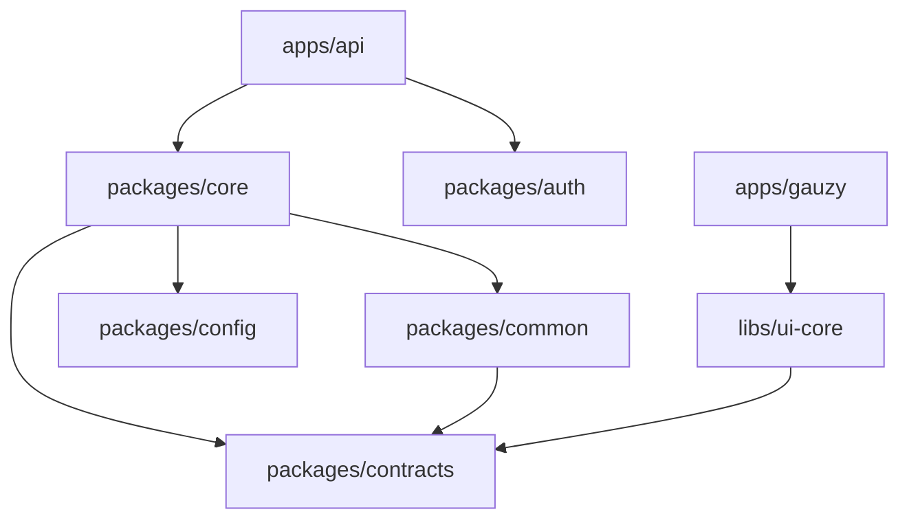

# Monorepo Workspace Guide

Navigate and work within the Gauzy NX monorepo.

## Workspace Layout

```
ever-gauzy/
├── apps/
│   ├── gauzy/              ← Angular web app
│   ├── api/                ← NestJS API server
│   ├── desktop/            ← Electron desktop app
│   ├── desktop-timer/      ← Desktop timer variant
│   └── server/             ← Electron server
├── packages/
│   ├── core/               ← Core API library
│   ├── auth/               ← Authentication
│   ├── common/             ← Shared types & utils
│   ├── config/             ← Configuration
│   ├── contracts/          ← TypeScript interfaces
│   └── plugins/            ← Plugin packages
│       ├── integration-ai/
│       ├── integration-github/
│       └── ...
├── libs/
│   ├── ui-core/            ← Angular shared UI
│   └── desktop-libs/       ← Desktop shared libs
├── nx.json
├── workspace.json
└── package.json
```

## Key Commands

| Command          | Description         |
| ---------------- | ------------------- |
| `yarn start:api` | Start API (dev)     |
| `yarn start`     | Start web app (dev) |
| `yarn build:api` | Build API           |
| `yarn build`     | Build web app       |
| `yarn test`      | Run all tests       |
| `yarn lint`      | Lint all packages   |

## NX Commands

```bash
# Run specific project target
npx nx run api:build

# Affected builds (only changed)
npx nx affected:build

# Dependency graph
npx nx graph

# List all projects
npx nx show projects
```

## Package Dependencies



## Related Pages

- [Development Guide](../development/development-guide) — setup
- [Git Workflow](../development/git-workflow) — branching
- [Dependency Management](./dependency-management) — deps
