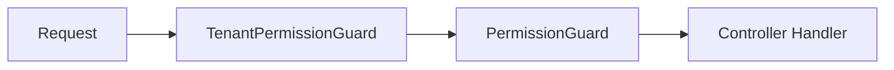

# API Security Best Practices

Comprehensive API security patterns and practices used in Ever Gauzy.

## Authentication

All API endpoints (except [public endpoints](../api/public-api-endpoints)) require JWT authentication:

```
Authorization: Bearer {jwt-token}
```

### Token Lifecycle

1. User authenticates via `/api/auth/login`
2. Server issues a JWT access token (short-lived) and refresh token (long-lived)
3. Client includes access token in all requests
4. When access token expires, client uses refresh token to get a new one
5. When refresh token expires, user must re-authenticate

### Token Configuration

| Variable                      | Description       | Recommended     |
| ----------------------------- | ----------------- | --------------- |
| `JWT_SECRET`                  | Signing key       | 256-bit random  |
| `JWT_TOKEN_EXPIRATION_TIME`   | Access token TTL  | 3600 (1 hour)   |
| `JWT_REFRESH_SECRET`          | Refresh key       | 256-bit random  |
| `JWT_REFRESH_EXPIRATION_TIME` | Refresh token TTL | 604800 (7 days) |

## Authorization

### Guard Stack

Every protected endpoint uses a layered guard stack:



| Guard                         | Purpose                    |
| ----------------------------- | -------------------------- |
| `TenantPermissionGuard`       | Validates tenant context   |
| `PermissionGuard`             | Checks user permissions    |
| `OrganizationPermissionGuard` | Org-level permission check |
| `RoleGuard`                   | Role-based access control  |

### Permission Decorators

```typescript
@Permissions(PermissionsEnum.ORG_USERS_VIEW)
@Get('/users')
async findAll() { ... }
```

## Relation Whitelisting

All endpoints that accept `relations` query parameters must use enum-based whitelists to prevent data exposure:

```typescript
// ✅ SAFE: Explicit whitelist
enum AllowedInvoiceRelations {
  FROM_ORGANIZATION = 'fromOrganization',
  TO_CONTACT = 'toContact',
  INVOICE_ITEMS = 'invoiceItems'
}

@Query('relations') relations: AllowedInvoiceRelations[]

// ❌ UNSAFE: Arbitrary string relations
@Query('relations') relations: string[]
```

## Rate Limiting

Configure rate limiting to prevent abuse:

| Variable         | Description      | Default |
| ---------------- | ---------------- | ------- |
| `THROTTLE_TTL`   | Window (seconds) | `60`    |
| `THROTTLE_LIMIT` | Max requests     | `60`    |

## CORS

Configure allowed origins:

```
CORS_ALLOW_ORIGIN=https://app.example.com,https://admin.example.com
```

## Related Pages

- [Tenant Isolation](./tenant-isolation) — data isolation
- [Input Validation](./input-validation) — request validation
- [Public Endpoint Data Exposure](./public-endpoint-data-exposure) — public API security
