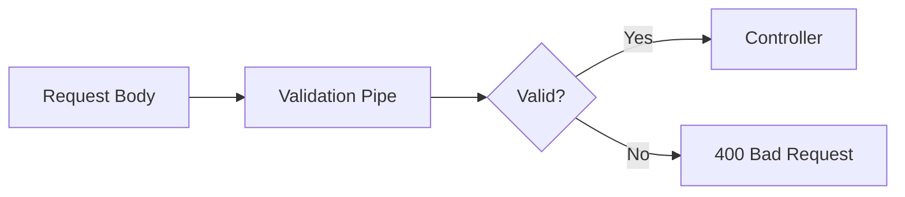

# Input Validation & Sanitization

How Gauzy validates and sanitizes all incoming data.

## Validation Pipeline



## class-validator DTOs

All input is validated using DTOs with `class-validator` decorators:

```typescript
import { IsString, IsOptional, IsUUID, IsEnum } from "class-validator";

export class CreateTaskDTO {
  @IsString()
  title: string;

  @IsOptional()
  @IsString()
  description?: string;

  @IsUUID()
  projectId: string;

  @IsEnum(TaskStatusEnum)
  status: TaskStatusEnum;
}
```

## Validation Pipe

Applied via the `@UseValidationPipe()` decorator:

```typescript
@Post('/')
@UseValidationPipe({ whitelist: true })
async create(@Body() entity: CreateTaskDTO) { ... }
```

### Options

| Option                 | Description                        |
| ---------------------- | ---------------------------------- |
| `whitelist`            | Strip properties not in the DTO    |
| `transform`            | Auto-transform to DTO types        |
| `forbidNonWhitelisted` | Throw error for unknown properties |

## UUID Validation

All ID parameters are validated with `UUIDValidationPipe`:

```typescript
@Get('/:id')
async findById(@Param('id', UUIDValidationPipe) id: string) { ... }
```

## Query Parameter Validation

Query parameters use `ParseJsonPipe` and `BaseQueryDTO`:

```typescript
@Get('/')
@UseValidationPipe()
async findAll(@Query() params: BaseQueryDTO<Task>) { ... }
```

## SQL Injection Prevention

TypeORM and MikroORM both use parameterized queries, preventing SQL injection:

```typescript
// ✅ SAFE: Parameterized
this.repository.findOne({ where: { id } });

// ❌ UNSAFE: String interpolation
this.repository.query(`SELECT * FROM task WHERE id = '${id}'`);
```

## Related Pages

- [API Security Best Practices](./api-security-best-practices) — security overview
- [File Upload Security](./file-upload-security) — file validation
