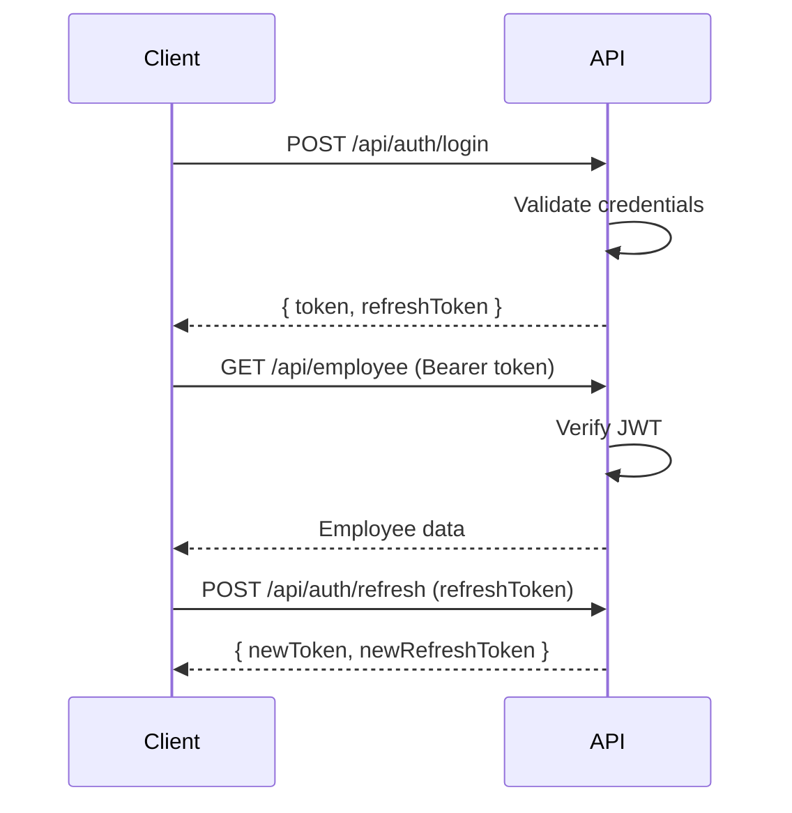

# JWT Token Management

Deep dive into JWT-based authentication.

## Token Types

| Token         | Purpose            | Lifetime   |
| ------------- | ------------------ | ---------- |
| Access Token  | API authentication | 15 min-1hr |
| Refresh Token | Renew access token | 7-30 days  |

## Token Structure

```json
{
  "header": { "alg": "HS256", "typ": "JWT" },
  "payload": {
    "id": "user-uuid",
    "tenantId": "tenant-uuid",
    "role": "ADMIN",
    "iat": 1709635260,
    "exp": 1709638860
  }
}
```

## Configuration

```env
JWT_SECRET=your-secret-key-min-32-chars
JWT_TOKEN_EXPIRATION_TIME=3600
JWT_REFRESH_TOKEN_SECRET=your-refresh-secret
JWT_REFRESH_TOKEN_EXPIRATION_TIME=604800
```

## Token Flow



## Security Best Practices

| Practice           | Implementation             |
| ------------------ | -------------------------- |
| Strong secret      | Min 256-bit secret key     |
| Short expiration   | Access: 15-60 min          |
| Refresh rotation   | Issue new refresh on use   |
| HTTPS only         | Prevent token interception |
| HttpOnly cookies   | Prevent XSS access         |
| Token blacklisting | Invalidate on logout       |

## Related Pages

- [Authentication Guide](../api/authentication-endpoints) — auth API
- [OAuth2 Flows](./oauth2-flows) — social auth
- [API Key Management](./api-key-management) — API keys
