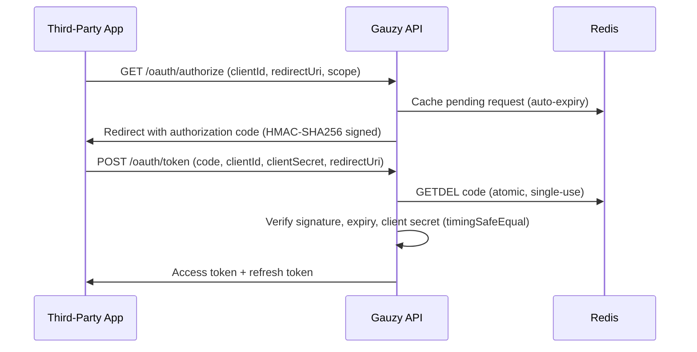

# OAuth App Authorization (Server-to-Server)

For third-party integrations, an OAuth 2.0-style authorization code flow is supported for server-to-server communication.

## Authorization Code Generation

- Codes are **HMAC-SHA256 signed** with a `codeSecret` (versioned format: `v1.<payload>.<signature>`).
- Codes contain: `jti`, `userId`, `tenantId`, `clientId`, `redirectUri`, `scope`, `exp`.
- Single-use enforcement via **Redis `GETDEL`** (atomic get-and-delete, race-condition safe).
- Codes are short-lived with configurable TTL.
- Pending requests are cached in Redis with automatic expiry.

## Token Exchange

- **Timing-safe** client secret comparison (`timingSafeEqual`).
- **Redirect URI validation** against allowlist.
- **Single-use codes** — already-used codes are rejected (`Authorization code already used`).
- Signature and expiry are validated before any token exchange.

## Flow Diagram

## Related Pages

- [Token Lifecycle](./token-lifecycle) — JWT token management
- [Authentication Flows](./authentication-flows) — user-facing auth flows
- [Security Overview](./security-overview) — architecture overview
