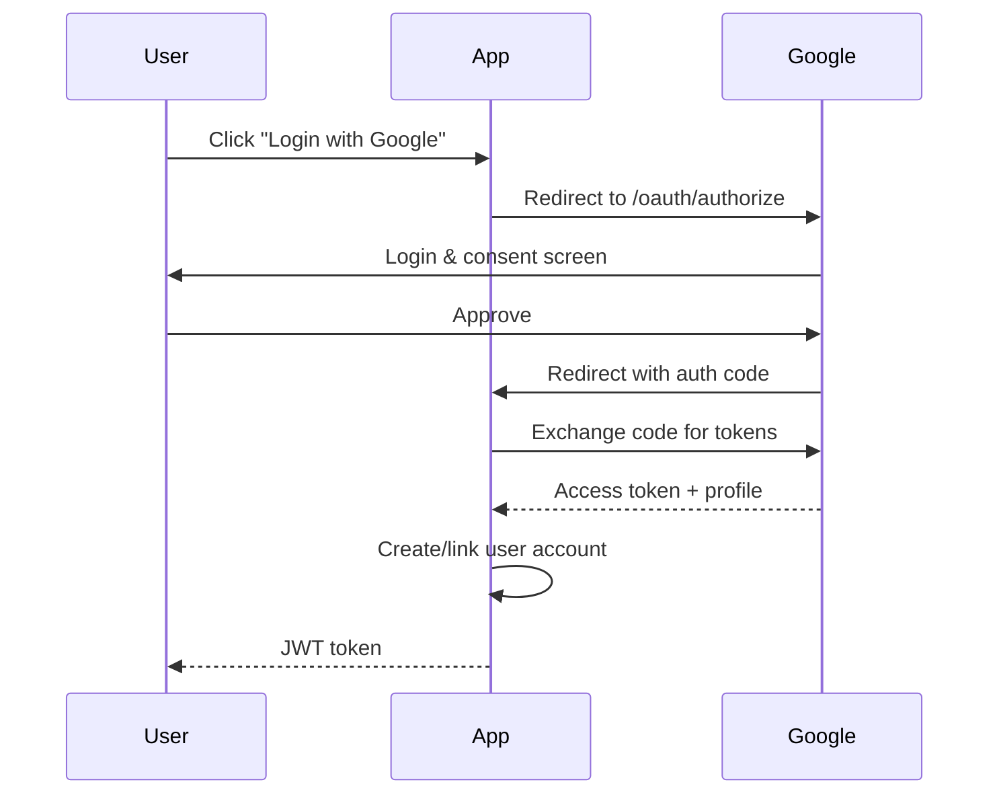

# OAuth2 & Social Auth Flows

Configure social login and OAuth2 authentication.

## Supported Providers

| Provider  | Strategy  | Status   |
| --------- | --------- | -------- |
| Google    | OAuth2    | Built-in |
| GitHub    | OAuth2    | Built-in |
| Facebook  | OAuth2    | Built-in |
| Twitter   | OAuth1.1a | Built-in |
| Microsoft | OAuth2    | Built-in |
| LinkedIn  | OAuth2    | Built-in |

## OAuth2 Flow



## Configuration

```env
# Google
GOOGLE_CLIENT_ID=your-client-id
GOOGLE_CLIENT_SECRET=your-client-secret
GOOGLE_CALLBACK_URL=http://localhost:3000/api/auth/google/callback

# GitHub
GITHUB_CLIENT_ID=your-client-id
GITHUB_CLIENT_SECRET=your-client-secret
GITHUB_CALLBACK_URL=http://localhost:3000/api/auth/github/callback

# Facebook
FACEBOOK_CLIENT_ID=your-app-id
FACEBOOK_CLIENT_SECRET=your-app-secret
FACEBOOK_CALLBACK_URL=http://localhost:3000/api/auth/facebook/callback
```

## Implementation

```typescript
@UseGuards(AuthGuard('google'))
@Get('google')
async googleAuth() {}

@UseGuards(AuthGuard('google'))
@Get('google/callback')
async googleAuthCallback(@Req() req) {
  return this.authService.socialLogin(req.user, 'google');
}
```

## Related Pages

- [JWT Deep Dive](./jwt-deep-dive) — token management
- [SSO with SAML](../integrations/sso-saml) — enterprise SSO
- [Authentication API](../api/authentication-endpoints) — auth API
