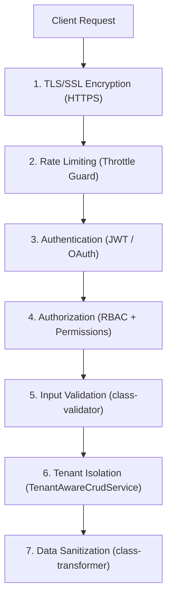

# Security Overview

Security architecture and best practices for Ever Gauzy deployments.

:::info
Contact: security@ever.co — If you discover any security issue, please disclose responsibly by sending an email, not by creating a GitHub issue.
:::

Ever Gauzy™ follows good security practices, but 100% security cannot be guaranteed in any software. In a production setup, all client-side to server-side communications should be encrypted using HTTPS/WSS/SSL (REST APIs, GraphQL endpoint, Socket.io WebSockets, etc.).

## Security Layers

## Authentication Security

- **scrypt** password hashing (default) with transparent **bcrypt** fallback for legacy hashes
- **Progressive hash migration** — legacy bcrypt hashes are automatically re-hashed to scrypt on login
- **JWT** with short-lived access tokens and defense-in-depth validation
- **Refresh tokens** with identity reconciliation and token rotation
- **Constant-time password comparison** (`timingSafeEqual`) — prevents timing attacks
- **OAuth 2.0** for social authentication (tokens validated server-side against each provider's API)
- **Email verification** for new accounts
- **Magic login codes** via CSPRNG (`crypto.randomInt()`)

## Authorization Guards

The application uses a layered guard system with **12 specialized guards**:

| Guard                         | Purpose                                            |
| ----------------------------- | -------------------------------------------------- |
| `AuthGuard`                   | Global JWT validation (applied to all routes)      |
| `TenantPermissionGuard`       | Ensures requests are scoped to the user's tenant   |
| `PermissionGuard`             | Checks fine-grained permissions (`@Permissions()`) |
| `RoleGuard`                   | Role-based access control (`@Roles()`)             |
| `OrganizationPermissionGuard` | Organization-level permission checks               |
| `ManagerOrPermissionGuard`    | Allows managers OR users with specific permissions |
| `TenantBaseGuard`             | Base tenant validation logic                       |
| `FeatureFlagGuard`            | Feature flag gating                                |
| `ApiKeyAuthGuard`             | API key authentication for integrations            |
| `AuthRefreshGuard`            | Validates refresh tokens specifically              |
| `RegisterAuthorizationGuard`  | Controls user registration access                  |

Routes explicitly decorated with `@Public()` are the only exceptions to the global `AuthGuard`.

### Tenant Isolation

All entities extending `TenantBaseEntity` or `TenantOrganizationBaseEntity` are automatically scoped to the current tenant. Cross-tenant data access is prevented at the ORM level.

## HTTP Security Headers

[Helmet](https://helmetjs.github.io/) is enabled in **all environments**, providing:

- `X-Content-Type-Options: nosniff`
- `X-Frame-Options: SAMEORIGIN`
- `Strict-Transport-Security` (HSTS)
- `X-XSS-Protection`
- Content Security Policy (CSP)
- And other hardening headers

## Input Validation

- **`class-validator`** is used across all DTOs with `@UseValidationPipe({ whitelist: true })` to strip unknown properties.
- **`UUIDValidationPipe`** validates UUID parameters.
- **`ParseJsonPipe`** parses query parameters with safe defaults.
- Relation loading in public endpoints is restricted to **enum-based allowlists** of safe relations — see [Public Endpoint Data Exposure](./public-endpoint-data-exposure).
- File upload paths are **sanitized** to prevent path traversal (alphanumeric, dash, underscore only).

## Session Management

Sessions are managed through **Redis** (production) or in-memory stores (development):

- Redis-backed sessions provide persistence across server restarts.
- Session configuration is handled by `configureRedisSession()`.

## File Storage Security

All file storage providers (AWS S3, DigitalOcean Spaces, Wasabi, Cloudinary, Local) use structured logging:

- **No credential leaks** — API keys, secret keys, and full configuration objects are never logged.
- **Error logging** uses `Logger.error()` with message-only output.
- Debug logs use safe messages (e.g., `"S3 configuration loaded"` instead of `JSON.stringify(config)`).

## Database Seeding Safety

Default user seeding includes protections:

- Existing user passwords are **never overwritten** during re-seeding.
- Set `FORCE_SEED_PASSWORD=true` to explicitly allow password overwrites (use with caution).

## Environment Variables Reference

| Variable                                 | Purpose                                | Required in Prod      |
| ---------------------------------------- | -------------------------------------- | --------------------- |
| `JWT_SECRET`                             | Access token signing key               | ✅                    |
| `JWT_REFRESH_TOKEN_SECRET`               | Refresh token signing key              | ✅                    |
| `JWT_VERIFICATION_TOKEN_SECRET`          | Email verification token key           | ✅                    |
| `JWT_TOKEN_EXPIRATION_TIME`              | Access token expiry (seconds)          | No                    |
| `JWT_REFRESH_TOKEN_EXPIRATION_TIME`      | Refresh token expiry (seconds)         | No                    |
| `JWT_VERIFICATION_TOKEN_EXPIRATION_TIME` | Verification token expiry (seconds)    | No                    |
| `THROTTLE_ENABLED`                       | Enable/disable rate limiting           | No (default: `true`)  |
| `THROTTLE_TTL`                           | Rate limit window (ms)                 | No                    |
| `THROTTLE_LIMIT`                         | Global rate limit                      | No                    |
| `MAGIC_CODE_EXPIRATION_TIME`             | Magic code expiry (seconds)            | No                    |
| `FORCE_SEED_PASSWORD`                    | Allow seed password overwrite          | No (default: `false`) |
| `OTEL_ENABLED`                           | Enable OpenTelemetry tracing           | No                    |
| `ALLOWED_ORIGINS`                        | CORS allowed origins (comma-separated) | Recommended           |

## CVE Clarifications

### CVE-2023-53951 (JWT Weak HMAC Secret)

:::caution
**CVE-2023-53951** refers to the **public demo environment** (`demo.gauzy.co` / `apidemo.gauzy.co`), which intentionally uses default credentials and secrets for testing purposes. This is expected behavior for a demo environment meant to allow public access and evaluation of the software.

**Production deployments should always use strong, unique secrets configured via environment variables** (e.g., `JWT_SECRET`, `JWT_REFRESH_SECRET`). See the [environment configuration documentation](https://github.com/ever-co/ever-gauzy/blob/develop/.env.sample) for all required security-related environment variables.
:::

## Related Pages

- [Authentication Flows](./authentication-flows) — login, magic code, workspace switching
- [Token Lifecycle](./token-lifecycle) — JWT payload, validation, rotation
- [Password Security](./password-security) — hashing, policy, reset flow
- [OAuth App Authorization](./oauth-app-authorization) — server-to-server OAuth
- [Data Protection](./data-protection) — GDPR, data handling
- [Rate Limiting](./rate-limiting) — API throttling
- [CORS Configuration](./cors-configuration) — cross-origin settings
- [Audit Logging](./audit-logging) — activity logs and observability
- [Public Endpoint Data Exposure](./public-endpoint-data-exposure) — TypeORM relation allowlisting
- [Authentication](../authentication/auth-overview) — auth setup details
- [Roles & Permissions](../authentication/roles-and-permissions) — RBAC
