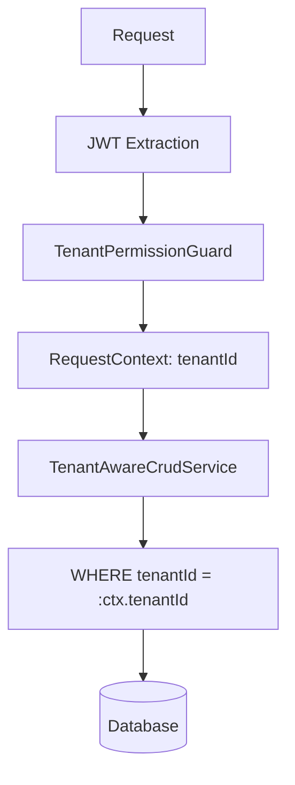

# Tenant Isolation

How Ever Gauzy ensures complete data isolation between tenants.

## Overview

Multi-tenancy in Gauzy uses **row-level isolation** — all entities include a `tenantId` column, and all queries are automatically filtered by the current user's tenant.

## Isolation Layers



### Layer 1: JWT Token

The JWT token contains the user's `tenantId`. This is validated on every request.

### Layer 2: TenantPermissionGuard

The `TenantPermissionGuard` extracts the tenant from the JWT and sets it in the `RequestContext`.

### Layer 3: Base Entity Classes

All entities extend `TenantBaseEntity` which includes:

```typescript
class TenantBaseEntity {
  @Column()
  tenantId: string;

  @ManyToOne(() => Tenant)
  tenant: Tenant;
}
```

### Layer 4: Service Layer

`TenantAwareCrudService` automatically appends `tenantId` to all queries:

```typescript
findAll(filter) {
  // Automatically adds: WHERE tenantId = currentTenantId
  return super.findAll({
    ...filter,
    where: { ...filter.where, tenantId: RequestContext.currentTenantId() }
  });
}
```

## Cross-Tenant Protection

| Protection              | Mechanism                     |
| ----------------------- | ----------------------------- |
| Read isolation          | Automatic WHERE clause        |
| Write isolation         | TenantId injected on create   |
| Update/Delete isolation | Ownership validation          |
| Relation traversal      | Tenant-scoped joins           |
| Public endpoints        | No tenant context (read-only) |

## Testing Tenant Isolation

When developing new features, always verify:

1. User A (Tenant 1) cannot read User B's (Tenant 2) data
2. Cross-tenant IDs in requests are rejected
3. Public endpoints don't leak tenant-specific data

## Related Pages

- [API Security Best Practices](./api-security-best-practices) — API security
- [Multi-Tenancy Architecture](../architecture/multi-tenancy) — architecture overview
