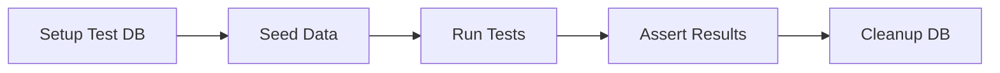

# E2E Testing Guide

End-to-end testing for the Gauzy API.

## Setup

E2E tests use **Jest** with **supertest** against a real running API:

```bash
# Run E2E tests
yarn test:e2e
```

## Writing E2E Tests

```typescript
import { Test, TestingModule } from "@nestjs/testing";
import { INestApplication } from "@nestjs/common";
import * as request from "supertest";
import { AppModule } from "../src/app.module";

describe("EmployeeController (E2E)", () => {
  let app: INestApplication;
  let authToken: string;

  beforeAll(async () => {
    const module: TestingModule = await Test.createTestingModule({
      imports: [AppModule],
    }).compile();

    app = module.createNestApplication();
    await app.init();

    // Login to get auth token
    const loginRes = await request(app.getHttpServer())
      .post("/api/auth/login")
      .send({ email: "admin@ever.co", password: "admin" });
    authToken = loginRes.body.token;
  });

  afterAll(async () => {
    await app.close();
  });

  describe("GET /api/employee", () => {
    it("should return paginated list", () => {
      return request(app.getHttpServer())
        .get("/api/employee")
        .set("Authorization", `Bearer ${authToken}`)
        .expect(200)
        .expect((res) => {
          expect(res.body.items).toBeDefined();
          expect(res.body.total).toBeGreaterThanOrEqual(0);
        });
    });

    it("should return 401 without auth", () => {
      return request(app.getHttpServer()).get("/api/employee").expect(401);
    });
  });

  describe("POST /api/employee", () => {
    it("should create an employee", async () => {
      const res = await request(app.getHttpServer())
        .post("/api/employee")
        .set("Authorization", `Bearer ${authToken}`)
        .send({
          user: { firstName: "Test", lastName: "User", email: "test@ever.co" },
          startedWorkOn: new Date().toISOString(),
        })
        .expect(201);

      expect(res.body.id).toBeDefined();
    });
  });
});
```

## Test Database

E2E tests use a separate test database:

```env
# .env.test
DB_TYPE=sqlite
DB_NAME=gauzy-test.sqlite3
```

## Test Lifecycle



## Best Practices

- Use a separate test database
- Seed minimal required data
- Clean up after each test suite
- Test both success and error paths
- Test authentication and authorization

## Related Pages

- [Unit Testing Guide](./unit-testing) — unit tests
- [API Integration Testing](./api-integration-testing) — API testing
- [CI Test Pipeline](./ci-test-pipeline) — CI integration
