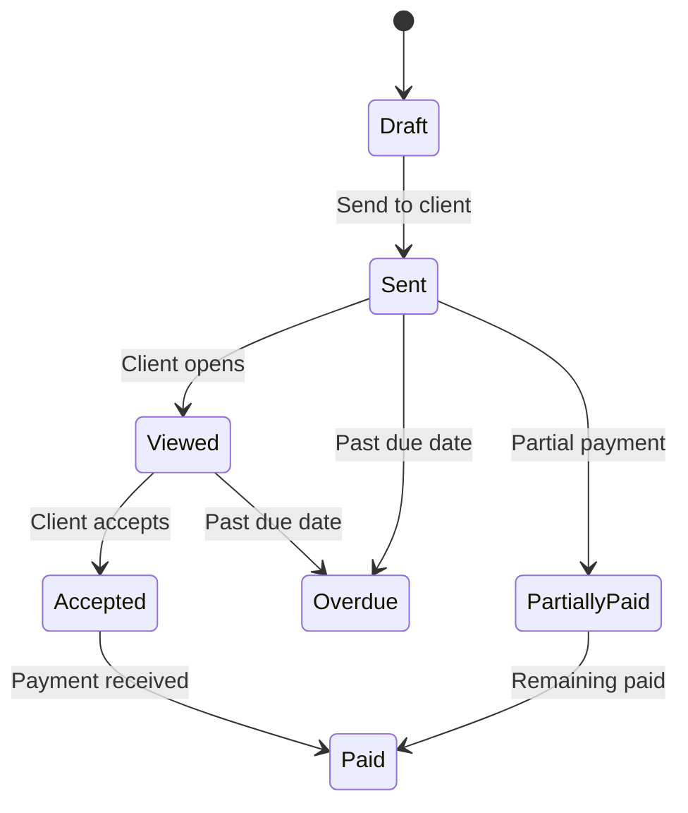

# Tutorial: Invoice Creation

Create and send professional invoices step by step.

## Step 1: Create an Invoice

1. Navigate to **Accounting** → **Invoices**
2. Click **Add Invoice**

## Step 2: Fill Invoice Details

| Field          | Description                 |
| -------------- | --------------------------- |
| Invoice Number | Auto-generated or custom    |
| Invoice Date   | Date of issue               |
| Due Date       | Payment deadline            |
| Client         | Select from contacts        |
| Currency       | Billing currency            |
| Discount       | Flat or percentage discount |
| Tax            | Tax rate percentage         |

## Step 3: Add Line Items

Click **Add Item** for each billable entry:

### From Time Logs

1. Select **By Project** or **By Task**
2. Choose date range
3. Gauzy calculates hours × rate automatically

### Manual Items

1. Enter description
2. Set quantity and unit price
3. Add tax if applicable

### From Expenses

1. Select **By Expense**
2. Choose expenses to bill
3. Amounts populate automatically

## Step 4: Preview

Click **Preview** to see the invoice as the client will see it. Uses your [Accounting Template](../features/accounting-templates).

## Step 5: Send Invoice

1. Click **Send**
2. Choose delivery method:
   - **Email** — sends directly to client
   - **PDF** — download PDF to send manually
   - **Link** — generate a payment link

## Step 6: Track Payment

When payment arrives:

1. Open the invoice
2. Click **Record Payment**
3. Enter amount received
4. Status updates automatically

## Invoice Statuses

## Next Steps

- [CRM Contacts Tutorial](./crm-contacts-tutorial)
- [Invoicing Feature](../features/invoicing)
- [Invoice Endpoints](../api/invoice-endpoints)
