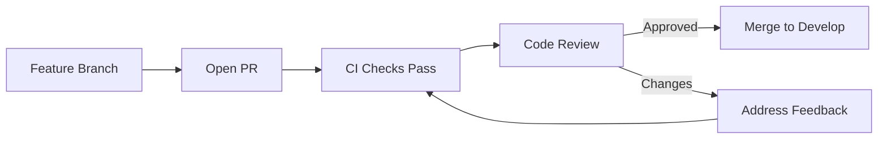

# Code Review Workflow

Standards and process for code reviews.

## Pull Request Process



## Before Opening a PR

1. Rebase on latest `develop`
2. Ensure all tests pass locally
3. Run linting: `yarn lint`
4. Self-review your diff
5. Write a clear PR description

## PR Template

```markdown
## What Changed

Brief description of changes.

## Why

Business context or issue reference.

## How to Test

1. Step-by-step testing instructions
2. Expected outcomes

## Screenshots

Before/after if UI changes.

## Checklist

- [ ] Tests added/updated
- [ ] Documentation updated
- [ ] No console.log statements
- [ ] Types properly defined
```

## Reviewer Checklist

| Area           | Check                          |
| -------------- | ------------------------------ |
| Logic          | Correct business logic         |
| Security       | No vulnerabilities introduced  |
| Performance    | No N+1 queries, proper indexes |
| Types          | Proper TypeScript types        |
| Tests          | Adequate test coverage         |
| Naming         | Clear variable/function names  |
| Error Handling | Proper exception handling      |
| Tenant Scoping | `tenantId` properly applied    |

## Review Response Times

| Priority | Target Response |
| -------- | --------------- |
| Critical | < 2 hours       |
| Normal   | < 24 hours      |
| Low      | < 48 hours      |

## Related Pages

- [Git Workflow](../development/git-workflow) — branching model
- [CI Test Pipeline](../testing/ci-test-pipeline) — CI checks
- [Development Guide](../development/development-guide) — setup
