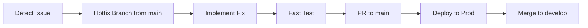

# Hotfix Workflow

Emergency fix process for production issues.

## When to Use

- Critical production bug affecting users
- Security vulnerability discovered
- Data integrity issue

## Process



## Steps

### 1. Create Hotfix Branch

```bash
git checkout main
git pull
git checkout -b hotfix/issue-description
```

### 2. Implement Fix

- Focus on the minimal fix only
- No refactoring or feature additions
- Add a regression test

### 3. Test

```bash
yarn test
yarn test:e2e  # if time permits
```

### 4. Deploy

```bash
# Fast-track PR review
# Merge to main
# CI/CD auto-deploys to production
```

### 5. Backport

```bash
git checkout develop
git merge hotfix/issue-description
git push
```

### 6. Post-Mortem

| Item       | Detail                     |
| ---------- | -------------------------- |
| Root cause | Why did this happen?       |
| Detection  | How was it found?          |
| Impact     | How many users affected?   |
| Fix        | What was changed?          |
| Prevention | How to prevent recurrence? |

## Related Pages

- [Release Management](./release-management) — releases
- [Incident Response](./incident-response) — incident handling
- [Git Workflow](../development/git-workflow) — branching
