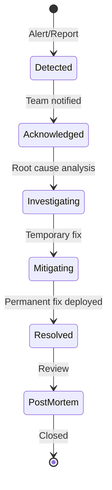

# Incident Response Workflow

Handle production incidents systematically.

## Severity Levels

| Level | Name     | Response Time | Examples                    |
| ----- | -------- | ------------- | --------------------------- |
| SEV-1 | Critical | < 15 min      | Full outage, data breach    |
| SEV-2 | Major    | < 1 hour      | Partial outage, degraded    |
| SEV-3 | Minor    | < 4 hours     | Non-critical bug, slow perf |
| SEV-4 | Low      | Next business | Cosmetic issue, minor bug   |

## Incident Lifecycle



## Response Steps

### 1. Detection & Acknowledgment

- Monitor alerts (Prometheus, Sentry, Uptime)
- Acknowledge in incident channel
- Assign incident commander

### 2. Communication

- Notify stakeholders
- Update status page
- Set expectations for resolution

### 3. Investigation

```bash
# Check API health
curl https://api.example.com/api/health

# Check logs
kubectl logs -f deployment/gauzy-api --tail=100

# Check metrics
# Grafana dashboard → API Overview
```

### 4. Mitigation

- Rollback if deployment-related
- Scale up if load-related
- Block traffic if security-related

### 5. Resolution & Post-Mortem

| Section      | Content                |
| ------------ | ---------------------- |
| Timeline     | When things happened   |
| Root Cause   | Why it happened        |
| Impact       | Users/revenue affected |
| Fix Applied  | What was done          |
| Action Items | Prevent recurrence     |

## Related Pages

- [Hotfix Workflow](./hotfix) — emergency fixes
- [Health Checks](../observability/health-checks) — monitoring
- [Alerting](../observability/alerting) — alert setup
