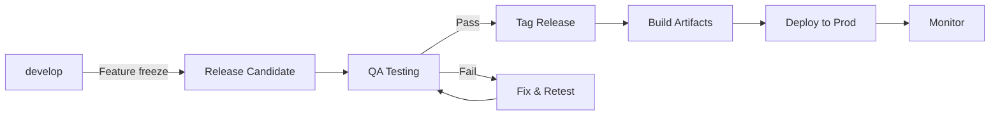

# Release Management Workflow

Plan, build, and ship releases.

## Release Process

## Version Numbering

Gauzy follows **Semantic Versioning** (SemVer):

| Type  | Format  | Example | When             |
| ----- | ------- | ------- | ---------------- |
| Major | `X.0.0` | `2.0.0` | Breaking changes |
| Minor | `0.X.0` | `1.5.0` | New features     |
| Patch | `0.0.X` | `1.5.3` | Bug fixes        |

## Release Checklist

### Pre-Release

- [ ] All features merged to `develop`
- [ ] All tests passing
- [ ] Version bumped in `package.json`
- [ ] Changelog updated
- [ ] Documentation updated
- [ ] Database migrations tested

### Release Day

- [ ] Create release branch from `develop`
- [ ] Final QA on staging
- [ ] Tag release in Git
- [ ] Build Docker images
- [ ] Deploy to production
- [ ] Verify health checks
- [ ] Monitor error rates

### Post-Release

- [ ] Merge release branch to `main`
- [ ] Merge back to `develop`
- [ ] Announce release
- [ ] Update documentation site
- [ ] Close related issues/PRs

## Rollback Process

If critical issues found:

1. Revert to previous Docker image tag
2. Or: `kubectl rollout undo deployment/gauzy-api`
3. Investigate and fix
4. Re-release as patch

## Related Pages

- [CI/CD Pipeline](../deployment/ci-cd/cicd-pipeline-guide) — CI/CD
- [Blue-Green Deployment](../devops/blue-green-deployment) — zero-downtime
- [Hotfix Workflow](./hotfix) — emergency fixes
